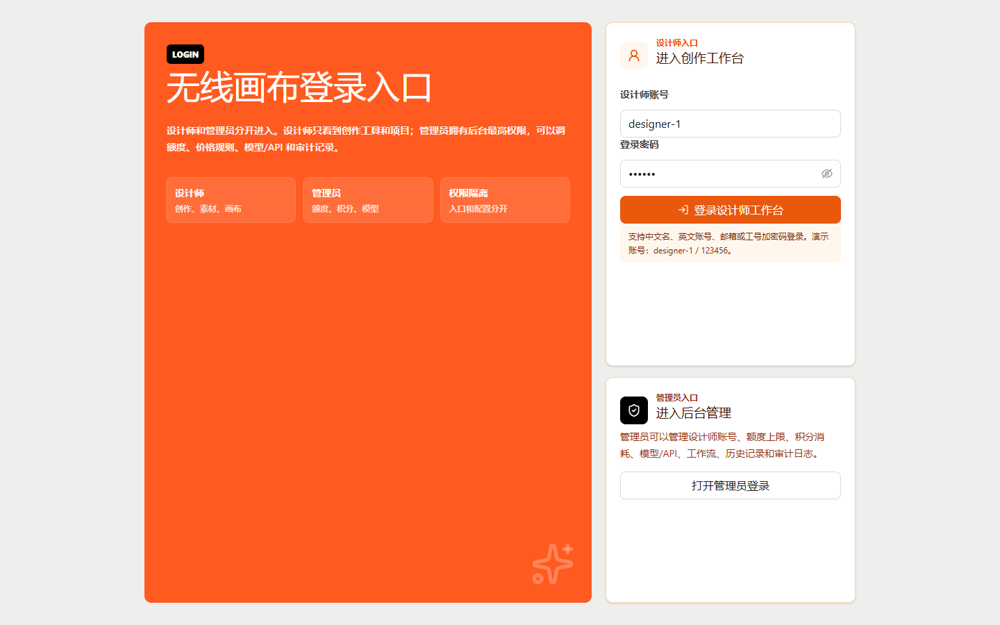
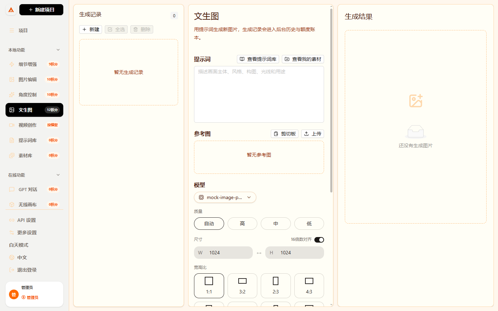
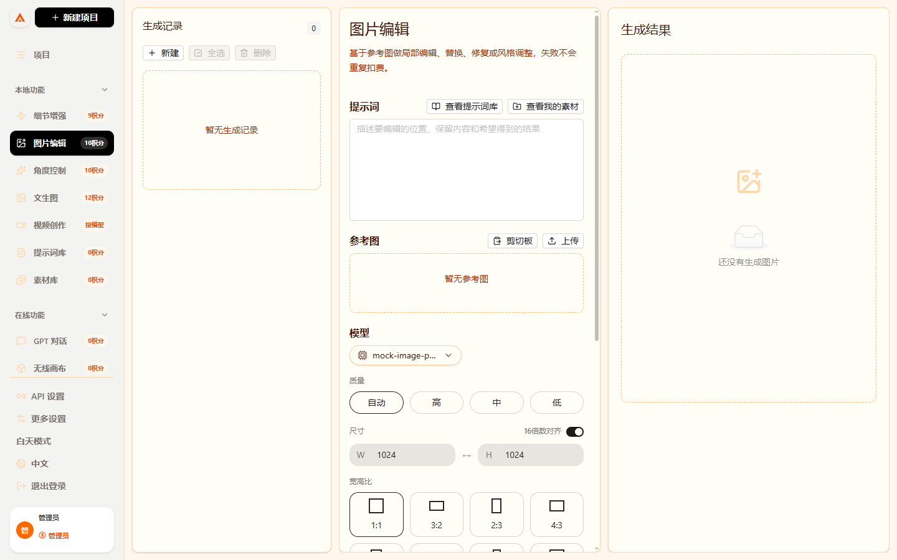
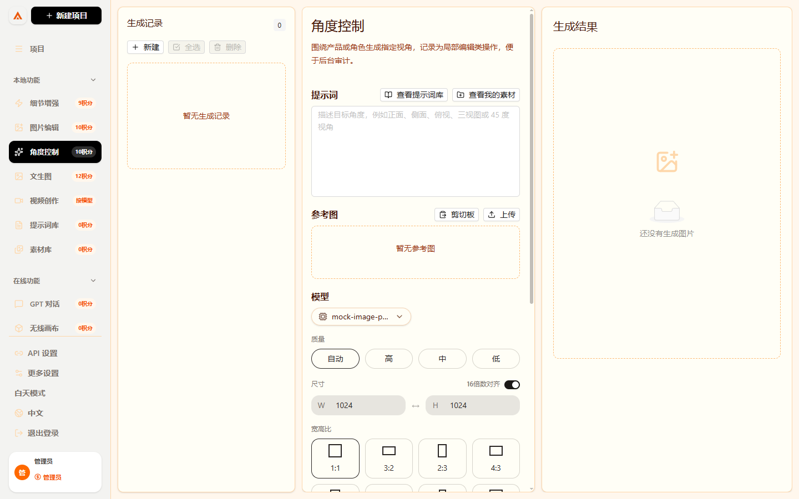
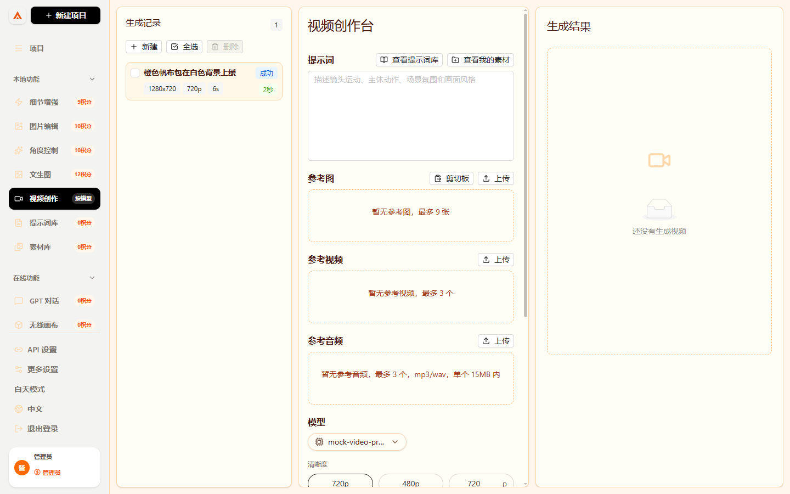
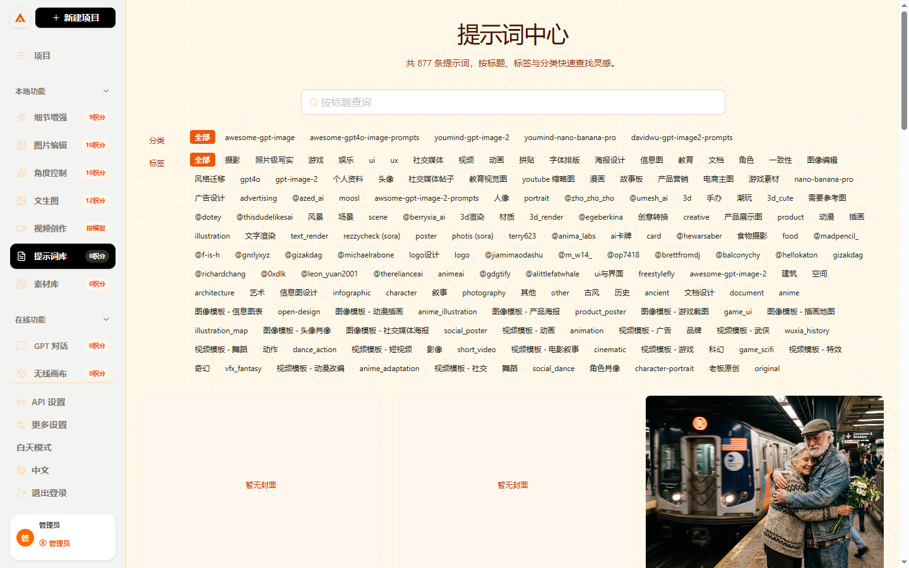
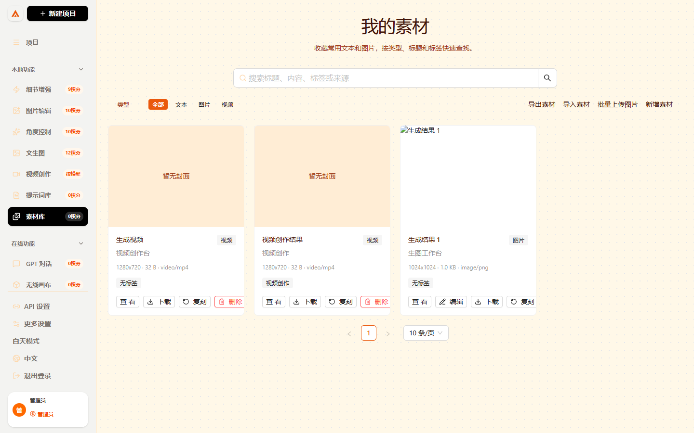
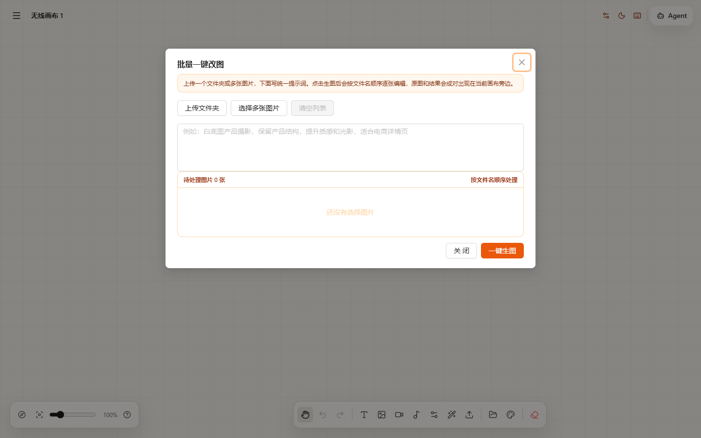
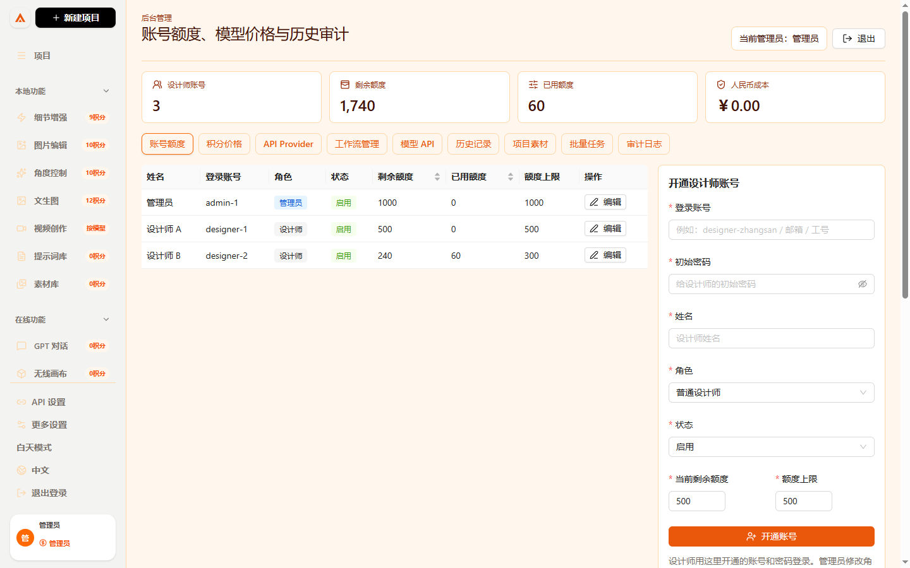
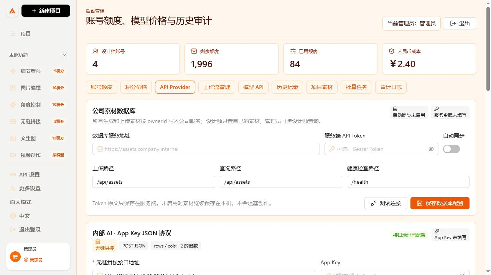

# 无线画布

无线画布是一套给公司内部设计团队使用的 AI 创作工作台。它把项目、文生图、细节增强、图片编辑、角度控制、无缝拼接、视频创作、提示词库、素材库、无线画布、设计师额度、模型 API、价格规则、历史记录、批量任务和审计日志放在同一个系统里。

一句话理解：这是一个“设计师前台创作工具 + 管理员后台管控中心”。

生产服务器部署、企业微信、工作流、备份恢复和 40 人压测请参阅：[生产部署与验收手册](docs/manual/production-deployment.md)。

最新生产式自动验收：40 位设计师持续提交 2 分钟，共成功提交并完成 4,573 个模拟出图任务，请求失败率 0.00%，P95 为 106.77 ms；任务、额度结算、素材和历史记录数量完全一致。查看 [GitHub Actions 验证记录](https://github.com/Jizhidemu52/Vincent-s-Canvas/actions/runs/29092186577)。


## 角色怎么区分

系统入口是：

```text
http://localhost:3000/login
```

设计师和管理员从同一个登录入口进入，但进入的是不同区域：

| 身份 | 进入哪里 | 能看到什么 | 不能做什么 |
| --- | --- | --- | --- |
| 设计师 | 创作工作台 | 自己的项目、任务、素材和积分 | 不能进入后台或查看他人数据 |
| 部门管理员 | 部门后台 | 本部门设计师账号、额度和审计数据 | 不能查看其他部门或配置全局模型密钥 |
| 超级管理员 | 全局后台 | 全公司账号、部门、额度、模型、价格和审计 | 首次登录必须改密并启用二次验证 |



## 每个入口消耗多少积分

前台左侧菜单会直接标注积分，设计师不用猜价格。管理员在后台修改价格规则后，前台预估会跟着后台规则走。

| 模块 | 默认前台标注 | 作用 | 适合谁用 |
| --- | --- | --- | --- |
| 文生图 | 12 积分 | 输入提示词生成图片，支持模型、尺寸、数量和质量设置 | 设计师 |
| 细节增强 | 9 积分 | 上传原图后做高清放大、细节修复、质感增强 | 设计师 |
| 图片编辑 | 10 积分 | 基于参考图做局部编辑、替换、修复、风格调整 | 设计师 |
| 角度控制 | 10 积分 | 围绕产品或角色生成正面、侧面、俯视、45 度等视角 | 设计师 |
| 无缝拼接 | 2 积分 | 上传纹理图，按横向和纵向倍率生成连续平铺素材 | 设计师 |
| 视频创作 | 按模型 | 管理视频生成入口和视频参数，成本由模型配置决定 | 设计师 |
| 提示词库 | 0 积分 | 保存常用提示词，方便复用 | 设计师 |
| 素材库 | 0 积分 | 保存图片、视频、文本素材，按项目复盘 | 设计师和管理员 |
| GPT 对话 | 0 积分 | 在画布场景里讨论项目、拆提示词、整理生成思路 | 设计师 |
| 无线画布 | 0 积分 | 多项目画布、节点拖拽、连线、导入导出 | 设计师 |
| 后台管理 | 管理员 | 管账号、额度、模型、API、价格、历史、项目、批量任务、审计 | 管理员 |

额度不足时，任务不能提交。任务失败、重复提交、批量任务单张失败等情况，建议在正式后端里统一走额度账本，方便追踪每一笔积分变化。

## 新手最快上手

### 第 1 步：启动完整服务

正式登录依赖 PostgreSQL 和 Redis，推荐在安装了 Docker Compose 的公司服务器运行：

```bash
cp .env.example .env
# 编辑 .env，替换所有 replace-with 开头的值
docker compose up -d --build
```

生成 MFA 加密密钥：

```bash
openssl rand -base64 32  # MFA_ENCRYPTION_KEY
openssl rand -base64 32  # PROVIDER_ENCRYPTION_KEY，必须使用另一把密钥
```

首次启动会自动执行数据库迁移并创建首位超级管理员。打开 `http://服务器地址:3000/admin/login`，使用 `.env` 中的管理员账号和初始密码登录，随后系统会强制修改密码并启用六位动态验证码。

首位超级管理员创建成功后，可以从 `.env` 删除 `BOOTSTRAP_ADMIN_PASSWORD`；后续重启只会检查管理员是否存在，不会重复创建。

企业微信扫码登录还需由公司 IT 在企业微信管理后台创建自建应用，并把可信回调地址设置为：

```text
https://你的正式域名/api/auth/wecom/callback
```

然后填写 `.env` 中的 `WECOM_CORP_ID`、`WECOM_AGENT_ID`、`WECOM_SECRET` 和 `WECOM_CALLBACK_URL`。未配置企业微信时，账号密码登录仍可使用。

仅开发前端界面时，可以进入 `web` 目录：

进入项目的 `web` 目录：

```bash
cd web
bun install
bun run dev
```

前端会把 `/api` 代理到 `http://localhost:3100`。没有启动后端时只能查看登录页，不能使用演示账号绕过服务端鉴权。启动后打开：

```text
http://localhost:3000/login
```

生产环境不要使用裸 HTTP，也不要把 PostgreSQL、Redis 或 API 服务端口直接暴露到公网。

本地验收任务队列时可暂时设置 `TASK_MOCK_MODE=true`。Worker 会走完整的排队、积分冻结、处理、历史入库和成功结算流程，但返回系统生成的 QA 占位图，不调用外部模型。正式上线必须改回 `false`，并在后台配置 Provider 和模型。

### 第 2 步：选择身份

1. 普通设计师选择设计师账号。
2. 点击 `登录设计师工作台`。
3. 管理员点击 `打开管理员登录`。
4. 管理员登录页只显示管理员账号，普通设计师不会出现在后台登录选择里。

### 第 3 步：看左侧菜单

设计师登录后，左侧是工作入口：

- 项目
- 文生图
- 细节增强
- 图片编辑
- 角度控制
- 视频创作
- 提示词库
- 素材库
- GPT 对话
- 无线画布

管理员登录后，左侧会额外出现：

- 后台管理
- API 设置

设计师不会看到这些管理入口。

## 模块图文操作手册

### 1. 登录入口


怎么操作：

1. 打开 `http://localhost:3000/login`。
2. 如果是设计师，输入管理员开通的账号和密码。账号可以是中文名、英文账号、邮箱或工号。
3. 点击 `登录设计师工作台`；英文账号不区分大小写，中文账号支持正常中文输入。
4. 如果是管理员，点击右侧 `打开管理员登录`。
5. 管理员在后台登录页选择管理员账号后进入后台。

你应该看到的结果：

- 设计师只能进入创作工作台。
- 管理员可以进入后台管理。
- 普通设计师不会看到额度、价格、模型 API、审计日志这些管理入口。

### 2. 项目工作台


这个模块做什么：

- 管理设计项目。
- 新建设计项目。
- 查看最近打开的项目。
- 进入画布继续编辑。
- 从项目维度查看素材、模型和成本。

怎么操作：

1. 登录设计师工作台。
2. 点击左侧 `项目`。
3. 点击 `新建项目` 新增项目。
4. 点击已有项目卡片进入项目。
5. 后续生成的图片、编辑结果、素材都可以按项目归档。

### 3. 文生图



这个模块做什么：

- 输入文字提示词生成图片。
- 选择模型、尺寸、质量和生成数量。
- 根据后台价格规则显示预计积分。
- 生成结果可以进入素材库或画布。

怎么操作：

1. 点击左侧 `文生图`。
2. 在 `提示词` 输入框写清楚画面内容、风格、材质和用途。
3. 选择模型。
4. 选择质量、尺寸、比例和生成张数。
5. 查看页面上的预计积分。
6. 点击生成按钮。
7. 生成完成后保存到素材库、加入参考图或下载。

积分说明：

- 默认 12 积分/张。
- 管理员可以在 `后台管理 -> 积分价格` 修改生成一张图的积分。
- 不同模型也可以在 `后台管理 -> 模型 API` 设置不同单次成本。

### 4. 细节增强


这个模块做什么：

- 对已有图片进行放大。
- 修复模糊细节。
- 增强材质、纹理、清晰度。
- 适合产品图、服装图、面料图、头像图的二次增强。

怎么操作：

1. 点击左侧 `细节增强`。
2. 在参考图区上传原图，或使用剪切板导入。
3. 在提示词里写增强要求，例如“保留原构图，提升布料纹理和边缘清晰度”。
4. 选择模型和尺寸。
5. 查看预计积分。
6. 点击增强按钮。

积分说明：

- 默认 9 积分/次。
- 管理员可以在后台把“放大图片”或增强类操作改成新的积分规则。

### 5. 图片编辑



这个模块做什么：

- 对参考图做局部修改。
- 替换背景、补图、修图、改颜色、改材质。
- 保留主体，按提示词调整局部区域。

怎么操作：

1. 点击左侧 `图片编辑`。
2. 上传需要编辑的参考图。
3. 在提示词中说明要改哪里、怎么改、哪些地方必须保留。
4. 选择模型、质量和尺寸。
5. 查看预计积分。
6. 点击编辑按钮。

积分说明：

- 默认 10 积分/次。
- 管理员可以在 `积分价格` 里调整“局部编辑”的积分。

### 6. 角度控制



这个模块做什么：

- 根据产品或角色参考图生成不同视角。
- 常用视角包括正面、侧面、背面、俯视、45 度。
- 适合做产品图、角色设定、服装款式多角度展示。

怎么操作：

1. 点击左侧 `角度控制`。
2. 上传主体参考图。
3. 在提示词中写明需要的角度，例如“生成同一件夹克的正面和侧面视图”。
4. 选择模型和输出尺寸。
5. 查看预计积分。
6. 点击生成。

积分说明：

- 默认 10 积分/次。
- 当前按图片编辑类操作计费，管理员可以在后台调整。

### 7. 无缝拼接


这个模块做什么：

- 把一张纹理图处理成可连续平铺的无缝素材。
- 横向和纵向可以分别选择 2、4、6、8 倍。
- 结果可下载，并同步保存到素材库和历史记录。

怎么操作：

1. 点击左侧 `无缝拼接`。
2. 粘贴图片、上传图片，或从素材库选择一张图片。
3. 选择横向倍数和纵向倍数；接口要求两项都使用 2 的倍数。
4. 确认按钮旁显示 `2 积分`。
5. 点击 `开始无缝拼接`。
6. 成功后在右侧查看、下载结果，或到素材库继续复用。

扣费说明：

- 默认 2 积分/次，管理员修改后台价格规则后，设计师端会同步显示新价格。
- 只有成功结果才扣积分；接口失败时不会扣除设计师额度。

### 8. 视频创作



这个模块做什么：

- 管理视频生成入口。
- 设置视频提示词、参考图、比例、时长、质量和模型。
- 后续可以接入不同视频模型或内部工作流。

怎么操作：

1. 点击左侧 `视频创作`。
2. 输入视频提示词。
3. 上传参考图或选择项目素材。
4. 选择视频模型、比例、时长和质量。
5. 查看模型成本说明。
6. 点击生成。

积分说明：

- 前台默认显示 `按模型`。
- 管理员在 `后台管理 -> 模型 API` 或 `工作流管理` 中设置具体模型成本。

### 9. 提示词库



这个模块做什么：

- 保存常用提示词。
- 按标签、项目、用途管理提示词。
- 帮团队沉淀稳定可复用的出图写法。

怎么操作：

1. 点击左侧 `提示词库`。
2. 新增提示词，填写标题、内容、标签和适用场景。
3. 在生成图片时复制或引用提示词。
4. 团队可以把好用的提示词整理成模板。

积分说明：

- 浏览和管理提示词默认 0 积分。
- 真正生成图片时才按文生图、编辑、增强等操作扣积分。

### 10. 素材库



这个模块做什么：

- 保存项目图片、视频、文本素材。
- 每条素材写入所属设计师 `ownerId`，按项目、设计师、操作类型归档。
- 设计师 A 只能看到 A 的素材，设计师 B 只能看到 B 的素材。
- 管理员可以查看全部设计师素材，并按设计师姓名筛选。

怎么操作：

1. 点击左侧 `素材库`。
2. 上传素材，或从生成结果保存到素材库。
3. 给素材设置项目、分类、标签和说明。
4. 在文生图、图片编辑、角度控制或画布里复用素材。

权限结果：

- 切换到另一个设计师账号后，看不到前一个设计师的素材。
- 管理员进入 `后台管理 -> 项目素材`，可以选择“全部设计师”或指定姓名查看。


积分说明：

- 浏览、上传、归档素材默认 0 积分。
- 使用素材发起生成任务时，按对应生成操作扣积分。

### 11. GPT 对话和无线画布


这个模块做什么：

- 在画布里拖拽图片、文字和生成结果。
- 把灵感、提示词、参考图、出图结果放在同一个项目里。
- GPT 对话用于拆解需求、优化提示词、整理生成方案。
- 支持画布素材导入导出。

怎么操作：

1. 点击左侧 `无线画布` 进入画布。
2. 新增节点，把图片、文字、提示词放进画布。
3. 使用连线表达素材关系。
4. 点击 `GPT 对话` 进入对话模式，整理提示词和生成计划。
5. 把画布里的素材继续送到文生图、编辑或素材库。

积分说明：

- 进入画布和整理内容默认 0 积分。
- 如果后续从画布触发图片生成、编辑或增强，按对应操作扣积分。

### 12. 画布批量一键改图



这个入口在无线画布项目页的底部工具栏里，适合一次性处理一个文件夹里的多张图片。

怎么操作：

1. 点击左侧 `无线画布`。
2. 新建或打开一个画布项目。
3. 点击底部工具栏里的 `批量改图`。
4. 点击 `上传文件夹` 或 `选择多张图片`。
5. 在提示词框里写统一编辑要求，例如“白底图产品摄影，保留产品结构，提升质感和光影，适合电商详情页”。
6. 确认待处理图片数量和文件名顺序。
7. 点击 `一键生图`。
8. 结果会按顺序生成，并和原图成对出现在当前画布旁边；成功结果会同步进入历史记录和素材库。

扣费规则：

- 批量改图按每张图计费。
- 某一张失败不会影响整批继续执行。
- 成功的图片进入 History 并扣除额度；失败图片记录失败原因。
- 管理员可以在 `后台管理 -> 积分价格` 里调整“批量处理每张图”的积分。

### 13. 后台管理



这个模块做什么：

- 管理设计师账号。
- 调整设计师额度和额度上限。
- 设置每个操作消耗多少积分。
- 管理 API Provider、模型 API、RunningHub、ComfyUI 和本地工作流。
- 查看历史记录、项目素材、批量任务和审计日志。

怎么操作：

1. 打开 `http://localhost:3000/login`。
2. 点击 `打开管理员登录`。
3. 选择管理员账号进入后台。
4. 在 `账号额度` 里给设计师加额度、扣额度或设置额度上限。
5. 在 `积分价格` 里设置生成、放大、去背景、局部编辑、批量处理的积分。
6. 在 `模型 API` 里配置模型名称、模型 ID、能力、单次积分成本、价格、启用状态和 Provider。
7. 在 `工作流管理` 里配置 RunningHub、ComfyUI 或本地工作流模板。
8. 在 `历史记录`、`批量任务` 和 `审计日志` 里复盘谁用了什么模型、花了多少积分、生成了哪些结果。

权限说明：

- 只有管理员能进入后台。
- 只有管理员能修改额度、积分、模型 API、Provider 和工作流。
- 普通设计师直接访问 `/admin` 会被拦到管理员登录页。

## 管理员后台能管什么

### 账号和额度


管理员可以查看每个设计师：

- 姓名
- 角色
- 状态
- 剩余额度
- 已用额度
- 额度上限

管理员可以给设计师增加额度、扣减额度，也可以设置最大额度上限。

开通账号时，`登录账号` 支持以下形式：

- 中文名，例如 `李华`
- 英文账号，例如 `lihua` 或 `designer-lihua`
- 公司邮箱，例如 `lihua@company.com`
- 员工工号，例如 `D20260018`

每个账号仍有唯一内部 ID，素材归属使用内部 ID，不会因为设计师改显示姓名而串库。

### 积分和价格

可以设置不同操作消耗多少积分：

- 生成一张图
- 放大图片
- 去背景
- 局部编辑
- 批量处理每张图
- 无缝拼接

也可以记录人民币成本，方便内部核算。前端设计师看到的积分预估会和后台规则保持一致。

### API Provider

统一管理外部模型 API：

- Provider 名称
- Provider ID
- 协议类型
- Base URL
- 图片请求模式
- 文生图接口
- 图片编辑接口
- 支持的图片模型、聊天模型、视频模型
- 默认积分成本
- 默认人民币成本
- 是否启用
- 是否主 Provider

普通前端只看到模型名称、能力、价格和状态，不应该看到 API Key。

#### 公司素材数据库



这个入口用于把设计师生成或上传的素材自动写入公司数据库或对象存储服务。

管理员配置步骤：

1. 进入 `后台管理 -> API Provider`。
2. 在 `公司素材数据库` 填数据库服务地址，例如 `https://assets.company.internal`。
3. 填上传路径，默认 `/api/assets`。
4. 填查询路径，默认 `/api/assets`。
5. 填健康检查路径，默认 `/health`。
6. 如公司服务需要鉴权，填写 Bearer Token。
7. 打开 `自动同步`，点击 `保存数据库配置`。
8. 点击 `测试连接`。

启用后，新生成、画布保存、单张上传和批量上传的素材都会携带 `ownerId` 自动同步。未启用时素材继续保存在本机，不会阻塞设计师创作。

公司后端需要实现：

| 方法 | 路径 | 用途 |
| --- | --- | --- |
| `GET` | `/health` | 返回 2xx，供管理员测试连接 |
| `POST` | `/api/assets` | 保存图片、视频或文本素材 |
| `GET` | `/api/assets?ownerId=designer-id` | 查询指定设计师素材；管理员可不传 ownerId 查询全部 |

上传请求示例：

```json
{
  "id": "asset-id",
  "ownerId": "designer-1",
  "ownerName": "设计师 A",
  "kind": "image",
  "title": "生成结果",
  "tags": ["生成图"],
  "source": "无缝拼接",
  "createdAt": "2026-07-10T09:00:00.000Z",
  "metadata": {
    "projectId": "project-id",
    "prompt": "提示词",
    "model": "internal-seamless"
  },
  "content": {
    "mimeType": "image/png",
    "width": 2048,
    "height": 2048,
    "contentBase64": "不带 data:image 前缀的 Base64"
  }
}
```

生产安全要求：公司后端必须从真实登录 Session/JWT 确认设计师身份，不能只信任请求里的 `ownerId`；普通设计师查询时由后端强制使用自己的用户 ID，只有管理员角色可以跨用户查询。服务 Token 只保存在 `data/company-asset-database-config.json` 或服务端环境变量中，不会提交到 GitHub。

#### 内部 AI：App Key JSON 协议


这块是本项目为内部无缝拼接接口提供的专用配置入口，只有管理员能看到。

操作步骤：

1. 使用管理员账号登录，进入 `后台管理 -> API Provider`。
2. 在页面顶部找到 `内部 AI · App Key JSON 协议`。
3. 填写无缝拼接接口地址，例如 `http://122.247.78.91:8101/std/tohwkdpj`。
4. 在 `App Key` 中填写管理员拿到的密钥；如果内部接口暂时允许空 Key，可以留空。
5. 点击 `保存到服务端`。
6. 点击 `测试连接`，页面会显示接口返回结果。

安全说明：

- 完整 App Key 只保存在服务端的 `data/internal-ai-config.json`，该目录已加入 Git 忽略，不会上传到 GitHub。
- 浏览器重新打开页面时只能看到脱敏状态，例如 `abcd***wxyz`，无法取回完整 Key。
- 设计师不能进入 API Provider 页面，也不能调用配置修改接口。
- 如果测试显示“10002 工作节点未启动”，表示远端内部 AI 的处理节点未启动，不是本地保存失败；需要接口维护人员启动远端工作节点。

### 工作流管理

工作流管理用于统一管理：

- RunningHub 工作流
- ComfyUI / 本地工作流
- 本地批量处理流程

这里可以把常见能力整理成模板，例如：

- 高清放大
- 局部编辑
- 批量处理
- 角度控制
- 去背景

### 历史记录

管理员可以查看所有设计师的出图历史，包括：

- 操作人
- 项目
- 原图
- 结果图
- 提示词
- 使用模型
- 生成数量
- 消耗积分
- 金额成本
- 操作类型
- 成功/失败状态
- 失败原因

历史记录支持导出 CSV，方便财务、审计或内部复盘。

## 接入模型 API 的基本流程

### 普通 Provider

1. 进入后台。
2. 打开 `API Provider`。
3. 选择已有 Provider，或填写新的 Provider。
4. 填写 Provider ID、显示名称、协议、Base URL、图片请求模式和模型 ID。
5. 保存 Provider。
6. 在密钥区域选择密钥类型，输入 API Key。
7. 保存密钥状态。
8. 打开 `模型 API`，为模型设置能力、积分成本、人民币成本和启用状态。
9. 回到前台创作页面，在模型选择里使用对应模型。

### 内部 AI App Key 接口

1. 进入 `后台管理 -> API Provider`。
2. 使用页面顶部的 `内部 AI · App Key JSON 协议` 专用卡片，不需要在通用 Provider 表单里重复填写。
3. 填接口地址和 App Key，点击 `保存到服务端`。
4. 点击 `测试连接`。
5. 测试成功后，设计师进入 `本地功能 -> 无缝拼接`，上传图片并提交任务。

本地管理时，配置接口只接受来自本机且带管理员身份头的请求。部署到服务器时，建议在环境变量中设置 `INTERNAL_AI_CONFIG_TOKEN`，并在反向代理或正式管理员后端中转配置请求。不要把真实 App Key 写进 `.env.example`、源码、README 或 Git 提交。

## 详细操作手册

完整的新手操作手册请看：

[docs/manual/operation-manual.md](docs/manual/operation-manual.md)

里面按模块写了：

- 第一次怎么启动
- 每个按钮在哪里
- 每个模块是干什么的
- 设计师怎么生成图片
- 管理员怎么配置账号额度
- 管理员怎么接入接口
- 管理员怎么看历史记录
- 批量任务怎么理解
- 常见问题怎么排查

## 常用地址

| 页面 | 地址 |
| --- | --- |
| 登录入口 | `http://localhost:3000/login` |
| 首页 / 项目 | `http://localhost:3000` |
| 文生图 | `http://localhost:3000/image` |
| 细节增强 | `http://localhost:3000/image?tool=detail-enhance` |
| 图片编辑 | `http://localhost:3000/image?tool=image-edit` |
| 角度控制 | `http://localhost:3000/image?tool=angle-control` |
| 无缝拼接 | `http://localhost:3000/image?tool=seamless-stitch` |
| 视频创作 | `http://localhost:3000/video` |
| 素材库 | `http://localhost:3000/assets` |
| 提示词库 | `http://localhost:3000/prompts` |
| GPT 对话 | `http://localhost:3000/canvas?tool=gpt-chat` |
| 无线画布 | `http://localhost:3000/canvas` |
| 后台登录 | `http://localhost:3000/admin/login` |
| 后台管理 | `http://localhost:3000/admin` |

## 构建

```bash
cd web
bun run build
```

## Docker

```bash
docker build -t wireless-canvas .
docker run --rm -p 3000:3000 wireless-canvas
```

## 当前版本说明

当前版本适合：

- 本地演示
- 单机试用
- 内部业务流程验证
- 后台规则原型验证

正式多人部署前建议补齐：

- 后端登录
- 基于 Session/JWT 的管理员接口鉴权
- 其他通用 Provider 的服务端 API Key 存储
- 服务端额度账本
- 任务队列
- 正式公司数据库或对象存储（本项目已提供素材同步适配入口）
- 操作审计落库
