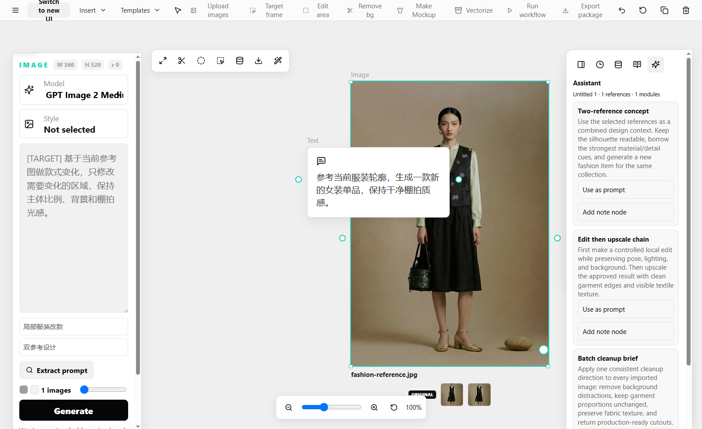

# Vincent-s-Canvas

公司内部设计师使用的无限画布图片工作台。目标是把项目管理、参考图、提示词、图片生成、局部编辑、批量处理、工作流节点、素材沉淀、历史记录、账号额度和后台监控放在同一个受控系统里。



## 当前定位

这个仓库保留 Vite + React 前端和本地 Node HTTP API，不整体迁移到其他开源项目架构。功能形态参考 Recraft、basketikun infinite-canvas、T8 penguin canvas 和 hero8152 Infinite-Canvas：画布是项目内部的主工作台，模型密钥和额度逻辑放在后端，前端只负责设计师操作体验。

## 已实现能力

- 登录后先进入用户端首页，不会直接显示画布。
- `Projects` 支持新建独立任务，每个任务进入自己的无限画布。
- `Profile` 展示设计师姓名、账号角色、剩余额度和已用额度。
- `History` 展示历史出图记录、模型、消耗额度、项目来源和结果缩略图。
- 项目画布采用 Recraft 式布局：顶部工具栏、左侧 `IMAGE`/Prompt 卡片、中央无限画布、右侧 Context/History/Assets/Prompts/Assistant 面板。
- 画布支持外部图片拖拽导入、图片粘贴导入、节点自由拖动、图片缩放、复制、删除、撤销/重做、滚轮缩放、小地图和视图重置。
- 图片节点支持双击后在图片下方直接输入 Prompt、选择模型并生成。
- 左侧 Prompt 面板也支持选择模型、填写提示词、选择出图数量并生成，形成双入口模型选择。
- 模型选择器按分组展示 GPT Image、Nano Banana、Flux、Upscale、Remove BG 等模型或操作能力。
- 图片旁工具栏支持放大、去背景、框选编辑、保存素材、下载和 Magic edit。
- 框选编辑会弹出确认窗口，可选择 rectangle、ellipse、freehand。确认后结果图会放在原图旁边，可继续下一轮编辑。
- 批量模式支持导入文件夹或示例队列，按同一个 Prompt 逐张处理图片并把结果放回画布。
- 工作流模式支持从图片右侧端口拉出模块选择器，创建 Generate、Edit、Upscale、Remove BG、Upload reference 节点并自动连线。
- 多图参考支持选择两张或多张图片，作为同一组 references 连接到一个生成节点。
- 生成结果会进入右侧 `Assets` 素材库，素材可以再次插回画布继续使用。
- 后端托管模型 API，前端只传模型 id 和参数，不保存真实 provider API key。
- 管理员后台支持 provider 状态、审计记录、用量统计和设计师额度调整。

## 主要文件

- `src/App.tsx`: 用户端首页、项目页、Recraft 式画布、节点 UI、顶部工具栏、右侧 Dock、管理员 UI。
- `src/domain/workspace.ts`: 画布领域模型、节点、连线、多选、批量、工作流、多图参考、撤销重做、素材保存。
- `src/services/modelApi.ts`: 前端调用后端模型、工作区、历史、额度 API。
- `server/api.ts`: 后端模型路由、账号额度、历史、管理员审计和 provider 状态。
- `server/http.ts`: 本地 HTTP API server，包含 workspace 快照保存和模型操作接口。
- `src/App.test.tsx`, `src/domain/workspace.test.ts`, `server/*.test.ts`: 用户路径、画布交互、后端接口和领域逻辑测试。

## 本地运行

安装依赖：

```bash
npm install
```

启动后端 API：

```bash
npm run api
```

另开一个终端启动前端：

```bash
npm run dev
```

打开 Vite 输出的地址，通常是：

```text
http://127.0.0.1:5173/
```

## 后端 API

浏览器端不保存真实模型 API key。所有模型调用通过后端接口进入 provider adapter，后续可以替换为 GPT Image、Nano Banana、RunningHub、ComfyUI 或公司内部模型。

- `GET /api/models`
- `GET /api/profile`
- `GET /api/history`
- `GET /api/admin/audit`
- `GET /api/admin/usage`
- `GET /api/admin/jobs`
- `GET /api/admin/providers`
- `POST /api/admin/credits`
- `POST /api/generations`
- `POST /api/edits`
- `POST /api/upscale`
- `POST /api/remove-bg`
- `GET /api/workspace`
- `POST /api/workspace`

写入接口使用统一的 `GenerationRequest`，返回统一的 `GenerationResult`。请求可以带 `x-request-id`，用于防止重复提交和重复扣额度。

## 验证

```bash
npm test -- --run
npm run build
```

当前测试覆盖：

- 登录后首页不显示画布，创建项目后才进入画布。
- 外部图片拖拽进画布、粘贴图片进画布、节点拖动和缩放。
- 左侧 Prompt 面板和图片内联 Prompt 的双入口模型选择。
- 模型分组下拉菜单。
- 工具栏放大、去背景、下载、Magic edit、框选编辑确认。
- 批量处理和生成历史写入。
- 工作流节点创建、连线、多图参考和链式运行。
- 素材保存和复用。
- 后端额度扣减、重复提交保护、账号隔离、管理员调额。
- 大图 Data URL 工作区快照保存，保证真实拖入图片后可以被后端托管。

## 下一阶段

- 接入真实模型 provider adapter，例如 GPT Image、Nano Banana、RunningHub、ComfyUI。
- 扩展图片工具栏操作，例如裁剪、局部重绘、变体对比、Mockup、矢量化和导出规范。
- 增强团队素材库、搜索、标签、项目权限和管理员审计。
- 做更细的画布性能优化，支持更大项目和更多图片节点。
