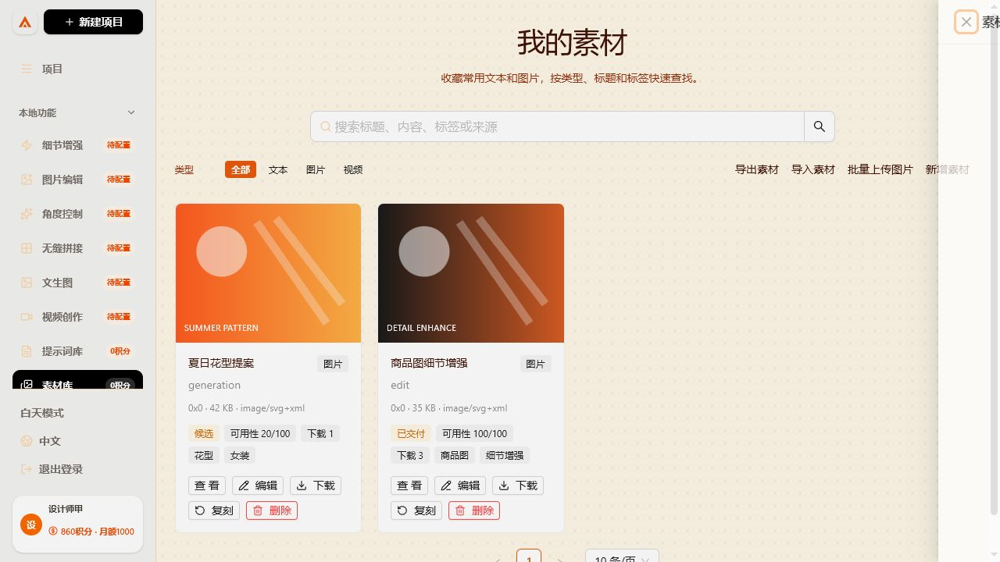
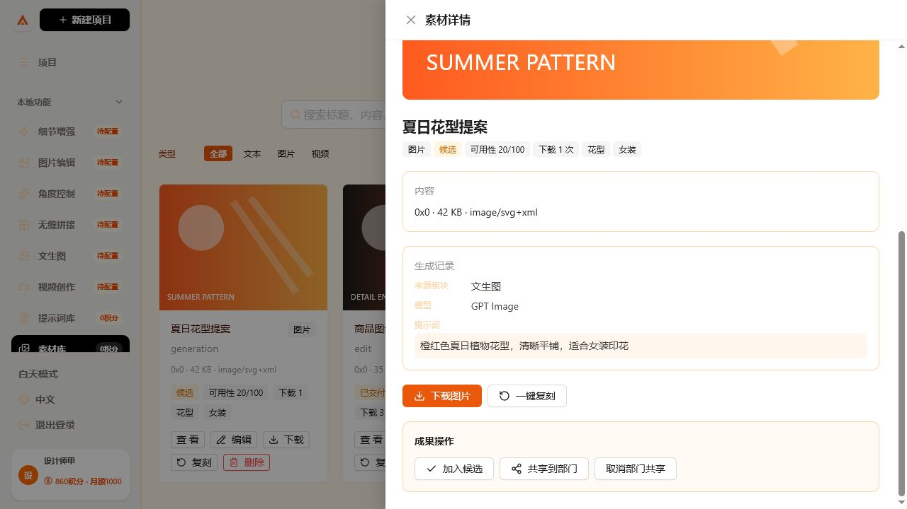
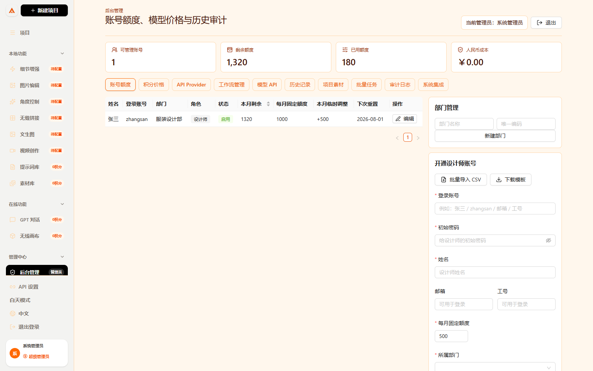
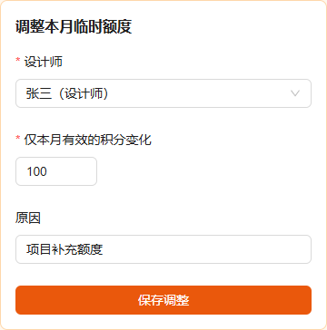
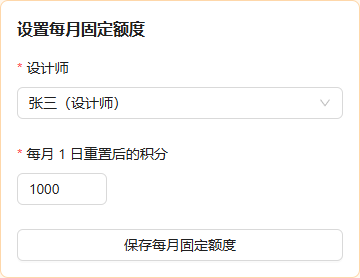
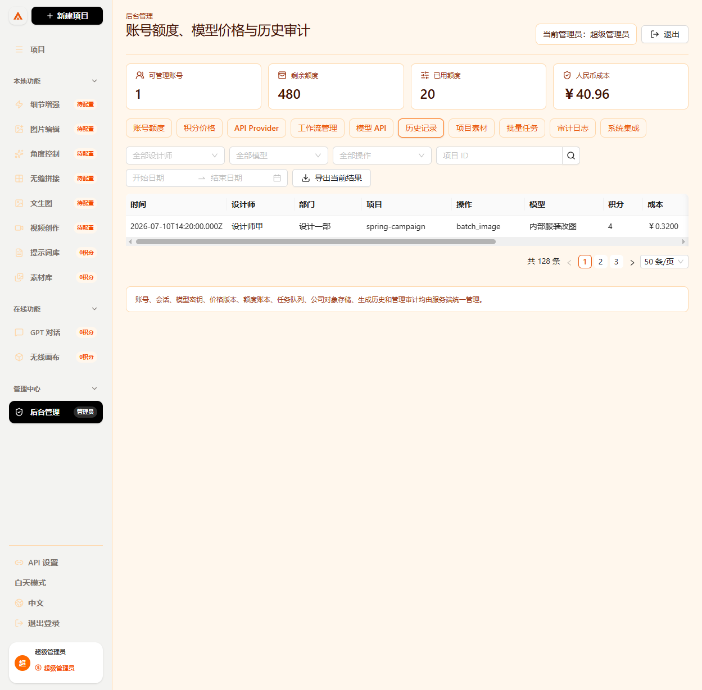

# 无线画布

无线画布是一套给公司内部设计团队使用的 AI 创作工作台。它把项目、文生图、细节增强、图片编辑、角度控制、无缝拼接、视频创作、提示词库、素材库、无线画布、设计师额度、模型 API、价格规则、历史记录、批量任务和审计日志放在同一个系统里。

一句话理解：这是一个“设计师前台创作工具 + 管理员后台管控中心”。

生产服务器部署、企业微信、工作流、备份恢复和 40 人压测请参阅：[生产部署与验收手册](docs/manual/production-deployment.md)。第一阶段每项需求的实现与证据见：[第一阶段验收矩阵](docs/manual/phase-one-acceptance.md)。

正式上线前可运行 `bun ops/preflight/production-preflight.ts --require-wecom`，在不打印任何 Secret 的前提下检查生产环境变量、HTTPS 回调、对象存储、加密密钥、Worker 并发与模拟任务模式。

生产式并发基线：40 位设计师持续提交 2 分钟，共成功提交并完成 4,573 个模拟出图任务，请求失败率 0.00%，P95 为 106.77 ms；任务、额度结算、素材和历史记录数量完全一致。最新服务端媒体、恢复和隔离验证见 [GitHub Actions 记录](https://github.com/Jizhidemu52/Vincent-s-Canvas/actions/runs/29096875561)。


## 角色怎么区分

设计师入口是：

```text
http://localhost:3000/login
```

管理员入口是：

```text
http://localhost:3000/admin/login
```

两个入口明确分开，服务端还会核对账号角色，设计师账号不能从管理员入口进入后台：

| 身份 | 进入哪里 | 能看到什么 | 不能做什么 |
| --- | --- | --- | --- |
| 设计师 | 创作工作台 | 自己的项目、任务、素材和积分 | 不能进入后台或查看他人数据 |
| 部门管理员 | 部门后台 | 本部门设计师账号、额度和审计数据 | 不能查看其他部门或配置全局模型密钥 |
| 超级管理员 | 全局后台 | 全公司账号、部门、额度、模型、价格和审计 | 首次登录必须改密并启用二次验证 |


## 每个入口消耗多少积分

前台左侧菜单会直接标注积分，设计师不用猜价格。管理员在后台修改价格规则后，前台预估会跟着后台规则走。

| 模块 | 默认前台标注 | 作用 | 适合谁用 |
| --- | --- | --- | --- |
| 文生图 | 12 积分 | 输入提示词生成图片，支持模型、尺寸、数量和质量设置 | 设计师 |
| 细节增强 | 9 积分 | 上传原图后做高清放大、细节修复、质感增强 | 设计师 |
| 图片编辑 | 10 积分 | 基于参考图做局部编辑、替换、修复、风格调整 | 设计师 |
| 角度控制 | 10 积分 | 围绕产品或角色生成正面、侧面、俯视、45 度等视角 | 设计师 |
| 无缝拼接 | 2 积分 | 上传纹理图，按横向和纵向倍率生成连续平铺素材 | 设计师 |
| 视频创作 | 30 积分起 | 输入提示词和参考图生成视频，实际预估为操作价加模型价 | 设计师 |
| 提示词库 | 0 积分 | 保存常用提示词，方便复用 | 设计师 |
| 素材库 | 0 积分 | 保存图片、视频、文本素材，按项目复盘 | 设计师和管理员 |
| GPT 对话 | 0 积分 | 在画布场景里讨论项目、拆提示词、整理生成思路 | 设计师 |
| 无线画布 | 0 积分 | 多项目画布、节点拖拽、连线、导入导出 | 设计师 |
| 后台管理 | 管理员 | 管账号、额度、模型、API、价格、历史、项目、批量任务、审计 | 管理员 |

额度不足时，任务不能提交。任务失败、重复提交、批量任务单张失败等情况，建议在正式后端里统一走额度账本，方便追踪每一笔积分变化。

## 新手最快上手

### 第 1 步：启动完整服务

正式登录依赖 PostgreSQL 和 Redis，推荐在安装了 Docker Compose 的公司服务器运行：

```bash
cp .env.example .env
# 编辑 .env，替换所有 replace-with 开头的值
docker compose up -d --build
```

生成 MFA 加密密钥：

```bash
openssl rand -base64 32  # MFA_ENCRYPTION_KEY
openssl rand -base64 32  # PROVIDER_ENCRYPTION_KEY，必须使用另一把密钥
```

首次启动会自动执行数据库迁移并创建首位超级管理员。打开 `http://服务器地址:3000/admin/login`，使用 `.env` 中的管理员账号和初始密码登录，随后系统会强制修改密码并启用六位动态验证码。

首位超级管理员创建成功后，可以从 `.env` 删除 `BOOTSTRAP_ADMIN_PASSWORD`；后续重启只会检查管理员是否存在，不会重复创建。

企业微信扫码登录还需由公司 IT 在企业微信管理后台创建自建应用，并把可信回调地址设置为：

```text
https://你的正式域名/api/auth/wecom/callback
```

然后填写 `.env` 中的 `WECOM_CORP_ID`、`WECOM_AGENT_ID`、`WECOM_SECRET` 和 `WECOM_CALLBACK_URL`。未配置企业微信时，账号密码登录仍可使用。

仅开发前端界面时，可以进入 `web` 目录：

进入项目的 `web` 目录：

```bash
cd web
bun install
bun run dev
```

前端会把 `/api` 代理到 `http://localhost:3100`。没有启动后端时只能查看登录页，不能使用演示账号绕过服务端鉴权。启动后打开：

```text
http://localhost:3000/login
```

生产环境不要使用裸 HTTP，也不要把 PostgreSQL、Redis 或 API 服务端口直接暴露到公网。

本地验收任务队列时可暂时设置 `TASK_MOCK_MODE=true`。Worker 会走完整的排队、积分冻结、处理、历史入库和成功结算流程，但返回系统生成的 QA 占位图，不调用外部模型。正式上线必须改回 `false`，并在后台配置 Provider 和模型。

### 第 2 步：选择身份

1. 普通设计师选择设计师账号。
2. 点击 `登录设计师工作台`。
3. 管理员点击 `打开管理员登录`。
4. 管理员登录页只显示管理员账号，普通设计师不会出现在后台登录选择里。

### 第 3 步：看左侧菜单

设计师登录后，左侧是工作入口：

- 项目
- 文生图
- 细节增强
- 图片编辑
- 角度控制
- 视频创作
- 提示词库
- 素材库
- GPT 对话
- 无线画布

管理员登录后，左侧会额外出现：

- 后台管理
- API 设置

设计师不会看到这些管理入口。

## 模块图文操作手册

### 1. 登录入口


怎么操作：

1. 打开 `http://localhost:3000/login`。
2. 如果是设计师，输入管理员开通的账号和密码。账号可以是中文名、英文账号、邮箱或工号。
3. 点击 `登录设计师工作台`；英文账号不区分大小写，中文账号支持正常中文输入。
4. 如果是管理员，点击右侧 `打开管理员登录`。
5. 管理员在后台登录页选择管理员账号后进入后台。

你应该看到的结果：

- 设计师只能进入创作工作台。
- 管理员可以进入后台管理。
- 普通设计师不会看到额度、价格、模型 API、审计日志这些管理入口。

### 2. 项目工作台


这个模块做什么：

- 管理设计项目。
- 新建设计项目。
- 查看最近打开的项目。
- 进入画布继续编辑。
- 从项目维度查看素材、模型和成本。

怎么操作：

1. 登录设计师工作台。
2. 点击左侧 `项目`。
3. 点击 `新建项目` 新增项目。
4. 点击已有项目卡片进入项目。
5. 后续生成的图片、编辑结果、素材都可以按项目归档。

### 3. 文生图


这个模块做什么：

- 输入文字提示词生成图片。
- 选择模型、尺寸、质量和生成数量。
- 根据后台价格规则显示预计积分。
- 生成结果可以进入素材库或画布。

怎么操作：

1. 点击左侧 `文生图`。
2. 在 `提示词` 输入框写清楚画面内容、风格、材质和用途。
3. 选择模型。
4. 选择质量、尺寸、比例和生成张数。
5. 查看页面上的预计积分。
6. 点击生成按钮。
7. 生成完成后保存到素材库、加入参考图或下载。

积分说明：

- 默认 12 积分/张。
- 管理员可以在 `后台管理 -> 积分价格` 修改生成一张图的积分。
- 不同模型也可以在 `后台管理 -> 模型 API` 设置不同单次成本。

### 4. 细节增强


这个模块做什么：

- 对已有图片进行放大。
- 修复模糊细节。
- 增强材质、纹理、清晰度。
- 适合产品图、服装图、面料图、头像图的二次增强。

怎么操作：

1. 点击左侧 `细节增强`。
2. 在参考图区上传原图，或使用剪切板导入。
3. 在提示词里写增强要求，例如“保留原构图，提升布料纹理和边缘清晰度”。
4. 选择模型和尺寸。
5. 查看预计积分。
6. 点击增强按钮。

积分说明：

- 默认 9 积分/次。
- 管理员可以在后台把“放大图片”或增强类操作改成新的积分规则。

### 5. 图片编辑


这个模块做什么：

- 对参考图做局部修改。
- 替换背景、补图、修图、改颜色、改材质。
- 保留主体，按提示词调整局部区域。

怎么操作：

1. 点击左侧 `图片编辑`。
2. 上传需要编辑的参考图。
3. 在提示词中说明要改哪里、怎么改、哪些地方必须保留。
4. 选择模型、质量和尺寸。
5. 查看预计积分。
6. 点击编辑按钮。

积分说明：

- 默认 10 积分/次。
- 管理员可以在 `积分价格` 里调整“局部编辑”的积分。

### 6. 角度控制


这个模块做什么：

- 根据产品或角色参考图生成不同视角。
- 常用视角包括正面、侧面、背面、俯视、45 度。
- 适合做产品图、角色设定、服装款式多角度展示。

怎么操作：

1. 点击左侧 `角度控制`。
2. 上传主体参考图。
3. 在提示词中写明需要的角度，例如“生成同一件夹克的正面和侧面视图”。
4. 选择模型和输出尺寸。
5. 查看预计积分。
6. 点击生成。

积分说明：

- 默认 10 积分/次。
- 当前按图片编辑类操作计费，管理员可以在后台调整。

### 7. 无缝拼接


这个模块做什么：

- 把一张纹理图处理成可连续平铺的无缝素材。
- 横向和纵向可以分别选择 2、4、6、8 倍。
- 结果可下载，并同步保存到素材库和历史记录。

怎么操作：

1. 点击左侧 `无缝拼接`。
2. 粘贴图片、上传图片，或从素材库选择一张图片。
3. 选择横向倍数和纵向倍数；接口要求两项都使用 2 的倍数。
4. 确认按钮旁显示 `2 积分`。
5. 点击 `开始无缝拼接`。
6. 成功后在右侧查看、下载结果，或到素材库继续复用。

扣费说明：

- 默认 2 积分/次，管理员修改后台价格规则后，设计师端会同步显示新价格。
- 只有成功结果才扣积分；接口失败时不会扣除设计师额度。

### 8. 视频创作


这个模块做什么：

- 设置视频提示词、参考图、比例、时长、质量和模型。
- 前端上传参考图后只提交同源任务，Worker 在服务端调用 OpenAI 兼容视频接口或管理员绑定的工作流。
- 页面显示本次预计积分和设计师剩余额度；额度不足时服务端拒绝提交。

怎么操作：

1. 点击左侧 `视频创作`。
2. 输入视频提示词。
3. 上传参考图或选择项目素材。
4. 选择视频模型、比例、时长和质量。
5. 查看模型成本说明。
6. 点击生成。

积分说明：

- 前台默认显示 `按模型`。
- 管理员在 `后台管理 -> 模型 API` 或 `工作流管理` 中设置具体模型成本。

### 9. 提示词库


这个模块做什么：

- 保存常用提示词。
- 按标签、项目、用途管理提示词。
- 帮团队沉淀稳定可复用的出图写法。

怎么操作：

1. 点击左侧 `提示词库`。
2. 新增提示词，填写标题、内容、标签和适用场景。
3. 在生成图片时复制或引用提示词。
4. 团队可以把好用的提示词整理成模板。

积分说明：

- 浏览和管理提示词默认 0 积分。
- 真正生成图片时才按文生图、编辑、增强等操作扣积分。

### 10. 素材库



这个模块做什么：

- 保存项目图片、视频、文本素材。
- 每条素材写入所属设计师 `ownerId`，按项目、设计师、操作类型归档。
- 每张生成结果显示成果状态、可用性分数和下载次数，分数可以追溯到服务端事件。
- 设计师 A 只能看到 A 的素材，设计师 B 只能看到 B 的素材。
- 管理员可以查看全部设计师素材，并按设计师姓名筛选。

怎么操作：

1. 点击左侧 `素材库`。
2. 上传素材，或从生成结果保存到素材库。
3. 给素材设置项目、分类、标签和说明。
4. 点击素材图片或 `查看` 打开详情，检查来源板块、模型和完整提示词。
5. 点击 `加入候选` 后，该成果增加 5 分；重复点击会保留操作记录，但不会重复加分。
6. 点击 `下载`。文件响应成功并触发浏览器保存后，首次下载增加 15 分；重复下载只增加次数。
7. 点击 `一键复刻`，系统先记录继续编辑或跨成员复用事件，再携带提示词和模型跳转到原功能板块。
8. 需要团队复用时点击 `共享到部门`；取消共享后，其他成员不能再发起新的复用。



成果状态与分数：

| 行为 | 分值 | 谁可以操作 |
| --- | ---: | --- |
| 加入候选 | 5 | 素材所有者 |
| 加入正式项目 | 10 | 素材所有者 |
| 继续编辑或作为参考图 | 10 | 素材所有者 |
| 被其他成员复用 | 15 | 已获共享权限的其他成员 |
| 首次成功下载 | 15 | 素材所有者；重复下载不重复计分 |
| 正式导出 | 20 | 素材所有者 |
| 确认采用 | 30 | 对应管理员；后续小组阶段扩展给组长 |
| 最终交付 | 40 | 对应管理员；后续小组阶段扩展给组长 |

同一计分行为只计一次，单张图片最高 100 分。管理员下载、系统备份、素材同步、预览和复制链接不计入首次下载。浏览器无法证明操作系统最终写盘，因此系统的“成功下载”口径是：文件响应完整成功，并且前端已经触发本地保存。

权限结果：

- 切换到另一个设计师账号后，看不到前一个设计师的素材。
- 管理员进入 `后台管理 -> 项目素材`，可以选择“全部设计师”或指定姓名查看。


积分说明：

- 浏览、上传、归档素材默认 0 积分。
- 使用素材发起生成任务时，按对应生成操作扣积分。

### 11. GPT 对话和无线画布


这个模块做什么：

- 在画布里拖拽图片、文字和生成结果。
- 把灵感、提示词、参考图、出图结果放在同一个项目里。
- GPT 对话用于拆解需求、优化提示词、整理生成方案。
- 支持画布素材导入导出。

怎么操作：

1. 点击左侧 `无线画布` 进入画布。
2. 新增节点，把图片、文字、提示词放进画布。
3. 使用连线表达素材关系。
4. 点击 `GPT 对话` 进入对话模式，整理提示词和生成计划。
5. 把画布里的素材继续送到文生图、编辑或素材库。

积分说明：

- 进入画布和整理内容默认 0 积分。
- 如果后续从画布触发图片生成、编辑或增强，按对应操作扣积分。

### 12. 画布批量一键改图


这个入口在无线画布项目页的底部工具栏里，适合一次性处理一个文件夹里的多张图片。

怎么操作：

1. 点击左侧 `无线画布`。
2. 新建或打开一个画布项目。
3. 点击底部工具栏里的 `批量改图`。
4. 点击 `上传文件夹` 或 `选择多张图片`。
5. 在提示词框里写统一编辑要求，例如“白底图产品摄影，保留产品结构，提升质感和光影，适合电商详情页”。
6. 确认待处理图片数量和文件名顺序。
7. 点击 `一键生图`。
8. 提交后，每张图片会分别显示 `等待中`、`处理中`、`已暂停`、`成功`、`失败` 或 `已取消`。
9. 需要临时调整任务时，可以暂停等待项、恢复暂停项或取消尚未处理的图片；正在处理和已经完成的图片不会被重复提交。
10. 结果会按顺序生成，并和原图成对出现在当前画布旁边；成功结果会同步进入历史记录和素材库。

扣费规则：

- 批量改图按每张图计费。
- 整个文件夹只创建一个服务端批次，每张图片仍有独立任务和账本记录。
- 某一张失败不会影响整批继续执行。
- 成功的图片进入 History 并扣除额度；失败图片记录失败原因。
- 管理员可以在 `后台管理 -> 积分价格` 里调整“批量处理每张图”的积分。

### 13. 后台管理



这个模块做什么：

- 管理设计师账号。
- 分开管理“每月固定额度”和“本月临时额度”。
- 设置每个操作消耗多少积分。
- 管理 API Provider、模型 API、RunningHub、ComfyUI 和本地工作流。
- 查看历史记录、项目素材、批量任务和审计日志。

怎么操作：

1. 打开 `http://localhost:3000/login`。
2. 点击 `打开管理员登录`。
3. 选择管理员账号进入后台。
4. 在 `账号额度` 里设置每月固定额度，或临时增加、扣减仅本月有效的积分。
5. 在 `积分价格` 里设置生成、放大、去背景、局部编辑、批量处理的积分。
6. 在 `模型 API` 里配置模型名称、模型 ID、能力、单次积分成本、价格、启用状态和 Provider。
7. 在 `工作流管理` 里配置 RunningHub、ComfyUI 或本地工作流模板。
8. 在 `历史记录`、`批量任务` 和 `审计日志` 里复盘谁用了什么模型、花了多少积分、生成了哪些结果。
9. 在 `系统集成` 查看企业微信、公司对象存储、服务端加密密钥、Worker 并发以及 LDAP/OIDC 预留状态。

权限说明：

- 只有管理员能进入后台。
- 只有管理员能修改额度、积分、模型 API、Provider 和工作流。
- 普通设计师直接访问 `/admin` 会被拦到管理员登录页。

### 14. 系统集成诊断


这个页面只对超级管理员开放，不返回 API Key、企业微信 Secret 或加密密钥原文。

怎么操作：

1. 使用超级管理员登录。
2. 进入 `后台管理 -> 系统集成`。
3. 查看 `企业微信 SSO` 是否列出缺失的环境变量。
4. 确认企业微信回调地址使用 HTTPS。
5. 确认 `公司对象存储`、`Provider 密钥加密` 和 `管理员 MFA 加密` 显示 `可用`。
6. 确认正式环境没有出现“模拟任务模式”警告。
7. 修改服务器 `.env` 并重启 API 后，点击 `刷新状态` 查看最新结果。

LDAP 和 OIDC 当前显示“接口已预留”，首版仍推荐使用企业微信或账号密码登录。

## 管理员后台能管什么

### 账号和额度


管理员可以查看每个设计师：

- 姓名
- 角色
- 状态
- 本月剩余
- 每月固定额度
- 本月临时调整
- 下次重置日期

管理员有两个不同的额度入口：



- `调整本月临时额度`：例如本月临时增加 500，只在当前上海自然月有效；下月 1 日自动失效，不改变每月固定额度。



- `设置每月固定额度`：决定以后每月 1 日重置后的新额度。例如固定额度为 1000，本月临时加 500，本月可用额度会增加，但下月仍重置为 1000。
- 上月未使用积分不结转；月度重置由服务端原子执行并写入额度账本，同一个月不会重复重置。
- 上月失败任务在下月释放时不会把已过期积分返到新月份。

开通账号时，`登录账号` 支持以下形式：

- 中文名，例如 `李华`
- 英文账号，例如 `lihua` 或 `designer-lihua`
- 公司邮箱，例如 `lihua@company.com`
- 员工工号，例如 `D20260018`

每个账号仍有唯一内部 ID，素材归属使用内部 ID，不会因为设计师改显示姓名而串库。

### 积分和价格

可以设置不同操作消耗多少积分：

- 生成一张图
- 放大图片
- 去背景
- 局部编辑
- 批量处理每张图
- 无缝拼接

也可以记录人民币成本，方便内部核算。前端设计师看到的积分预估会和后台规则保持一致。

### API Provider

统一管理外部模型 API：

- Provider 名称
- Provider ID
- 协议类型
- Base URL
- 图片请求模式
- 文生图接口
- 图片编辑接口
- 支持的图片模型、聊天模型、视频模型
- 默认积分成本
- 默认人民币成本
- 是否启用
- 是否主 Provider

普通前端只看到模型名称、能力、价格和状态，不应该看到 API Key。

#### 公司素材存储


正式版本不再使用浏览器里的“公司素材数据库地址”或 Bearer Token 配置。Web 只把文件上传到同源 `/api/assets`，API 从当前 Session 取得设计师 UUID，把素材元数据写入 PostgreSQL，并把文件写入 S3/MinIO 或公司的 S3 兼容对象存储。

管理员配置步骤：

1. 在服务器 `.env` 配置 `S3_ENDPOINT`、`S3_BUCKET`、`S3_ACCESS_KEY_ID` 和 `S3_SECRET_ACCESS_KEY`。
2. 执行 `docker compose up -d --build`，初始化容器会创建 Bucket 并启用版本保护。
3. 管理员登录后进入 `系统集成`，确认“对象存储”显示可用。
4. 设计师在素材库上传一张测试图，或提交一次模拟生成。
5. 设计师只能在“我的素材”看到自己的文件；超级管理员在 `素材监管` 按设计师或部门筛选。

正式素材接口：

| 方法 | 路径 | 权限与用途 |
| --- | --- | --- |
| `POST` | `/api/assets/upload-request` | 登录用户申请上传，服务端强制写入当前用户 UUID 和对象键 |
| `PUT` | `/api/assets/:id/upload` | 上传文件内容；大小必须和申请值一致 |
| `GET` | `/api/assets` | 设计师只返回本人素材；管理员按角色扩大范围 |
| `GET` | `/api/assets/:id/content` | 校验所有权或管理员范围后读取对象内容 |
| `GET` | `/api/assets/:id/events` | 查询授权范围内的成果事件和最新评分投影 |
| `POST` | `/api/assets/:id/events` | 写入候选、编辑、复用、导出、采用或交付等幂等事件 |
| `POST` | `/api/assets/:id/download-receipts` | 文件成功响应并触发保存后写下载回执；首次下载自动去重 |
| `POST/DELETE` | `/api/assets/:id/share` | 共享或取消共享到本人部门、项目或指定用户 |
| `PATCH` | `/api/assets/:id/visibility` | 管理员加入或撤出公司素材库 |
| `POST` | `/api/admin/assets/:assetId/events/:eventId/reverse` | 管理员追加反向纠错事件，不修改或删除旧记录 |
| `DELETE` | `/api/assets/:id` | 软删除本人素材；管理员操作写入审计 |

前端不能提交一个可信的 `ownerId` 来冒充别人。对象键使用 `users/{用户UUID}/...` 分区，数据库查询仍必须带用户或部门条件；对象键只是存储组织方式，不代替服务端权限校验。需要换成公司已有对象存储时，只要它兼容 S3 协议，替换服务器环境变量即可，不需要给设计师新增配置入口。

成果事件保存在 PostgreSQL 的 `asset_events` 表。`idempotency_key` 防止重复提交，`first_effective` 标记第一次有效计分，`source_event_id` 用于反向纠错。生成 Worker 保存文件后自动写入 `asset.generated`；历史生成素材在执行迁移 `010_asset_events.sql` 时幂等回填。任何统计系统都应从事件和评分投影读取，不要在浏览器重新计算分数。

#### 内部 AI：App Key JSON 协议


这块是本项目为内部无缝拼接接口提供的专用配置入口，只有管理员能看到。

操作步骤：

1. 使用管理员账号登录，进入 `后台管理 -> API Provider`。
2. 在页面顶部找到 `内部 AI · App Key JSON 协议`。
3. 填写无缝拼接接口地址，例如 `http://122.247.78.91:8101/std/tohwkdpj`。
4. 在 `App Key` 中填写管理员拿到的密钥。没有 App Key 时 Provider 保持停用，设计师端不会出现一个实际不可用的模型。
5. 点击 `保存到服务端`。
6. 点击 `测试连接`，页面会显示接口返回结果。
7. 打开 `积分价格`，确认“无缝拼接”为 `2` 积分；内部无缝拼接模型成本保持 `0` 积分，避免操作价与模型价重复相加。
8. 让设计师重新打开页面或等待最多 30 秒，左侧“无缝拼接”会同步显示 `2积分`。

安全说明：

- 完整 App Key 使用 `PROVIDER_ENCRYPTION_KEY` 加密后保存在 PostgreSQL 的 Provider 凭据字段中，不写入浏览器、README 或 Git。
- 浏览器重新打开页面时只能看到脱敏状态，例如 `abcd***wxyz`，无法取回完整 Key。
- 配置接口使用正式 Session 鉴权，并强制要求 `super_admin`；设计师和部门管理员都不能读取或修改 App Key。
- 保存配置会自动创建或更新“内部 AI”Provider、“无缝拼接”工作流和 `internal-seamless` 模型，不需要再在通用表单里重复配置。
- 如果测试显示“10002 工作节点未启动”，表示远端内部 AI 的处理节点未启动，不是本地保存失败；需要接口维护人员启动远端工作节点。

设计师实际提交链路：

```text
上传原图 -> 公司对象存储 -> 创建 seamless_stitch 任务 -> 冻结 2 积分
         -> Worker 解密 App Key 调内部接口 -> 结果写回个人素材库和历史记录
         -> 成功结算 2 积分 / 失败、取消或超时自动退还
```

同一个 `requestId` 重复提交只返回同一个任务，不会重复扣费；其他设计师不能复用这个请求号。生成结果按 `users/{设计师ID}/generated/...` 保存，A 设计师不能查看 B 的素材，超级管理员可以在后台按设计师筛选查看。

### 工作流管理

工作流管理用于统一管理：

- RunningHub 工作流
- ComfyUI / 本地工作流
- 本地批量处理流程

这里可以把常见能力整理成模板，例如：

- 高清放大
- 局部编辑
- 批量处理
- 角度控制
- 去背景

### 历史记录



管理员可以查看所有设计师的出图历史，包括：

- 操作人
- 项目
- 原图
- 结果图
- 提示词
- 使用模型
- 生成数量
- 消耗积分
- 金额成本
- 操作类型
- 成功/失败状态
- 失败原因

历史记录支持按设计师、项目 ID、模型、操作类型和日期范围组合筛选，列表采用服务端分页，不会一次把全公司的记录全部加载到浏览器。点击 `导出当前结果` 后，服务端会在相同权限和筛选条件下生成 CSV，并自动记录真实导出行数，方便财务、审计或内部复盘。单次结果超过 50,000 条时需要先缩小时间范围，避免生成超大报表影响平台任务。

## 接入模型 API 的基本流程

### 普通 Provider

1. 进入后台。
2. 打开 `API Provider`。
3. 选择已有 Provider，或填写新的 Provider。
4. 填写 Provider ID、显示名称、协议、Base URL、图片请求模式和模型 ID。
5. 保存 Provider。
6. 在密钥区域选择密钥类型，输入 API Key。
7. 保存密钥状态。
8. 打开 `模型 API`，为模型设置能力、积分成本、人民币成本和启用状态。
9. 回到前台创作页面，在模型选择里使用对应模型。

图片、视频和音频都使用同一套规则：任务操作价加模型价。模型能力必须与任务匹配，例如音频模型需要 `audio` 能力、视频模型需要 `video` 能力；后端会再次校验，不能只依赖前端下拉框。

### 内部 AI App Key 接口

1. 进入 `后台管理 -> API Provider`。
2. 使用页面顶部的 `内部 AI · App Key JSON 协议` 专用卡片，不需要在通用 Provider 表单里重复填写。
3. 填接口地址和 App Key，点击 `保存到服务端`。
4. 点击 `测试连接`。
5. 在 `积分价格` 确认无缝拼接为 2 积分。
6. 测试成功后，设计师进入 `本地功能 -> 无缝拼接`，上传图片并提交任务。
7. 管理员到 `历史记录`、`批量任务`、`素材监管` 或 `审计日志` 查看结果、积分和失败原因。

生产环境必须配置 32 字节的 `PROVIDER_ENCRYPTION_KEY`，并只通过管理员 Session 调用 `/api/admin/internal-ai`。不要把真实 App Key 写进 `.env.example`、源码、README、前端环境变量或 Git 提交。

## 详细操作手册

完整的新手操作手册请看：

[docs/manual/operation-manual.md](docs/manual/operation-manual.md)

里面按模块写了：

- 第一次怎么启动
- 每个按钮在哪里
- 每个模块是干什么的
- 设计师怎么生成图片
- 管理员怎么配置账号额度
- 管理员怎么接入接口
- 管理员怎么看历史记录
- 批量任务怎么理解
- 常见问题怎么排查

## 常用地址

| 页面 | 地址 |
| --- | --- |
| 登录入口 | `http://localhost:3000/login` |
| 首页 / 项目 | `http://localhost:3000` |
| 文生图 | `http://localhost:3000/image` |
| 细节增强 | `http://localhost:3000/image?tool=detail-enhance` |
| 图片编辑 | `http://localhost:3000/image?tool=image-edit` |
| 角度控制 | `http://localhost:3000/image?tool=angle-control` |
| 无缝拼接 | `http://localhost:3000/image?tool=seamless-stitch` |
| 视频创作 | `http://localhost:3000/video` |
| 素材库 | `http://localhost:3000/assets` |
| 提示词库 | `http://localhost:3000/prompts` |
| GPT 对话 | `http://localhost:3000/canvas?tool=gpt-chat` |
| 无线画布 | `http://localhost:3000/canvas` |
| 后台登录 | `http://localhost:3000/admin/login` |
| 后台管理 | `http://localhost:3000/admin` |

## 构建

```bash
cd web
bun run build
```

## Docker

```bash
docker build -t wireless-canvas .
docker run --rm -p 3000:3000 wireless-canvas
```

## 当前版本说明

当前版本已经包含：

- PostgreSQL 账号、部门、项目、任务、素材、历史、额度账本和审计数据。
- Redis Session、登录限流和优先级任务队列。
- 超级管理员、部门管理员、设计师三级服务端权限。
- Provider API Key 服务端加密存储，设计师端不提供密钥配置入口。
- 图片、视频、音频和工作流任务统一经过 Worker，成功结算、失败释放额度。
- S3/MinIO 素材对象存储、按设计师隔离、管理员跨用户监管。
- 数据库备份恢复、40 人持续并发和跨账号隔离的 GitHub Actions 验证。

正式上线仍需要公司 IT 提供域名、HTTPS 网关、生产服务器、企业微信自建应用参数和正式对象存储凭据。上线步骤见 [生产部署与验收手册](docs/manual/production-deployment.md)。
