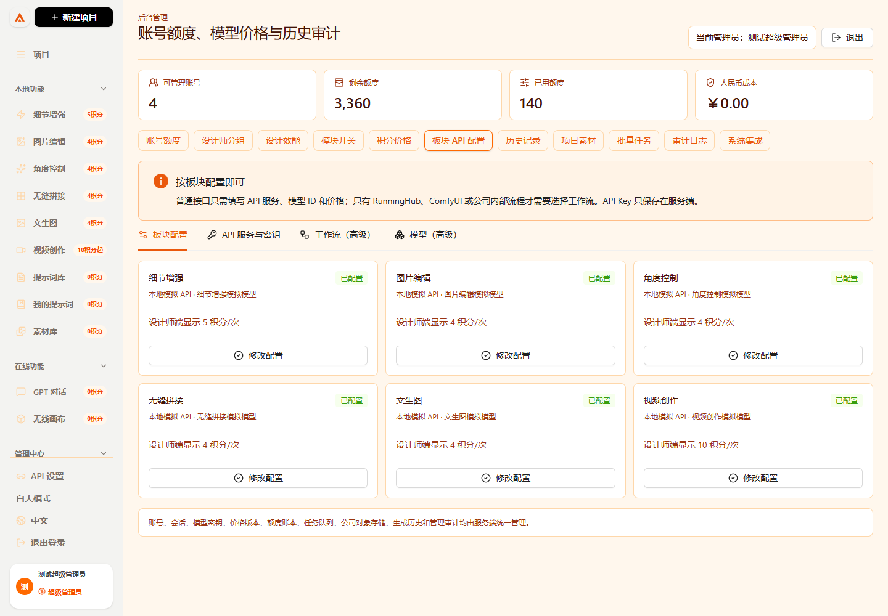
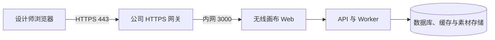

# 无线画布无脑部署手册

这份手册给第一次部署系统的人使用。不需要懂前端、后端或数据库；按顺序完成每一步，就能把无线画布运行在自己的电脑或公司服务器上。

> 想先了解每个功能怎么用，请看 [小白操作手册](operation-manual.md)。已经有运维同事、需要企业微信、备份、HTTPS 和 40 人并发验收时，请继续看 [生产部署与验收手册](production-deployment.md)。


## 先说清楚：源码在哪里

这个 GitHub 仓库就是完整源码，不是只有一个安装包。下载或克隆仓库后，下面这些目录都会在本地：

| 目录/文件 | 用途 |
| --- | --- |
| `web/` | 设计师与管理员看到的 React 网页源码 |
| `server/` | 登录、权限、额度、任务、素材和 API 的服务端源码 |
| `docs/` | 图文操作手册、部署说明和截图 |
| `ops/` | 生产预检、备份恢复和运维脚本 |
| `docker-compose.yml` | 一条命令启动网页、API、Worker、数据库、Redis 和素材存储 |
| `.env.example` | 生产环境配置模板；复制后再填写自己的密码与密钥 |

不会提交到 GitHub 的只有 `.env`、数据库数据、上传素材和 API Key 等私密内容。这是为了防止密钥泄露，并不代表源码缺失。

## 你要准备什么

1. 一台电脑或服务器。
2. 安装 Docker Desktop（Windows/Mac）或 Docker Engine + Docker Compose（Linux）。安装完成后打开终端，运行下面两条命令；都能显示版本号才算准备好：

```powershell
docker --version
docker compose version
```

3. Git。若没有 Git，也可以在 GitHub 项目页点击 **Code -> Download ZIP** 下载源码压缩包并解压。
4. 正式上线时建议准备一个域名和公司的 HTTPS 网关/反向代理。设计师只访问 HTTPS 域名；不要把 PostgreSQL、Redis、MinIO 或 Worker 端口暴露到公网。

## 第 1 步：取得源码

### 方法 A：推荐，使用 Git

在 PowerShell 或终端中运行：

```powershell
git clone https://github.com/Jizhidemu52/Vincent-s-Canvas.git
cd Vincent-s-Canvas
```

确认能看见源码目录：

```powershell
Get-ChildItem
```

你应该能看到 `web`、`server`、`docs`、`ops`、`docker-compose.yml` 和 `.env.example`。

### 方法 B：下载 ZIP

1. 打开 GitHub 项目主页。
2. 点击绿色 **Code** 按钮。
3. 点击 **Download ZIP**。
4. 解压后进入 `Vincent-s-Canvas` 文件夹。

> 后面的所有命令都必须在这个文件夹中运行。看不到 `docker-compose.yml` 时，说明你进入了错误的目录。

## 第 2 步：创建自己的配置文件

`.env` 是你的私密配置，不能上传到 GitHub，也不能发到群里。先由模板创建它：

```powershell
Copy-Item .env.example .env
```

Linux/macOS 使用：

```bash
cp .env.example .env
```

用记事本、VS Code 或服务器编辑器打开 `.env`。第一次至少要修改下面四项，不能保留 `replace-with-...` 的示例值：

```dotenv
POSTGRES_PASSWORD=替换成一个很长的数据库密码
BOOTSTRAP_ADMIN_USERNAME=admin
BOOTSTRAP_ADMIN_PASSWORD=替换成管理员首次登录密码
PROVIDER_ENCRYPTION_KEY=替换成随机的32字节Base64密钥
S3_SECRET_ACCESS_KEY=替换成对象存储密码
```

在 Linux 服务器上可用下面命令生成 `PROVIDER_ENCRYPTION_KEY`：

```bash
openssl rand -base64 32
```

将输出完整复制到 `PROVIDER_ENCRYPTION_KEY=` 后面。这个密钥用于加密后台保存的模型 API Key；遗失后不能直接读取旧的 Provider 密钥，所以请妥善保存在公司的密码管理工具中。

**现在不要填写模型 API Key。** 系统启动并登录管理员后台后，再在后台的 API 配置页面填写。这样 Key 只保存在服务端，不会暴露给设计师浏览器。

## 第 3 步：一条命令启动

仍在项目根目录运行：

```powershell
docker compose up -d --build
```

第一次会下载镜像并构建，通常需要几分钟。看到命令结束后，再检查服务状态：

```powershell
docker compose ps
```

所有核心服务应显示为 `running` 或 `Up`。如果有服务没有启动，用下面命令查看最后 100 行日志：

```powershell
docker compose logs --tail=100 api worker web
```

## 第 4 步：打开系统并首次登录

### 在自己电脑上试跑

浏览器打开：

```text
http://localhost:3000/login
```

### 在公司服务器上试跑

把 `SERVER_IP` 换成服务器的内网 IP 或公网 IP：

```text
http://SERVER_IP:3000/login
```

用第 2 步 `.env` 中填写的 `BOOTSTRAP_ADMIN_USERNAME` 和 `BOOTSTRAP_ADMIN_PASSWORD` 登录。首次登录后立即修改管理员密码，并创建设计师账号。


登录后，设计师只会看到创作、素材和自己的提示词；管理员才会看到后台管理入口、账户额度、模型 API、价格规则、审计和公司素材监管。


## 第 5 步：管理员完成上线前配置

依次在后台完成以下动作。设计师不需要也看不到这些配置。

1. 进入 **后台管理 -> 账号管理**：创建设计师账号、设置角色、月度额度和额度上限。
2. 进入 **后台管理 -> 模型/API**：新增 Provider，填写 API 地址、服务端 API Key、模型名称、能力和启用状态。
3. 进入 **后台管理 -> 价格规则**：设置文生图、编辑、无缝拼接、视频等操作的积分与金额成本。
4. 进入 **后台管理 -> 模块开关**：只启用已接好 API 且准备开放给设计师的功能。
5. 进入 **后台管理 -> 公司素材存储**：按公司的对象存储或素材数据库配置同步入口。设计师素材默认互相隔离，管理员可按设计师查看。




填写 Provider 后，请用一个管理员测试账号提交一次任务：先观察任务进入“处理中”，再确认结果留在右侧结果区、历史记录和素材库中。任务失败时系统不能扣费或应按配置退回积分。

## 第 6 步：正式发布给设计师

公司已有 HTTPS 网关、WAF 或反向代理时，请让运维同事把正式域名的 `443` 端口转发到本机的 `3000` 端口。



正式访问地址应是：

```text
https://你的正式域名/login
```

不要让设计师通过 `:3000`、`:3100`、`:5432`、`:6379` 或 `:9000` 访问服务。只有 HTTPS 网关对外开放即可。

如需企业微信登录、HTTPS 回调、对象存储备份、Worker 并发和 40 人验收，按 [生产部署与验收手册](production-deployment.md) 继续配置。企业微信还没准备好时，可以先保留其四个 `WECOM_` 配置为空并使用账号密码登录；企业微信参数齐全后，再运行：

```bash
bun ops/preflight/production-preflight.ts --require-wecom
```

若暂未接企业微信，可省略 `--require-wecom`：

```bash
bun ops/preflight/production-preflight.ts
```

预检只检查配置是否合理，不会打印 API Key 或密码。

## 最短验收清单

在把链接交给设计师前，请亲自确认：

- [ ] `docker compose ps` 中所有核心服务正常运行。
- [ ] 管理员能登录后台并修改一个测试设计师的额度，设计师刷新后能看到新额度。
- [ ] 设计师账号看不到模型 API、价格和其他设计师的素材。
- [ ] 管理员已配置并启用至少一个可用模型。
- [ ] 提交一次任务后，会先显示处理中，完成后保留在结果区、历史记录与个人素材库。
- [ ] 失败任务没有重复扣费，管理员能在历史和审计中找到记录。
- [ ] 通过正式 HTTPS 域名能打开 `/login`，而非只靠服务器端口访问。

## 最常见的卡点

### 1. 浏览器打不开网页

先运行：

```powershell
docker compose ps
```

如果 `web` 不是运行中，查看日志：

```powershell
docker compose logs --tail=100 web
```

在服务器上使用 `http://服务器IP:3000/login` 测试；如果服务器能打开、自己电脑打不开，通常是防火墙、云安全组或公司网关没有放行 `3000`，或还没有配置 HTTPS 反向代理。

### 2. 提示管理员尚未配置模型或 API

这是正常保护机制。使用管理员账号进入 **后台管理 -> 模型/API**，配置 Provider、模型和对应模块，再启用该模块。不要让设计师在浏览器里填写 API Key。

### 3. Docker 启动失败或一直重启

最常见原因是 `.env` 仍保留示例密码，或同一台服务器已经有服务占用 `3000` 端口。查看全部日志：

```powershell
docker compose logs --tail=200
```

修改 `.env` 后重启：

```powershell
docker compose up -d --build
```

### 4. 设计师没有额度或额度没有同步

管理员在 **账号管理** 中修改后，让设计师刷新页面或重新登录。额度以服务端账本为准；不要通过浏览器开发工具修改数字。

### 5. 想更新到 GitHub 的最新版本

先备份 `.env` 与公司素材数据，再运行：

```powershell
git pull
docker compose up -d --build
```

更新后重新跑一次“最短验收清单”。正式环境的备份与恢复步骤见 [生产部署与验收手册](production-deployment.md#7-备份与恢复演练)。

## 停止或重启系统

停止容器但保留数据库和素材数据：

```powershell
docker compose stop
```

重新启动：

```powershell
docker compose start
```

> 不要随意执行 `docker compose down -v`。其中 `-v` 会删除数据库与对象存储卷，除非你明确要清空测试环境且已经备份，否则不要使用。
