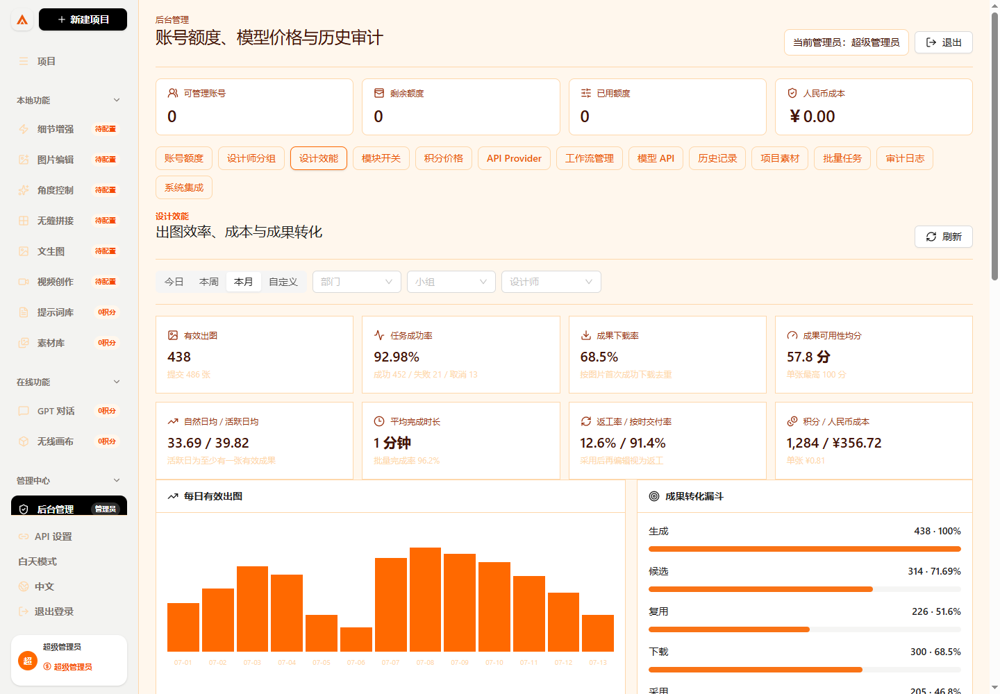

# 设计效能看板操作手册

这份手册用于管理员和组长查看设计团队的出图效率、成本与成果是否真正进入工作流程。统计结果来自服务端任务、素材、额度账本和追加式成果事件，不使用浏览器本地计数。

## 一、谁能看到

| 身份 | 可见范围 | 完整提示词 | 可纠正方向 |
| --- | --- | --- | --- |
| 超级管理员 | 全公司，可筛部门、小组和设计师 | 可以 | 可以 |
| 部门管理员 | 本部门 | 可以 | 可以 |
| 小组组长 | 本人当前小组及有效归属历史 | 可以 | 可以，仅本组 |
| 普通设计师 | 不显示效能管理看板 | 不适用 | 不可以 |

前端隐藏不是唯一权限边界。`GET /api/performance`、方向修改和截止时间接口都会再次校验 Session、角色、部门、小组有效关系和模块状态。

## 二、管理员查看看板



1. 打开 `/admin/login`，使用超级管理员或部门管理员账号登录。
2. 进入 `后台管理 -> 设计效能`。
3. 默认显示本月。可以切换今日、本周、本月或自定义开始、结束时间。
4. 超级管理员可继续选择部门、小组和设计师；部门管理员的部门范围由服务端固定。
5. 点击刷新重新读取任务、素材和成果事件。所有金额使用任务结算时保存的人民币成本快照。

## 三、组长查看本组

1. 组长仍使用设计师账号从 `/login` 登录。
2. 进入左侧 `我的小组`，页面顶部显示本组设计效能。
3. 组长可以按本组设计师筛选，但不能传入其他小组编号扩大范围。
4. 普通成员只看到本人的小组额度申请，不显示成员效率、成本和完整提示词。

## 四、指标怎么算

| 指标 | 口径 |
| --- | --- |
| 提交出图 | 图片类任务请求数量；非法数量按 1 处理 |
| 有效出图 | 状态为可用且有真实结果文件的图片成果数量 |
| 自然日均 | 有效出图除以查询范围自然日数 |
| 活跃日均 | 有效出图除以至少产生一张有效成果的日期数；无活跃日显示 `-` |
| 任务成功率 | 成功任务除以成功、失败和取消的终态任务 |
| 批量完成率 | 批量任务中成功或失败的已完成单项除以总单项 |
| 平均完成时长 | 有开始和完成时间的终态任务平均耗时 |
| 下载率 | 首次成功下载的有效图片数除以有效出图；重复下载不重复进入分子 |
| 返工率 | 采用后又发生继续编辑或复用的成果数除以已采用成果数 |
| 按时交付率 | 首次交付时间不晚于任务或项目截止时间的成果数除以已交付且有截止时间的成果数 |
| 单张积分/成本 | 成功任务结算积分或人民币成本除以有效出图 |
| 单个采用成果成本 | 成功任务总成本除以已采用成果数 |

失败、取消、重复提交、无结果文件、视频和音频不会进入有效出图。零分母显示 `-`，不会显示虚假的 `0%`。

## 五、成果转化与可用性

漏斗按图片去重展示：生成、候选、复用、首次下载、采用、交付。一次行为重复发生会保留事件次数，但同一行为只对一张图片计一次有效分。

| 行为 | 分值 |
| --- | ---: |
| 收藏或加入候选 | 5 |
| 加入正式项目 | 10 |
| 继续编辑 | 10 |
| 被复用 | 15 |
| 首次成功下载 | 15 |
| 正式导出 | 20 |
| 确认采用 | 30 |
| 最终交付 | 40 |

单张图片最高 100 分。每一分都能追溯到 `asset_events` 中的具体事件；纠错使用反向事件，不能删除或直接修改旧事件。

## 六、出图方向

系统支持花型图案、服装款式、商品图、图片编辑、细节增强、角度控制、批量改图和无缝拼接。判定优先级为：

1. 管理员或组长人工标签。
2. 功能板块和操作类型。
3. 完整提示词关键词规则。
4. 默认兜底分类。

每张成果保存主方向、辅助方向、规则版本和判定依据。占比和趋势只使用主方向。成果明细中的方向下拉框可纠正主方向，服务端会核对管理范围并写入 `performance.direction_updated` 审计记录。

## 七、截止时间

项目和任务都预留 `deadline_at`。内部系统可调用截止时间接口，首次 `asset.delivered` 不晚于截止时间即视为按时交付。项目和任务都设置时优先使用任务截止时间。

```http
PATCH /api/performance/deadline
Content-Type: application/json

{
  "targetType": "project",
  "targetId": "项目 UUID",
  "deadlineAt": "2026-07-31T18:00:00+08:00"
}
```

清空截止时间时传 `null`。组长只能操作本组有效范围，部门管理员只能操作本部门，超级管理员可操作全公司。

## 八、接口

| 方法 | 接口 | 用途 |
| --- | --- | --- |
| `GET` | `/api/performance?preset=month` | 读取授权范围内完整看板 |
| `GET` | `/api/performance?preset=custom&from=...&to=...` | 查询自定义时间，最长 366 天 |
| `PATCH` | `/api/performance/assets/:id/direction` | 修改成果主方向、辅助方向和管理标签 |
| `PATCH` | `/api/performance/deadline` | 设置或清空项目/任务截止时间 |
| `PATCH` | `/api/admin/modules` | 超级管理员开启或关闭 `performance` |

自定义时间必须包含带时区的 ISO 时间，开始时间必须早于结束时间。无权限返回 `403`；目标不在管理范围内返回 `404`，避免泄露其他部门或小组数据。

## 九、数据库升级

部署新版本时执行：

```bash
cd server
bun src/migrate.ts
```

迁移 `013_design_performance.sql` 会增加项目/任务截止时间、成果方向字段和索引，创建默认开启的 `performance` 模块开关，并为既有生成成果执行可重复的方向回填。原任务、素材、事件和账本不会被删除。

## 十、验收

1. 分别用超级管理员、部门管理员、组长和普通设计师登录，确认范围正确。
2. 关闭 `performance`，确认入口隐藏且直接请求接口返回 `MODULE_DISABLED`；重新开启后恢复。
3. 查询空时间段，确认计数为 0、所有零分母比例显示 `-`。
4. 对同一图片下载两次，确认下载次数增加但漏斗下载数和分数只增加一次。
5. 先采用再编辑，确认返工数增加；编辑发生在采用前则不计返工。
6. 设置截止时间并交付，分别验证提前、准时、逾期和无截止时间。
7. 修改成果方向，确认看板重新归类且审计日志出现 `performance.direction_updated`。
