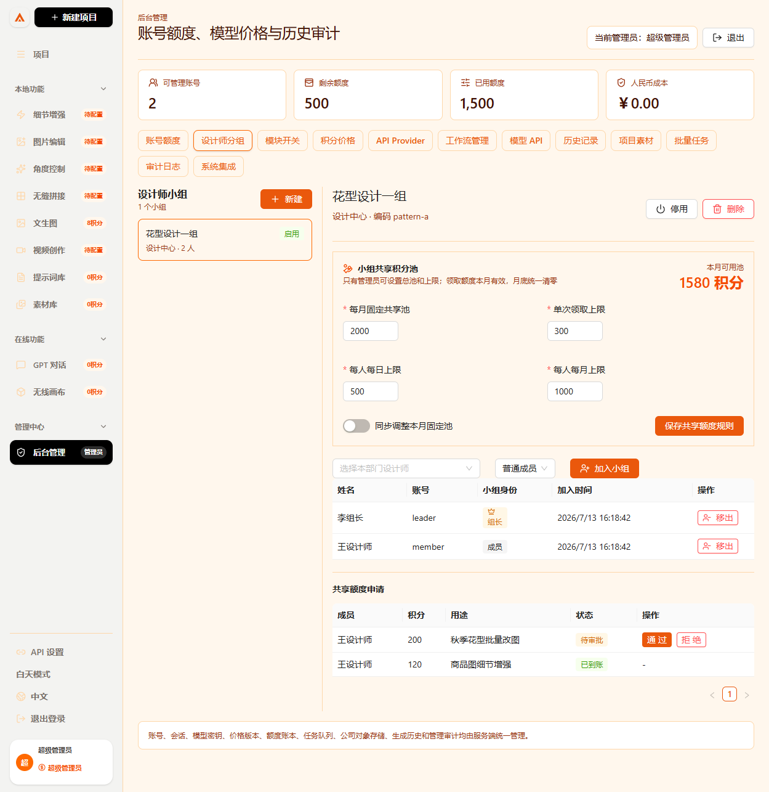
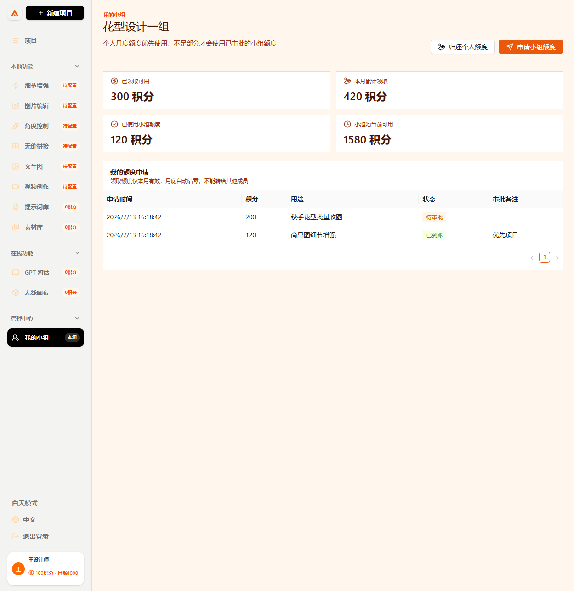
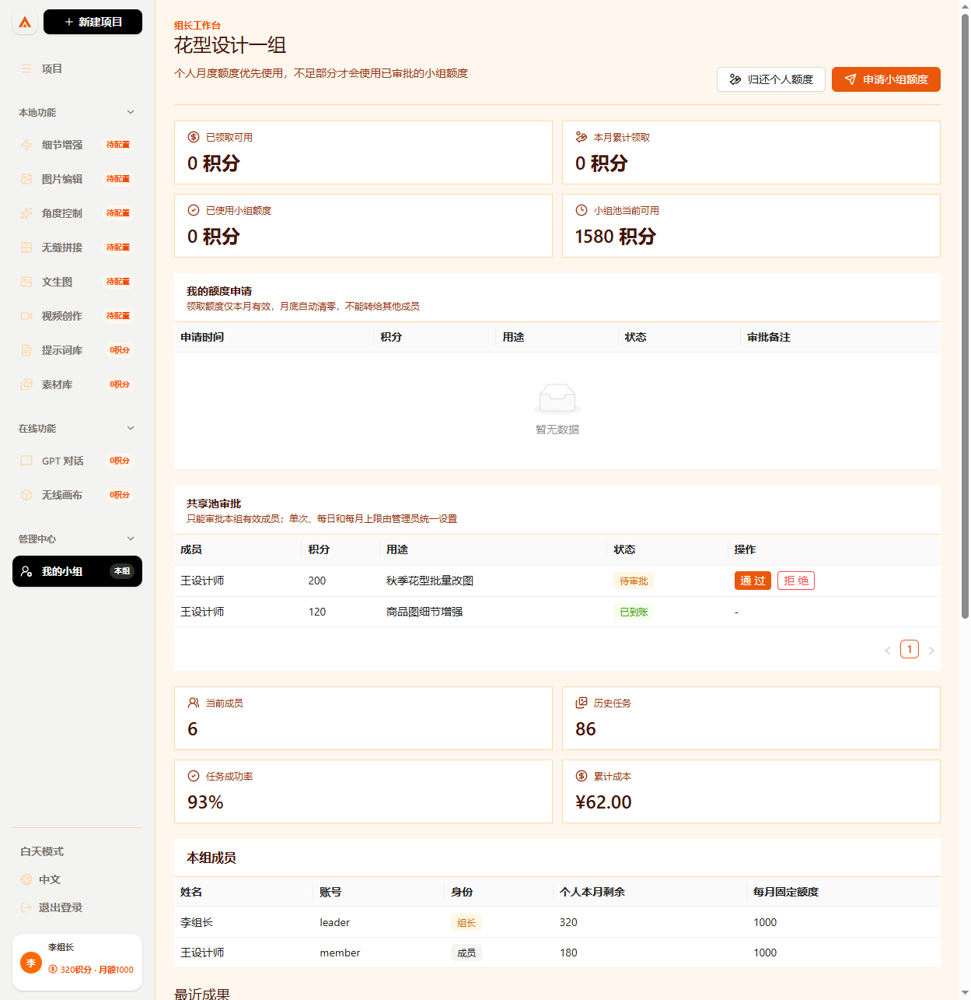

# 小组共享积分池操作手册

这份手册适合第一次使用系统的管理员、组长和设计师。共享额度的目标是让小组临时调剂本月积分，同时保证额度来源、审批、扣费和退还都能追溯。

## 一、先理解额度组成

每位设计师本月可用积分由两部分组成：

| 额度 | 来源 | 使用顺序 | 月底规则 |
| --- | --- | --- | --- |
| 个人月度额度 | 管理员给账号设置 | 优先使用 | 下月恢复固定月度额度，临时调整不带入下月 |
| 小组钱包额度 | 从本组共享池申请并获批 | 个人额度不足后使用 | 未使用余额清零，下月不能继承 |

共享池由“管理员设置的本月固定池 + 成员本月主动归还的个人积分”组成。禁止点对点转账、跨组领取、跨组归还和再次转移已领取额度。

## 二、管理员配置共享池



1. 打开 `http://服务器地址:3000/admin/login`，使用超级管理员或部门管理员账号登录。
2. 进入 `后台管理 -> 设计师分组`。
3. 先创建小组、加入成员并任命一位组长。
4. 选择目标小组，在“共享积分池”区域填写以下四项：
   - 每月固定共享额度：每月 1 日自动恢复到池中的积分。
   - 单次领取上限：一张申请最多能领取多少。
   - 每人每日上限：同一成员按上海时区自然日累计上限。
   - 每人每月上限：同一成员本自然月累计上限。
5. 若希望立即调整本月固定池，打开“同步调整本月共享池”；关闭时只保存下月策略。
6. 点击保存，确认页面显示新的规则与本月池余额。

当固定共享额度大于 0 时，三个领取上限也必须大于 0，并满足“单次上限不高于每日上限、每日上限不高于每月上限”。如果本月已经分配较多额度，管理员不能把本月池直接调成负数。

## 三、设计师申请积分



1. 从 `/login` 登录设计师工作台。
2. 点击左侧 `我的小组`。只要已加入启用中的小组，普通成员和组长都能看到入口。
3. 点击 `申请小组积分`。
4. 输入正整数积分和至少两个字的用途，例如“批量商品图任务”。
5. 提交后状态为“等待审批”，额度不会立即到账。
6. 组长或管理员批准后，页面的小组钱包余额增加。

申请按钮重复点击或网络重试会使用请求幂等号，同一请求只记一次，不会重复增加额度。

## 四、成员归还个人积分

1. 在 `我的小组` 点击 `归还积分到共享池`。
2. 输入要归还的正整数积分并确认。
3. 系统只允许归还本人本月尚未使用、尚未冻结的个人积分。
4. 成功后个人余额减少，小组池余额等额增加，两边账本同时留痕。

归还只是本月调剂：下月个人额度仍按管理员设置的固定月度额度重置，归还记录不会降低长期月度上限。

## 五、组长审批



1. 组长从设计师入口登录，进入 `我的小组`。
2. 在“待审批申请”查看成员、申请数额、用途和时间。
3. 点击批准后，系统再次检查成员仍在本组、申请仍在本月、池余额充足，并检查单次/每日/每月上限。
4. 点击拒绝时可以填写原因，申请不会扣减共享池。
5. 组长不能审批自己的申请；自己的申请必须由管理员处理。

并发点击同一申请、重复审批或两个审批同时触发上限时，服务端会锁定账本状态，只有符合规则的一次能成功。

## 六、出图如何扣积分

任务提交时，服务端按以下顺序冻结积分：

1. 先使用设计师个人本月余额。
2. 不足部分使用本人本月小组钱包。
3. 两部分合计仍不足时拒绝任务，不创建重复扣费。
4. 任务成功后按原来源结算；任务失败或取消时按原来源退还。
5. 跨月后才到达的旧任务退还不会把已过期额度带回新月份。

额度预留记录保存 `personal_credits`、`group_credits`、`group_id` 和 `group_period_start`，财务与审计可以确认每次成本究竟来自个人额度还是共享池。

## 七、月底自动清零

系统按 `Asia/Shanghai` 自然月懒加载结算。新月首次查询、申请、审批或出图时会自动执行：

- 关闭上月共享池并把剩余池余额记为过期。
- 清零成员上月小组钱包未使用余额。
- 将上月待审批申请改为“已过期”。
- 新建本月共享池，只放入管理员设置的固定额度。
- 不继承上月归还额、领取额或未使用余额。

管理员停用小组时也会立即关闭有效共享池、清零钱包并结束成员关系，历史账本不会删除。

## 八、服务端接口

| 方法 | 接口 | 权限 | 用途 |
| --- | --- | --- | --- |
| `GET` | `/api/group-credits` | 当前小组成员 | 查看本人钱包、规则和申请 |
| `POST` | `/api/group-credits/requests` | 当前小组成员 | 提交领取申请 |
| `POST` | `/api/group-credits/contributions` | 当前小组成员 | 归还个人本月积分到本组池 |
| `GET` | `/api/team/group-credits` | 当前组长 | 查看本组池、钱包、申请和账本 |
| `POST` | `/api/team/group-credits/requests/:id/decision` | 当前组长 | 审批本组申请 |
| `GET` | `/api/admin/group-credits/:groupId` | 授权管理员 | 查看指定小组共享额度 |
| `PATCH` | `/api/admin/group-credits/:groupId/policy` | 授权管理员 | 设置固定池和领取上限 |
| `POST` | `/api/admin/group-credits/:groupId/requests/:id/decision` | 授权管理员 | 代为审批或拒绝 |

领取申请示例：

```http
POST /api/group-credits/requests
Content-Type: application/json

{"requestId":"group-credit-20260713-0001","amount":30,"reason":"批量商品图任务"}
```

策略示例：

```http
PATCH /api/admin/group-credits/小组UUID/policy
Content-Type: application/json

{
  "monthlySharedCreditLimit":1000,
  "perRequestLimit":100,
  "dailyUserLimit":200,
  "monthlyUserLimit":500,
  "applyCurrentPeriod":true
}
```

## 九、常见错误

| 错误码 | 含义 | 处理方法 |
| --- | --- | --- |
| `CLAIM_LIMIT_EXCEEDED` | 超过单次领取上限 | 减少本次申请数额 |
| `DAILY_LIMIT_EXCEEDED` | 超过成员今日上限 | 次日再申请或联系管理员调整规则 |
| `MONTHLY_LIMIT_EXCEEDED` | 超过成员本月上限 | 下月再申请或联系管理员 |
| `POOL_CREDIT_EXHAUSTED` | 小组池余额不足 | 等待成员归还或管理员调整本月池 |
| `SELF_APPROVAL_FORBIDDEN` | 组长审批了自己的申请 | 交由管理员审批 |
| `MEMBERSHIP_CHANGED` | 申请人已离组、调组或停用 | 重新确认成员关系 |
| `REQUEST_EXPIRED` | 申请已经跨月 | 在本月重新申请 |
| `INSUFFICIENT_PERSONAL_CREDIT` | 归还数额超过个人可用余额 | 减少归还积分 |

## 十、部署和验收

升级前先备份 PostgreSQL。部署新版本后，在 `server` 目录执行：

```bash
bun install --frozen-lockfile
bun run migrate
bun run build
bun test
```

验收至少覆盖：正常申请与审批、重复请求、单次/每日/月度边界、组长自审、成员离组、并发审批、个人与小组混合扣费、失败退还、月底清零和小组停用。生产数据库中的 `group_credit_ledger` 是追加式账本，禁止直接更新或删除；纠错必须写反向记录。
