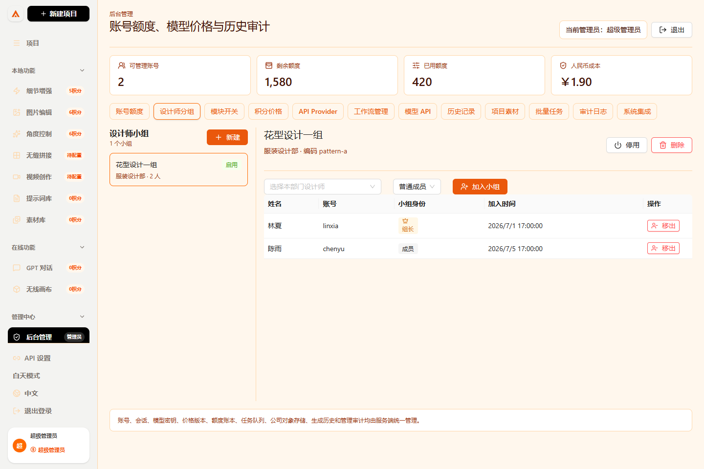
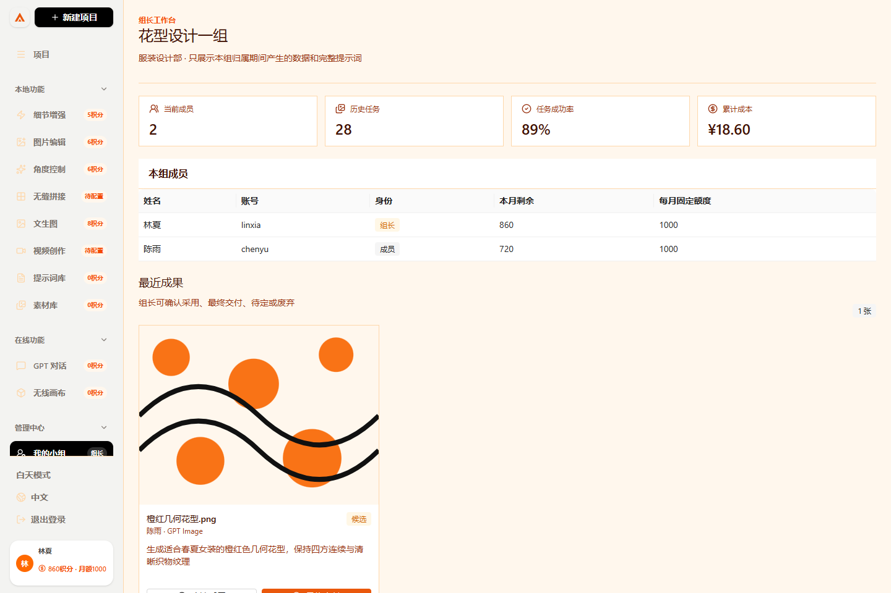
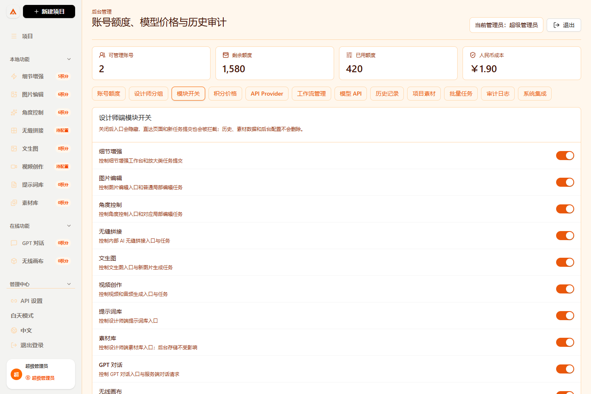

# 设计师分组、组长权限与模块开关手册

这份手册给第一次使用系统的管理员和组长。所有权限都以服务端当前登录会话为准，隐藏菜单不是唯一保护措施。

## 一、先认识四种使用身份

| 身份 | 登录入口 | 主要范围 |
| --- | --- | --- |
| 普通设计师 | `/login` | 只看自己的项目、素材、任务和积分 |
| 小组组长 | `/login` | 在设计师权限上增加本组看板，不进入管理员后台 |
| 部门管理员 | `/admin/login` | 管理本部门账号、额度和小组 |
| 超级管理员 | `/admin/login` | 管理全公司账号、小组、模块、模型、API、价格和审计 |

组长的基础角色仍然是 `designer`，小组身份是 `leader`。不要为了让某位设计师带组而把他改成管理员。

## 二、管理员创建小组



1. 打开 `http://服务器地址:3000/admin/login`。
2. 输入管理员账号、密码和已启用时的六位动态验证码。
3. 进入 `后台管理 -> 设计师分组`。
4. 点击左侧 `新建`。
5. 填写小组名称，例如“花型设计一组”。
6. 填写小组编码，例如 `pattern-a`；同一部门内不能重复。
7. 选择所属部门并提交。
8. 在右侧下拉框选择设计师，选择 `普通成员` 或 `任命组长`，再点击 `加入小组`。

边界规则：

- 一个设计师同一时刻只能在一个有效小组。
- 一个小组同一时刻只有一位组长。
- 部门管理员只能操作自己的部门。
- 停用小组会结束当前成员关系；有历史依赖的小组不能硬删除，请使用停用。
- 调组不会改写历史。报表按任务或成果发生时的小组快照归属。

## 三、组长查看本组



1. 组长从普通设计师入口 `/login` 登录。
2. 点击左侧 `我的小组`。
3. 顶部查看成员数、历史任务、成功率和人民币成本。
4. 在 `最近成果` 查看本组图片和完整提示词。
5. 点击 `确认采用`、`最终交付`、`标记待定` 或 `标记废弃` 追加成果事件。
6. 在任务表查看本组任务、模型、积分和完整提示词。
7. 点击 `导出本组报表` 下载 CSV；服务端会按当前小组有效期过滤并记录导出审计。

组长不能修改模型、Provider、API Key、价格、小组总额度、权限、账本或审计，也不能查看其他小组。离组、调组、账号停用或锁定后，组长权限立即失效。

## 四、超级管理员开启或关闭模块



1. 用超级管理员账号进入 `/admin`。
2. 点击 `模块开关`。
3. 找到要控制的模块，点击右侧开关。
4. 页面提示“已开启”或“已关闭”后，修改已经写入服务端和审计日志。
5. 设计师页面会在登录、页面重新显示或最长约 30 秒的定时同步后更新入口。

当前可控模块包括细节增强、图片编辑、角度控制、无缝拼接、文生图、视频创作、提示词库、素材库、GPT 对话、无线画布和我的小组。

关闭后的结果：

- 左侧菜单隐藏对应入口。
- 直接访问对应网址会返回项目页。
- 文生图、图片编辑、角度控制、细节增强、无缝拼接、视频/音频、画布批量任务和 GPT 对话会在服务端再次校验。
- 被拒绝的任务不会创建任务记录、不会冻结额度，也不会重复扣费。
- 已有素材、历史、任务结果和审计日志不删除。
- 后台管理、登录、改密、素材持久化和审计基础设施不受业务模块开关影响。

## 五、服务端接口

| 方法 | 路径 | 权限 | 用途 |
| --- | --- | --- | --- |
| `GET` | `/api/modules` | 已登录账号 | 读取当前模块状态 |
| `PATCH` | `/api/admin/modules` | 超级管理员 | 修改一个模块的启停状态 |
| `GET` | `/api/admin/groups` | 超级/部门管理员 | 按授权范围列出小组和当前成员 |
| `POST` | `/api/admin/groups` | 超级/部门管理员 | 创建小组 |
| `PATCH` | `/api/admin/groups/:id` | 超级/部门管理员 | 修改名称、编码或状态 |
| `POST` | `/api/admin/groups/:id/members` | 超级/部门管理员 | 加入成员或任命组长 |
| `DELETE` | `/api/admin/groups/:id/members/:userId` | 超级/部门管理员 | 结束成员关系 |
| `GET` | `/api/team` | 当前有效组长 | 查看本组概况和成员 |
| `GET` | `/api/team/history` | 当前有效组长 | 查看本组有效期内历史 |
| `GET` | `/api/team/history/export` | 当前有效组长 | 导出本组 CSV 并写入审计 |
| `GET` | `/api/team/audit` | 当前有效组长 | 查看本组相关审计 |

修改模块示例：

```http
PATCH /api/admin/modules
Content-Type: application/json

{"moduleKey":"image","enabled":false}
```

响应不包含任何 API Key。非超级管理员调用会返回 `403 FORBIDDEN`；被关闭模块的任务提交返回 `403 MODULE_DISABLED`。

## 六、常见问题

### 设计师为什么看不到“我的小组”？

确认账号已加入启用中的小组，同时确认超级管理员没有关闭“我的小组”模块。普通成员可以在这里申请或归还共享积分；组长会额外看到审批、本组成员和报表。重新登录可立即刷新会话身份。

### 关闭模块后为什么历史图片还在？

这是预期行为。模块开关只控制新入口和新提交，历史、素材、账本和审计必须保留用于公司复盘。

### 可以让部门管理员改全公司的模块开关吗？

不可以。模块启停影响所有设计师，只有超级管理员可以修改。部门管理员仅能读取当前状态。

### 成员调组后旧组报表会丢吗？

不会。成员关系保存生效和结束时间，成果事件保存发生时的小组快照，历史报表不会跟着当前小组被改写。
