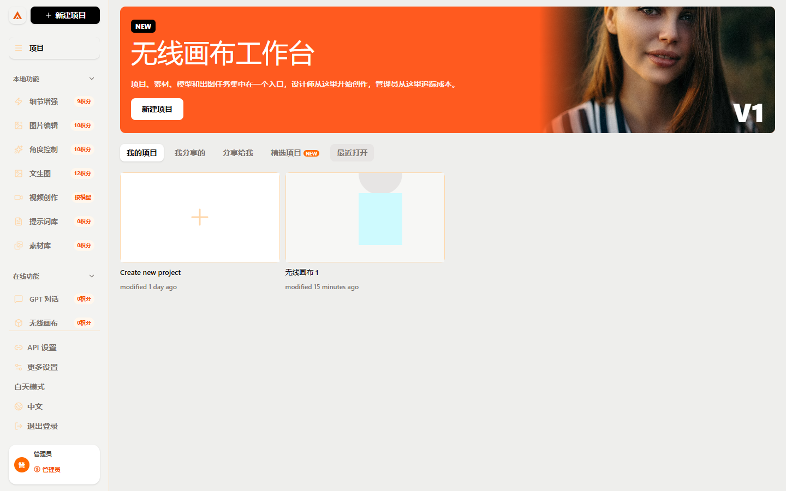
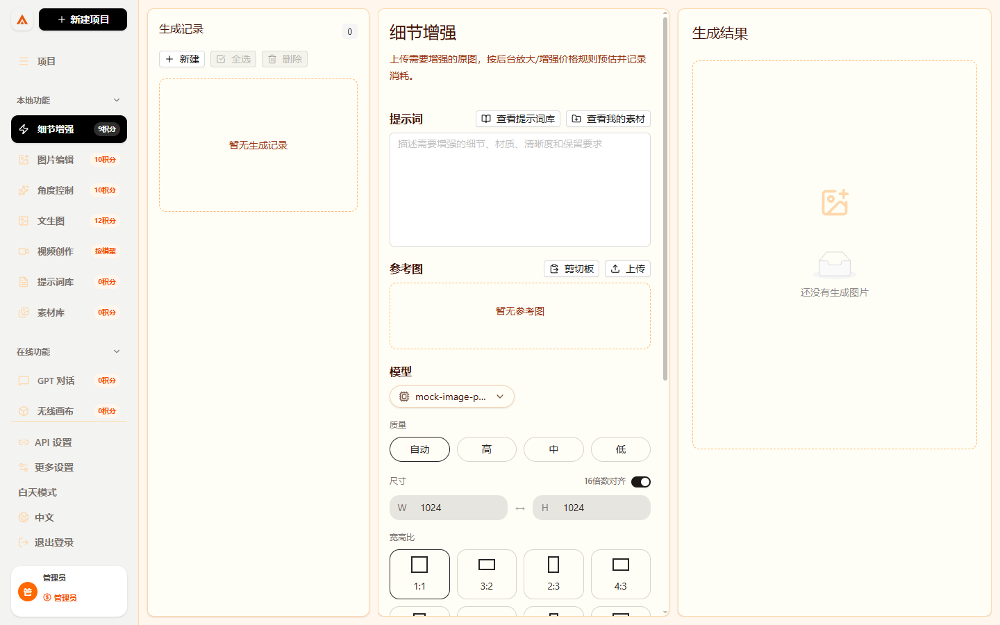
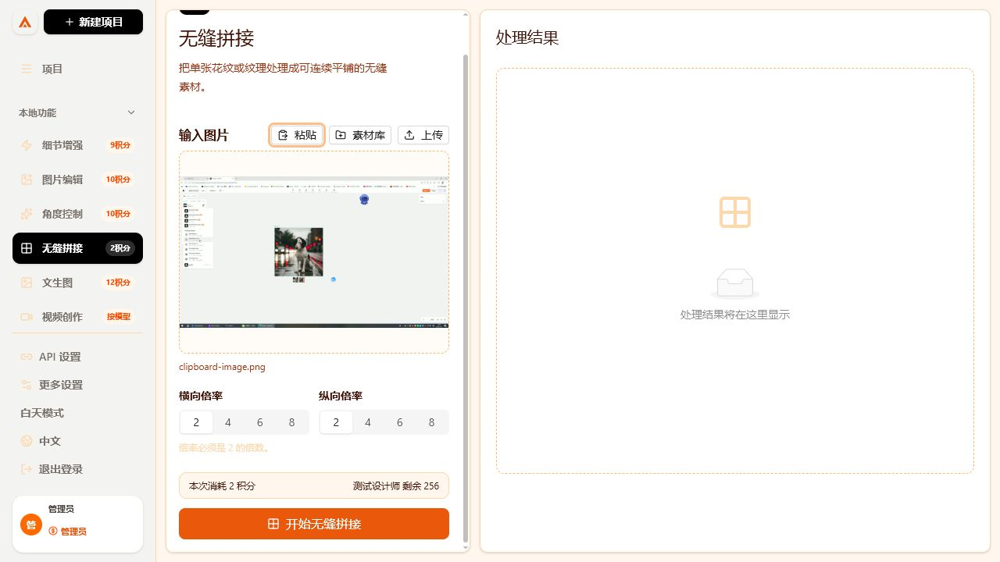
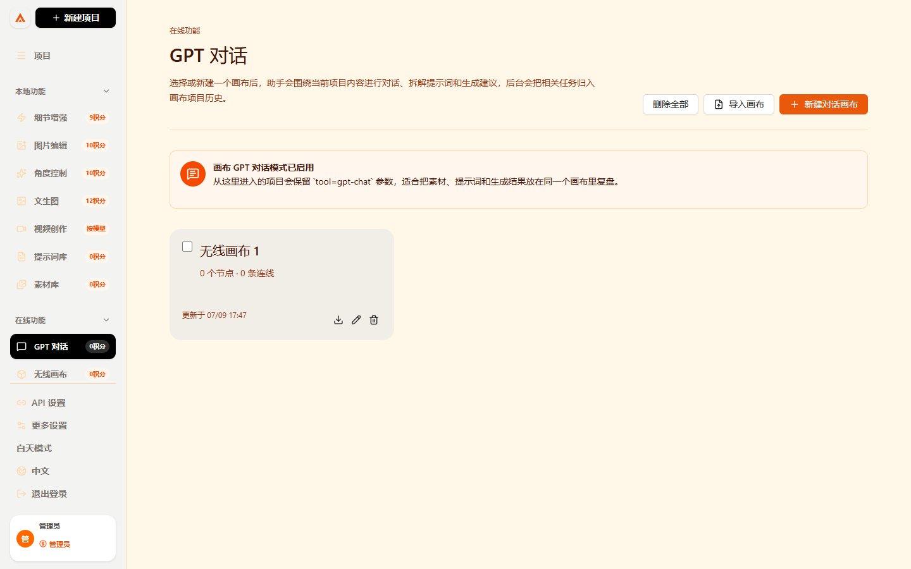
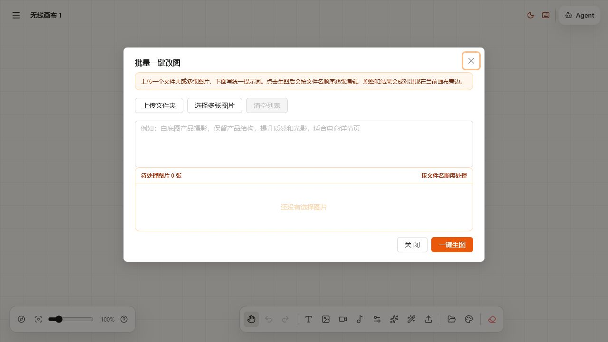
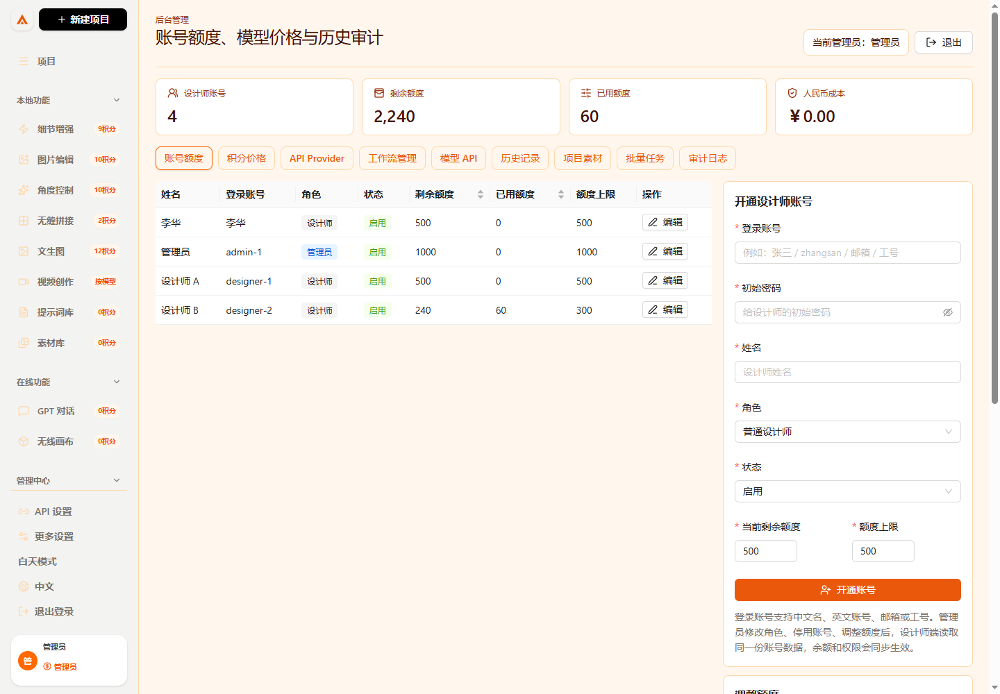
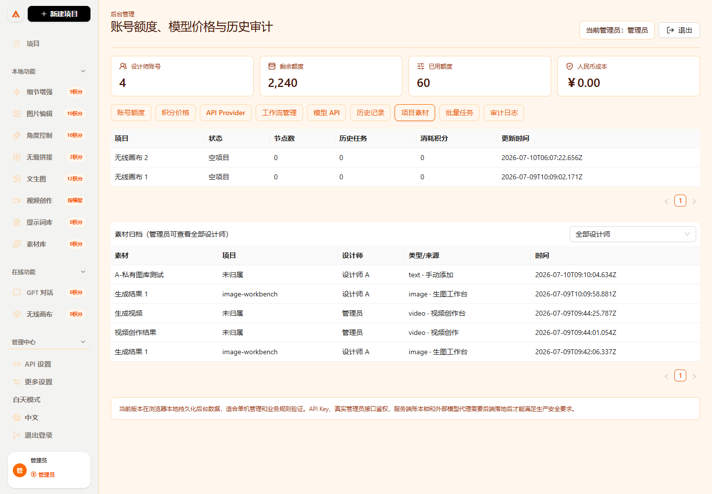
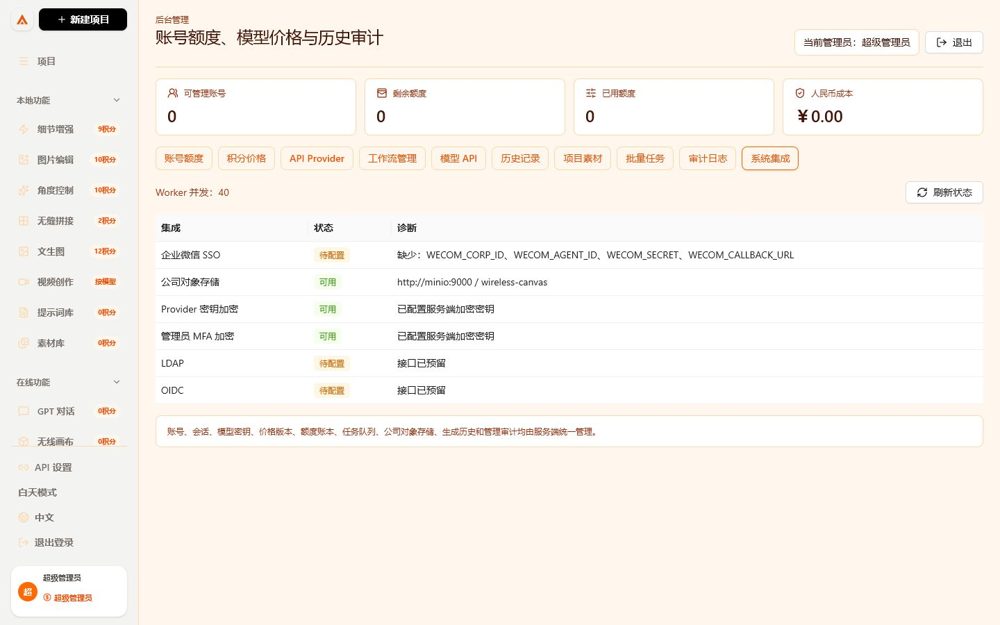
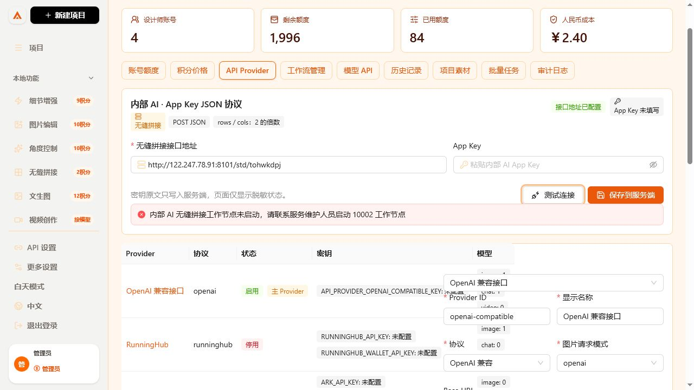

# 无线画布小白操作手册

这份手册写给第一次接触项目的人。你不需要懂代码，只要跟着步骤点，就能知道每个模块是干什么的、从哪里进入、怎么配置接口、怎么生成图片、管理员怎么管理额度和历史记录。



## 目录

1. 项目是什么
2. 第一次怎么启动
3. 页面左侧菜单怎么看
4. 设计师怎么用
5. 管理员怎么登录后台
6. 管理员怎么管理账号和额度
7. 管理员怎么设置积分价格
8. 管理员怎么接入模型 API
9. 管理员怎么配置工作流
10. 管理员怎么看历史记录
11. 素材库怎么用
12. 批量任务怎么理解
13. 常见问题

---

## 1. 项目是什么

无线画布是一个给设计团队用的 AI 图片工作台。

它有两类人使用：

| 人 | 主要做什么 |
| --- | --- |
| 设计师 | 生成图片、编辑图片、增强细节、做角度图、整理素材、使用画布 |
| 管理员 | 管设计师账号、额度、模型接口、价格、历史记录、批量任务、审计日志 |

你可以把它理解成：

```text
设计师前台：负责创作
管理员后台：负责管控
```

---

## 2. 第一次怎么启动

### 2.1 打开项目目录

进入项目里的 `web` 文件夹：

```bash
cd web
```

### 2.2 安装依赖

```bash
bun install
```

### 2.3 启动项目

```bash
bun run dev
```

### 2.4 打开浏览器

访问：

```text
http://localhost:3000/login
```

如果登录入口能打开，就说明启动成功。

### 2.5 先选择身份

登录入口有两种身份：

| 身份 | 怎么进 | 进去后能看到什么 |
| --- | --- | --- |
| 设计师 | 选择设计师账号，点 `登录设计师工作台` | 项目、生成、编辑、素材、画布等创作入口 |
| 管理员 | 点 `打开管理员登录`，再选择管理员账号 | 账号额度、积分价格、模型 API、工作流、历史、审计 |

设计师不会看到后台管理、API 设置、额度调控和价格配置。

---

## 3. 页面左侧菜单怎么看

打开项目后，左边有三组功能。

每个会产生费用的入口旁边都会显示积分，例如 `文生图 12积分`、`细节增强 9积分`、`图片编辑 10积分`、`无缝拼接 2积分`。管理员在后台修改价格规则后，前台显示的预计积分会同步变化。

### 3.1 本地功能

| 菜单 | 干什么 |
| --- | --- |
| 细节增强 | 上传一张图，让图片更清晰，细节更丰富 |
| 图片编辑 | 上传参考图，按提示词修改图片内容 |
| 角度控制 | 上传产品或角色图，生成不同角度 |
| 无缝拼接 | 上传纹理图，生成可以连续平铺的无缝素材 |
| 文生图 | 只输入文字，生成图片 |
| 视频创作 | 进入视频生成相关工作区 |
| 提示词库 | 保存和复用常用提示词 |
| 素材库 | 保存图片、视频、文本素材 |

### 3.2 在线功能

| 菜单 | 干什么 |
| --- | --- |
| GPT 对话 | 在画布场景里和助手讨论项目 |
| 无线画布 | 管理项目画布、节点、连线、导入导出 |

### 3.3 管理中心

| 菜单 | 干什么 |
| --- | --- |
| 后台管理 | 管设计师、额度、API、模型、价格、历史和审计 |

注意：这一组只有管理员能看到。普通设计师不会看到后台入口。

---

## 4. 设计师怎么用

### 4.1 文生图

适合场景：

- 想从 0 生成一张图
- 只有想法，没有参考图
- 需要快速出概念图

操作步骤：

1. 点左侧 `文生图`。
2. 找到 `提示词` 输入框。
3. 输入你想要的画面。
4. 选择模型。
5. 选择质量、尺寸、生成张数。
6. 看 `预计消耗`。
7. 点 `开始生成`。
8. 等待右侧出现结果。

生成后你可以：

- 点 `添加到素材`，保存到素材库。
- 点 `加入参考图`，继续做图生图或编辑。
- 点 `下载`，保存到电脑。

提示词示例：

```text
一张现代办公空间效果图，橙色品牌点缀，干净高级，柔和自然光，适合官网展示
```

---

### 4.2 细节增强



适合场景：

- 图片有点糊
- 想增强材质细节
- 想放大图片
- 想让产品图更清楚

操作步骤：

1. 点左侧 `细节增强`。
2. 在 `参考图` 区域上传原图。
3. 在提示词里写清楚要增强什么。
4. 查看预计消耗。
5. 点 `开始增强`。

提示词示例：

```text
增强产品边缘清晰度，保留原本颜色和构图，提升金属质感和细节，不要改变主体形状
```

注意：

- 细节增强必须先上传参考图。
- 如果没有参考图，按钮会提示你先添加参考图。
- 后台会按“放大图片”或增强类规则记录积分。

---

### 4.3 图片编辑

适合场景：

- 改图片里的某个区域
- 替换背景
- 改颜色
- 修掉瑕疵
- 把一个元素换成另一个元素

操作步骤：

1. 点左侧 `图片编辑`。
2. 上传要编辑的图片。
3. 在提示词里说明：
   - 改哪里
   - 保留哪里
   - 改成什么效果
4. 点 `开始编辑`。

提示词示例：

```text
保留人物姿势和服装轮廓，把背景改成高级灰摄影棚，光线更柔和，人物面部不要变形
```

注意：

- 图片编辑也需要参考图。
- 失败时不会重复扣费。
- 成功结果会进入历史记录。

---

### 4.4 角度控制

适合场景：

- 产品要做多角度展示
- 角色要做三视图
- 想生成正面、侧面、俯视、45 度角

操作步骤：

1. 点左侧 `角度控制`。
2. 上传产品图或角色图。
3. 在提示词里写目标角度。
4. 点 `生成角度图`。

提示词示例：

```text
根据参考图生成产品 45 度视角，保留品牌颜色、材质和结构比例，背景纯白
```

---

### 4.5 无缝拼接



适合场景：

- 面料、印花、墙纸或纹理图需要做连续平铺。
- 想快速检查图案横向和纵向衔接效果。
- 需要把一张小图扩展成 2、4、6、8 倍的无缝素材。

操作步骤：

1. 点左侧 `无缝拼接`。
2. 在 `参考图` 区域粘贴图片、上传图片，或从素材库选择图片。
3. 在 `横向倍数` 选择 2、4、6 或 8。
4. 在 `纵向倍数` 选择 2、4、6 或 8。
5. 确认提交按钮旁显示当前价格，默认是 `2 积分`。
6. 点 `开始无缝拼接`。
7. 右侧出现结果后，可以下载图片，结果也会保存到素材库和历史记录。

扣费和失败规则：

- 成功生成后才扣除 2 积分。
- 接口超时、工作节点未启动或返回失败时，不扣设计师额度。
- 管理员修改无缝拼接价格后，设计师端的菜单和提交区域会同步显示新价格。

---

### 4.6 GPT 对话



适合场景：

- 不知道提示词怎么写
- 想拆解项目方向
- 想围绕一个画布持续讨论
- 想把素材、想法、生成结果放在一个项目里

操作步骤：

1. 点左侧 `GPT 对话`。
2. 页面会进入 `画布 GPT 对话模式`。
3. 点 `新建对话画布`。
4. 进入画布后，可以围绕当前项目整理内容。

---

### 4.7 无线画布

适合场景：

- 一个项目有很多图
- 想把参考图、生成图、文字说明放在一起
- 想做项目复盘
- 想导入导出画布

操作步骤：

1. 点左侧 `无线画布`。
2. 点 `新建画布`。
3. 进入画布后添加图片、文字或其他节点。
4. 拖拽节点整理结构。
5. 需要保存给别人时，可以导出画布。
6. 别人给你画布压缩包时，可以导入画布。

### 4.8 画布批量一键改图



适合场景：

- 一个文件夹里有很多产品图要统一改成白底图。
- 多张图片要套同一条提示词做质感提升。
- 希望按文件名顺序逐张处理，失败一张不影响其他图片。

操作步骤：

1. 点左侧 `无线画布`。
2. 新建或打开一个画布。
3. 在画布底部工具栏点击 `批量改图`。
4. 点 `上传文件夹`，选择一个装满图片的文件夹；也可以点 `选择多张图片`。
5. 在大输入框里写统一提示词。
6. 看一下待处理图片数量，确认图片会按文件名顺序处理。
7. 点 `一键生图`。
8. 提交成功后，列表会分别显示每张图的等待、处理、暂停、成功、失败或取消状态。
9. 如果需要调整，可以点击 `暂停等待项`、`恢复` 或 `取消未处理项`；已经处理成功的图片不会重新提交或重复扣费。
10. 处理完成后，原图和结果图会成对放到画布旁边，方便你对比。
11. 成功结果会保存到历史记录，也可以进入素材库继续下载、复刻或复用提示词。

提示词示例：

```text
白底图产品摄影，保留产品原本结构和颜色，提升质感和柔和光影，背景纯净，适合电商详情页
```

扣费规则：

- 一次操作只建立一个服务端批次，但每张图片都有独立任务、状态和额度账本。
- 批量任务按每张图片计费。
- 某一张失败，不影响其他图片继续处理。
- 成功图片才进入历史记录并扣额度。
- 失败图片要记录失败原因，管理员可以在后台查看批量任务整体进度。

---

## 5. 管理员怎么登录后台

后台登录地址：

```text
http://localhost:3000/login
```

操作步骤：

1. 打开登录入口。
2. 点击 `打开管理员登录`。
3. 在后台登录页选择管理员账号。
4. 点 `登录后台`。
5. 登录成功后进入后台。

注意：

- 当前是本地演示登录。
- 正式上线时要接后端登录和权限校验。
- 普通设计师不能修改额度、价格、模型和 API 配置。
- 普通设计师直接访问 `/admin` 会被拦到管理员登录页。

---

## 6. 管理员怎么管理账号和额度

进入后台后，默认看到 `账号额度`。

你可以看到每个账号：

- 姓名
- 角色
- 状态
- 剩余额度
- 已用额度
- 额度上限

### 6.1 开通中文、英文或工号账号



1. 找到右侧 `开通设计师账号`。
2. 在 `登录账号` 选择一种公司内部习惯：
   - 中文名：`李华`
   - 英文账号：`lihua` 或 `designer-lihua`
   - 公司邮箱：`lihua@company.com`
   - 员工工号：`D20260018`
3. 填初始密码。
4. 填设计师显示姓名。
5. 角色选择 `普通设计师`，状态选择 `启用`。
6. 填当前剩余额度和额度上限。
7. 点 `开通账号`。
8. 把账号和初始密码交给对应设计师，让他从 `http://localhost:3000/login` 登录。

兼容规则：

- 英文账号不区分大小写。
- 中文账号支持正常中文输入。
- 全角英文和数字会自动按兼容形式处理。
- 素材归属使用内部账号 ID，不使用可修改的显示姓名，所以改姓名不会串图库。

### 6.2 给设计师加额度

1. 找到右侧 `调整额度`。
2. 选择设计师。
3. 在 `积分变化` 输入正数，例如 `100`。
4. 在原因里写说明，例如 `项目补充额度`。
5. 点 `保存调整`。

### 6.3 扣减设计师额度

1. 找到 `调整额度`。
2. 选择设计师。
3. 在 `积分变化` 输入负数，例如 `-20`。
4. 写原因。
5. 点 `保存调整`。

### 6.4 设置额度上限

1. 找到 `设置额度上限`。
2. 选择设计师。
3. 输入最多可拥有积分，例如 `500`。
4. 点 `更新上限`。

---

## 7. 管理员怎么设置积分价格

点击后台 Tab：`积分价格`。

这里可以设置每种操作消耗多少积分和多少钱。

常见规则：

| 操作 | 说明 |
| --- | --- |
| 生成一张图 | 文生图、普通生图 |
| 放大图片 | 细节增强、高清放大 |
| 去背景 | 去除图片背景 |
| 局部编辑 | 图片编辑、角度控制 |
| 批量处理每张图 | 批量任务按每张图计费 |
| 无缝拼接 | 每次把纹理图处理成连续平铺素材 |

操作步骤：

1. 选择操作类型。
2. 填后台名称。
3. 填积分。
4. 填人民币成本。
5. 点 `保存规则`。

注意：

- 前台的预计消耗会按照这里的规则计算。
- 额度不足时，设计师不能提交任务。
- 重复提交同一个请求不会重复扣费。

---

## 8. 管理员怎么接入模型 API

点击后台 Tab：`API Provider`。

这里统一管理外部模型接口。

### 8.1 什么是 Provider

Provider 就是模型接口来源，例如：

- OpenAI 兼容接口
- Gemini
- 火山引擎
- RunningHub
- Codex
- 公司内部模型
- 其他第三方 API

### 8.2 新增或修改 Provider

操作步骤：

1. 进入 `API Provider`。
2. 在右侧 `Provider 配置` 填写信息。
3. 填 `Provider ID`，例如 `company-api`。
4. 填 `显示名称`，例如 `公司内部模型`。
5. 选择 `协议`。
6. 填 `Base URL`。
7. 选择 `图片请求模式`。
8. 填图片模型、聊天模型、视频模型。
9. 填默认积分和默认成本。
10. 打开 `启用`。
11. 如果这是默认接口，打开 `主 Provider`。
12. 点 `保存 Provider`。

### 8.3 保存 API Key

操作步骤：

1. 找到 `密钥状态`。
2. 选择 Provider。
3. 选择密钥类型。
4. 输入 API Key。
5. 点 `保存密钥状态`。

注意：

- 页面保存后只显示脱敏状态。
- 正式上线时 API Key 必须只存在后端。
- 普通用户前端不能直接拿到 API Key。

### 8.4 接入公司素材存储



正式版本的素材入口已经集成到业务后端，不需要在设计师浏览器里填写数据库地址或 Token。文件经 `/api/assets` 上传，PostgreSQL 保存归属和生成记录，S3/MinIO 保存图片、视频和文本内容。

运维配置步骤：

1. 登录部署服务器，打开项目根目录的 `.env`。
2. 填写 `S3_ENDPOINT`、`S3_BUCKET`、`S3_ACCESS_KEY_ID`、`S3_SECRET_ACCESS_KEY` 和 `S3_REGION`。
3. 公司已有私有云对象存储时，填写其 S3 兼容地址；使用项目自带 MinIO 时保留 Compose 服务名。
4. 执行 `docker compose up -d --build`。
5. 使用超级管理员登录，进入 `系统集成`。
6. 确认“对象存储”显示可用，且页面不返回 Access Key 原文。
7. 使用设计师 A 上传一张图片，再使用设计师 B 登录；B 不应看到 A 的图片。
8. 超级管理员进入 `素材监管`，按设计师 A 筛选并打开该图片。



接口权限：

| 方法 | 路径 | 行为 |
| --- | --- | --- |
| `POST` | `/api/assets` | 从 Session 取得当前设计师 UUID，保存文件和元数据 |
| `GET` | `/api/assets` | 设计师只看本人；部门管理员只看本部门；超级管理员看全部 |
| `GET` | `/api/assets/:id/content` | 通过所有权和角色校验后返回文件 |
| `DELETE` | `/api/assets/:id` | 软删除并保留可审计的数据库记录 |

安全要求：

- 浏览器提交的 `ownerId` 不是权限依据，后端始终使用 Session 中的稳定用户 UUID。
- 对象键按 `users/{用户UUID}/...` 分区，但每次查询仍必须执行数据库权限过滤。
- S3 Secret、Provider Key 和数据库密码只放服务器环境变量或加密字段，不写前端、截图和 Git。
- A 与 B 使用相同的本地项目 ID 时，数据库按“用户 UUID + 项目 ID”保存为两条隔离记录。
- 管理员跨用户读取、删除或导出素材时写入审计日志。

### 8.5 配置内部 AI App Key JSON 接口



无缝拼接使用专门的内部 AI JSON 协议。这个入口在 `API Provider` 页面的最上方，只对管理员显示，不需要让设计师填写任何接口信息。

操作步骤：

1. 使用管理员账号登录。
2. 进入 `后台管理`，打开 `API Provider`。
3. 找到 `内部 AI · App Key JSON 协议`。
4. 在 `无缝拼接接口地址` 填完整 POST 地址，例如：

   ```text
   http://122.247.78.91:8101/std/tohwkdpj
   ```

5. 在 `App Key` 填接口密钥。没有 App Key 时 Provider 会保持停用，设计师不能提交这个模型。
6. 点 `保存到服务端`。
7. 看 `当前服务端状态`：有 Key 时只显示脱敏内容，不会显示完整密钥。
8. 点 `测试连接`。
9. 打开 `积分价格`，确认“无缝拼接”为 2 积分；内部无缝拼接模型成本设为 0，避免重复加价。
10. 测试成功后，让设计师进入 `本地功能 -> 无缝拼接` 使用。

接口发送的数据格式：

```json
{
  "app_key": "只在服务端注入",
  "image": "不含 data:image 前缀的 Base64",
  "rows": 2,
  "cols": 2
}
```

安全规则：

- 完整 App Key 使用 `PROVIDER_ENCRYPTION_KEY` 加密后保存到 PostgreSQL Provider 凭据字段。
- 普通设计师看不到配置入口，也读不到完整密钥。
- 浏览器只会收到 `hasAppKey` 和脱敏预览，不会收到原始 App Key。
- `/api/admin/internal-ai` 使用 Session 鉴权并要求超级管理员角色，旧的本机身份头和 Vite 密钥代理已删除。
- 保存时系统自动创建 Provider、工作流和模型；清除 App Key 时 Provider 自动停用。

设计师怎么操作：

1. 从 `http://服务器地址:3000/login` 登录设计师工作台。
2. 点左侧 `本地功能 -> 无缝拼接`，右上角应显示 `2 积分/次`。
3. 上传一张图片，或从“我的素材”选择自己的图片。
4. 选择横向和纵向倍率，倍率必须是 2 的倍数。
5. 点 `开始无缝拼接`。系统先冻结 2 积分，按钮进入处理中。
6. 成功后结果显示在右侧，同时自动进入该设计师自己的公司素材库和生成历史。
7. 失败、取消或超时会自动退还冻结积分；不要反复点击，同一请求只会创建一个任务。

管理员怎么核对：

1. 在 `账号管理` 查看设计师剩余积分是否减少 2。
2. 在 `历史记录` 按设计师、项目或 `seamless_stitch` 筛选，核对原图、结果图、积分、金额和状态。
3. 在 `素材监管` 按设计师筛选结果；普通设计师只能看到自己的素材。
4. 在 `审计日志` 查看内部 AI 配置修改和连接测试记录。

测试失败怎么判断：

- 显示 `10002 工作节点未启动`：远端接口已收到请求，但内部处理节点未运行，需要接口维护人员启动远端节点。
- 显示 `无法连接内部 AI 服务`：检查接口地址、网络、防火墙和服务状态。
- 保存成功但生成失败：配置已经保存，继续看测试连接和任务失败原因；Worker 最多重试 3 次，最终失败后自动退还积分。
- 页面显示“管理员尚未启用模型”：先确认 App Key 已保存，再刷新设计师页面或等待最多 30 秒同步模型配置。
- 页面显示“公司对象存储尚未配置”：先由运维配置 S3/MinIO；正式任务必须先保存原图和结果，不能只留在浏览器。

### 8.6 常见字段解释

| 字段 | 怎么填 |
| --- | --- |
| Provider ID | 机器识别用，建议英文和短横线 |
| 显示名称 | 给管理员看的名字 |
| 协议 | 按你的接口类型选 |
| Base URL | API 根地址 |
| 图片请求模式 | 按接口兼容方式选 |
| 图片模型 | 能出图的模型 ID |
| 聊天模型 | 能对话的模型 ID |
| 视频模型 | 能出视频的模型 ID |
| 默认积分 | 单次模型成本折算积分 |
| 默认成本 | 单次模型人民币成本 |

---

## 9. 管理员怎么配置工作流

点击后台 Tab：`工作流管理`。

工作流用来管理更复杂的能力，例如：

- RunningHub 工作流
- ComfyUI 工作流
- 本地批量处理流程

### 9.1 使用模板创建工作流

操作步骤：

1. 进入 `工作流管理`。
2. 在 `模型能力模板` 里找到需要的模板。
3. 点 `使用模板`。
4. 右侧会填入模板信息。
5. 修改名称、积分、成本、入口数等。
6. 确认启用。
7. 点 `保存工作流`。

### 9.2 工作流字段解释

| 字段 | 说明 |
| --- | --- |
| 工作流 ID | 后台唯一标识 |
| 模板 ID | 来源模板 |
| 名称 | 管理员看到的名称 |
| 来源 | RunningHub 或 ComfyUI / 本地 |
| 能力 | 生成、编辑、放大、批量 |
| Provider ID | 绑定哪个 Provider |
| 模型/工作流 ID | 外部平台里的模型或工作流编号 |
| 积分 | 执行一次消耗多少积分 |
| 成本 | 执行一次对应多少钱 |
| 入口数 | 管理员用于标记该工作流有多少个可用入口 |
| 说明 | 备注 |
| 启用 | 是否允许使用 |

---

## 10. 管理员怎么看历史记录

点击后台 Tab：`历史记录`。

这里用于回答这些问题：

- 谁生成了图
- 用了哪个模型
- 花了多少积分
- 属于哪个项目
- 成功还是失败
- 失败原因是什么
- 生成了哪些结果

### 10.1 筛选历史记录

你可以按：

- 设计师
- 模型
- 操作类型

进行筛选。

### 10.2 导出历史记录

点击导出按钮，可以导出 CSV。

适合用于：

- 财务核算
- 内部复盘
- 项目统计
- 审计留档

---

## 11. 素材库怎么用

素材库用于保存项目过程中产生的东西。

素材类型包括：

- 图片
- 视频
- 文本

常见操作：

1. 生成图片后点 `添加到素材`。
2. 进入 `素材库` 查看保存的结果。
3. 后台可以按项目、设计师、操作类型查看素材来源。

### 11.1 设计师图库隔离

- 设计师 A 登录后，只会看到 `ownerId` 属于 A 的素材。
- 设计师 B 登录后，只会看到 `ownerId` 属于 B 的素材。
- A 不能在素材库或画布“我的素材”选择器里看到 B 的素材，B 也不能看到 A 的素材。
- 管理员拥有最高权限，可以查看全部素材。

### 11.2 管理员按姓名查看


1. 管理员进入 `后台管理`。
2. 点击 `项目素材`。
3. 在 `素材归档` 右侧选择 `全部设计师`，或选择具体设计师姓名。
4. 查看素材名称、项目、设计师、类型/来源和保存时间。

### 11.3 接入公司对象存储后的结果

- 新生成图片、视频、音频和手动上传素材都会写入同源 `/api/assets`。
- PostgreSQL 记录设计师 UUID、项目、来源板块、提示词、模型、积分和任务 ID。
- S3/MinIO 保存文件内容；管理员查全员，设计师只能查本人。
- 具体部署和权限验证见本手册 `8.4 接入公司素材存储`。

建议用法：

- 每个项目生成的图都保存到素材库。
- 重要结果再进入画布做整理。
- 项目复盘时从素材库和历史记录一起看。

---

## 12. 批量任务怎么理解

批量任务是指一次处理多张图片。

后台会记录：

- 整个批量任务状态
- 每张图片自己的状态
- 每张图片成功或失败
- 每张失败图片的失败原因
- 成功图片的消耗

每张图片可能出现这些状态：

| 状态 | 意思 |
| --- | --- |
| 等待中 | 还没开始 |
| 处理中 | 正在执行 |
| 成功 | 已出结果 |
| 失败 | 这张失败了 |
| 暂停 | 暂停处理 |
| 已取消 | 被取消了 |

重要规则：

- 某一张失败，不影响整批其他图片。
- 成功的图片进入历史记录。
- 成功的图片才扣额度。
- 失败要记录失败原因。

---

## 13. 常见问题

### 13.1 打不开页面

检查项目是否启动：

```bash
cd web
bun run dev
```

然后打开：

```text
http://localhost:3000
```

### 13.2 点生成没有反应

检查：

1. 提示词是不是空的。
2. 图片编辑类工具有没有上传参考图。
3. 模型配置是否完成。
4. 额度是否足够。
5. 浏览器控制台是否有错误。

### 13.3 为什么细节增强、图片编辑、角度控制都要参考图

因为它们不是从 0 生成，而是基于已有图片做增强或编辑。

如果没有参考图，系统不知道要增强或修改哪张图。

### 13.4 为什么后台会跳到登录页

因为后台需要管理员权限。

先打开：

```text
http://localhost:3000/admin/login
```

选择管理员账号，再登录。

### 13.5 为什么 API Key 不能给普通用户看

API Key 相当于模型账号的密码。

如果普通用户前端能看到 Key，就可能被复制、滥用，造成费用损失。

内部 AI 和通用 Provider 的密钥都由管理员提交到业务后端，使用 `PROVIDER_ENCRYPTION_KEY` 加密保存。设计师接口只返回模型名称、能力、价格和启用状态。

### 13.6 当前版本能直接多人上线吗

代码已经具备 PostgreSQL 登录、Redis Session/队列、三级权限、服务端密钥、额度账本、对象存储和审计落库，并通过 40 位设计师持续提交测试。正式上线仍不能只开一个网址就结束，还需要公司 IT 完成：

- 正式域名和 HTTPS 网关。
- Linux 服务器或私有云主机。
- 企业微信自建应用参数与可信回调域。
- 生产数据库、Redis 和对象存储密码。
- Provider 正式账号、限流和失败规则验收。
- 备份恢复演练及 10 人试点后再扩到约 100 人。

完整步骤见 [生产部署与验收手册](production-deployment.md)。

---

## 14. 推荐新手学习顺序

第一次使用建议按这个顺序：

1. 打开首页。
2. 点 `文生图`，生成一张图。
3. 点 `细节增强`，上传一张图增强。
4. 点 `无缝拼接`，上传纹理图并查看 2 积分提示。
5. 点 `素材库`，查看保存结果。
6. 点 `无线画布`，新建一个画布。
7. 点 `GPT 对话`，进入对话画布模式。
8. 登录后台。
9. 看 `账号额度`。
10. 看 `积分价格`。
11. 看 `API Provider`，找到内部 AI 专用配置入口。
12. 看 `工作流管理`。
13. 看 `历史记录`。

按这个顺序走一遍，就能理解整个系统。
