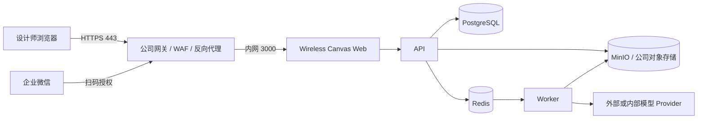

# 无线画布生产部署与验收

## 1. 服务器准备

建议准备一台安装了 Docker Engine 与 Docker Compose 的 Linux 服务器。正式环境只让公司的 HTTPS 网关、负载均衡或反向代理访问容器的 `3000` 端口；用户只访问域名的 `443` 端口。PostgreSQL、Redis、MinIO、API 和 Worker 不应直接暴露到公网。

公司没有 VPN 时，推荐使用“公司现有 HTTPS 网关 + 正式域名 + 企业微信登录”的方式：



需要公司 IT 提供：

- 一台 Linux 服务器或私有云主机，以及 SSH/控制台权限。
- 一个正式域名，例如 `canvas.company.com`。
- 该域名的 HTTPS 证书或公司现有自动签发网关。
- 允许网关转发到服务器 `3000` 端口的规则。
- 企业微信自建应用的 Corp ID、Agent ID、Secret 和可信回调域配置权限。

如果公司已有统一入口网关、WAF、零信任访问平台或内网域名，优先复用，不需要为了本项目单独购买 VPN。不要把 `3000`、`3100`、`5432`、`6379`、`9000` 或 `9001` 直接开放到公网。

```bash
git clone https://github.com/Jizhidemu52/Vincent-s-Canvas.git
cd Vincent-s-Canvas
cp .env.example .env
```

编辑 `.env`，至少替换：

- `POSTGRES_PASSWORD`
- `BOOTSTRAP_ADMIN_PASSWORD`
- `PROVIDER_ENCRYPTION_KEY`
- `S3_SECRET_ACCESS_KEY`

生成 Provider 加密密钥：

```bash
openssl rand -base64 32
```

启动前运行生产预检。已安装 Bun 时：

```bash
bun ops/preflight/production-preflight.ts --require-wecom
```

服务器只有 Docker 时：

```bash
docker run --rm --env-file .env \
  -v "$PWD:/workspace:ro" -w /workspace \
  oven/bun:1.3.13 \
  bun ops/preflight/production-preflight.ts --require-wecom
```

预检只输出通过项、缺失变量名和修复提示，不打印密码、Secret 或加密密钥。必须达到 `0 项错误` 才进入正式启动；首次管理员创建后的“删除初始密码”属于提醒项。

## 2. 启动

```bash
docker compose up -d --build
docker compose ps
curl http://localhost:3000/api/health
```

首次启动会自动执行 PostgreSQL 迁移、创建 MinIO Bucket、启用对象版本保护，并创建首位超级管理员。

打开 `http://服务器地址:3000/admin/login`：

1. 使用 `.env` 中的超级管理员账号和初始密码登录。
2. 按页面要求修改密码。
3. 成功后从 `.env` 删除 `BOOTSTRAP_ADMIN_PASSWORD`。

## 3. 开通设计师

进入 `后台管理 -> 账号额度`：

1. 先创建部门。
2. 单独创建账号，或下载 CSV 模板批量导入。
3. 登录账号可使用中文、英文、邮箱或工号。
4. 设置设计师所属部门、初始积分和额度上限。
5. 新账号首次密码登录必须修改密码。

部门管理员只能管理本部门设计师。超级管理员负责部门、Provider、模型、工作流和全局价格。

## 4. 企业微信

在企业微信管理后台创建自建应用，把可信回调地址设置为：

```text
https://你的域名/api/auth/wecom/callback
```

将 Corp ID、Agent ID 和 Secret 写入 `.env`：

```dotenv
WECOM_CORP_ID=
WECOM_AGENT_ID=
WECOM_SECRET=
WECOM_CALLBACK_URL=https://你的域名/api/auth/wecom/callback
```

四项必须同时填写，不能只填一部分；生产环境回调地址必须使用 HTTPS，否则 API 会拒绝启动。`WECOM_SECRET` 只写入服务器 `.env`，不能写进前端、截图或 GitHub。

账号匹配规则：

1. 先在 `后台管理 -> 账号额度` 开通内部账号。
2. 把账号的 `工号` 设置为该成员在企业微信通讯录中的 User ID，大小写和字符必须一致。
3. 首次扫码成功后，系统把企业微信 User ID 绑定到内部用户 UUID。
4. 后续即使显示姓名变化，也按不可变绑定登录，不会依赖姓名匹配。
5. 如果一个 User ID 或内部账号已绑定到其他对象，登录会被拒绝并写入审计日志，不会自动覆盖。

重启 API：

```bash
docker compose up -d api
```

企业微信成员的 User ID 应与账号工号一致，首次扫码后系统会绑定不可变内部用户 ID。

登录管理员后台后进入 `系统集成`：


企业微信一行显示 `可用` 且回调地址正确后，再用一位试点设计师扫码。服务端调用企业微信接口的超时为 10 秒；上游不可用时会返回可恢复的中文提示，并记录不含 Secret 的失败审计。

正式企业微信验收清单：

- 设计师扫码只能进入设计师工作台。
- 管理员扫码只能从管理员入口进入后台。
- 未开通账号的成员收到“尚未开通权限”。
- 停用账号无法通过已有绑定继续登录。
- 设计师端看不到 `系统集成`、模型密钥和额度配置。
- 回调 `state` 超时或重复使用会被拒绝。
- 企业微信接口超时不会创建半截 Session 或错误绑定。

## 5. Provider、工作流和模型

配置顺序：

1. 在 `API Provider` 新建 Provider，填写 Base URL 和 API Key。
2. API Key 由后端加密保存，浏览器只显示“已配置”。
3. 在 `工作流管理` 配置 RunningHub、ComfyUI 或自定义工作流。
4. 填写提交 JSON 模板、任务 ID 路径、状态路径和结果路径。
5. 在 `模型 API` 新建模型，并按需绑定工作流。
6. 配置模型积分、人民币成本和并发上限。
7. 在 `积分价格` 创建草稿，测试后发布。

模板变量：

```text
$prompt       提示词
$sourceUrls   公司素材地址数组
$workflowId   工作流 ID
$modelId      模型 ID
$apiKey       服务端 Provider API Key
$voice        音频任务参数示例
$seconds      视频任务参数示例
```

任务的 `parameters` 会作为同名模板变量传给 Worker，并原样进入历史记录。设计师端只会收到模型名称、能力、积分、价格和启用状态；Provider Key 不进入任务参数或浏览器存储。

## 6. 模拟出图验收

首次验收可在 `.env` 设置：

```dotenv
TASK_MOCK_MODE=true
```

```bash
docker compose up -d api worker
```

设计师点击生成后会经历真实的任务排队、积分冻结、Worker 执行、素材入库和成功结算，只是不调用外部模型。确认流程后必须把 `TASK_MOCK_MODE` 改回 `false`。

## 7. 备份与恢复

`backup` 容器每 15 分钟执行一次压缩 `pg_dump`，保存到 MinIO 的 `backups/postgres/`。MinIO Bucket 已启用版本保护。

查看备份日志：

```bash
docker compose logs --tail=100 backup
```

恢复前先停止 API 和 Worker：

```bash
docker compose stop api worker
docker compose run --rm backup restore.sh backups/postgres/20260710T120000Z.dump
docker compose up -d api worker
```

每季度至少执行一次恢复演练，并记录恢复耗时。验收目标为 RPO 不超过 15 分钟、RTO 不超过 4 小时。

## 8. 40 人并发验收

### 自动验收（推荐）

推送到 `main` 后，GitHub Actions 的 `compose-recovery` 会自动执行完整验收：

1. 构建并启动 Web、API、Worker、PostgreSQL、Redis、MinIO 和 Backup。
2. 写入恢复标记，创建数据库备份，删除标记后执行恢复，再确认标记恢复成功。
3. 通过管理员 API 完成首次改密，创建测试部门、模拟 Provider、模拟模型和 40 个相互隔离的设计师账号。
4. 40 个设计师分别登录并完成首次改密，获得 40 份独立 Session。
5. k6 使用 40 个并发用户持续提交 2 分钟；Worker 生成 QA 占位图并走真实队列、积分、对象存储、素材和历史链路。
6. 等待队列清空，核对成功任务、已结算额度、素材、历史、负余额和重复请求。

2026-07-10 的自动验收结果：

| 指标 | 结果 |
| --- | --- |
| 并发设计师 | 40 |
| 持续时间 | 2 分钟 |
| 成功提交 | 4,573 |
| 请求失败率 | 0.00% |
| 提交接口平均响应 | 53.83 ms |
| 提交接口 P95 | 106.77 ms |
| 失败任务 | 0 |
| 已结算额度记录 | 4,573 |
| 未结算冻结记录 | 0 |
| 已保存素材 | 4,573 |
| 成功历史记录 | 4,573 |
| 负余额账号 | 0 |
| 重复请求 ID | 0 |

对应的并发基线记录：[GitHub Actions 验证](https://github.com/Jizhidemu52/Vincent-s-Canvas/actions/runs/29092186577)。服务端媒体参数、音频计价、模型能力校验、跨账号隔离与恢复复验见 [最新 GitHub Actions 验证](https://github.com/Jizhidemu52/Vincent-s-Canvas/actions/runs/29096875561)。测试使用 `TASK_MOCK_MODE=true` 的部分验证平台自身并发、计费、队列和存储能力，不代表外部模型供应商的生成速度；接入正式模型后仍需对每个 Provider 单独做限流与超时验收。

### 手工复验

在测试环境创建 40 个设计师账号并准备各自的 Session Cookie，然后运行：

```bash
k6 run \
  -e BASE_URL=https://测试域名 \
  -e MODEL_CONFIG_ID=模型UUID \
  -e 'SESSION_COOKIES=["wireless_canvas_session=...","wireless_canvas_session=..."]' \
  ops/load/k6-40-submitters.js
```

通过条件：

- 40 个设计师持续提交 2 分钟。
- API 请求失败率低于 1%。
- 提交接口 P95 小于 1.5 秒。
- 相同 `requestId` 不重复冻结或扣费。
- 失败、取消和超时任务释放积分。
- 批量任务单张失败不影响其他图片。
- PostgreSQL、Redis、MinIO 和 Worker 无崩溃或数据串用。

## 9. 上线检查

```bash
docker compose ps
docker compose logs --tail=200 api worker postgres redis minio backup
curl https://正式域名/api/health
```

确认 HTTPS、企业微信回调、备份、审计导出、素材隔离和额度结算后，再从 10 位试点设计师逐步开放到约 100 人。
