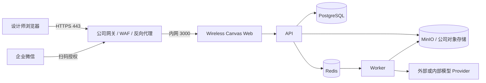
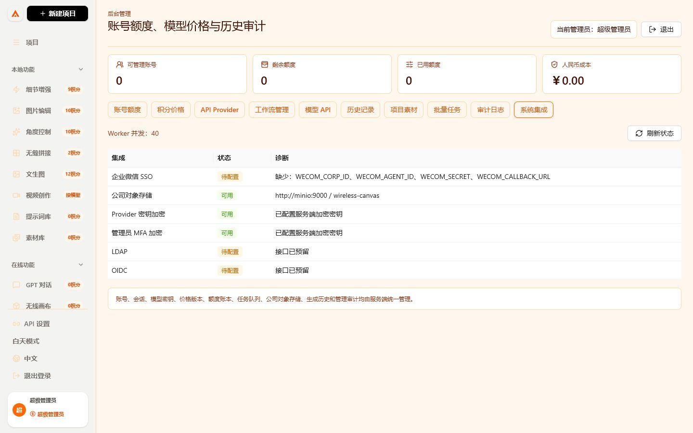

# 无线画布生产部署与验收

> 第一次部署、只想尽快把系统运行起来时，先看 [无脑部署手册](beginner-deployment.md)。本篇用于正式上线：企业微信、HTTPS、对象存储、备份恢复和并发验收。

## 1. 服务器准备

建议准备一台安装了 Docker Engine 与 Docker Compose 的 Linux 服务器。正式环境只让公司的 HTTPS 网关、负载均衡或反向代理访问容器的 `3000` 端口；用户只访问域名的 `443` 端口。PostgreSQL、Redis、MinIO、API 和 Worker 不应直接暴露到公网。

公司没有 VPN 时，推荐使用“公司现有 HTTPS 网关 + 正式域名 + 企业微信登录”的方式：


```mermaid
flowchart LR
    U[设计师浏览器] -->|HTTPS 443| G[公司网关 / WAF / 反向代理]
    W[企业微信] -->|扫码授权| G
    G -->|内网 3000| WEB[Wireless Canvas Web]
    WEB --> API[API]
    API --> PG[(PostgreSQL)]
    API --> R[(Redis)]
    API --> S[(MinIO / 公司对象存储)]
    R --> WK[Worker]
    WK --> S
    WK --> P[外部或内部模型 Provider]
```

需要公司 IT 提供：

- 目标 Linux 服务器的地址、SSH 端口、登录账号及可用认证方式；私钥或密码通过受控渠道提供，不贴到聊天或 Git。需要确认 Docker/Compose 权限和代码部署目录。
- 一个正式域名，以及 DNS、HTTPS 证书或公司现有网关的管理方式；说明只对内网开放还是允许公网访问。
- 网关转发到服务器 `3000` 端口的规则；确认该目录和端口是否已有服务，是否有需保留的数据。
- 持久化磁盘与备份存放位置。默认 Compose 使用本机 PostgreSQL、Redis 和 MinIO 卷；若要复用公司现有数据库或对象存储，应先提供对应连接方案，不直接套用默认 Compose。
- 若启用企业微信，提供自建应用的 Corp ID、Agent ID、Secret 和可信回调域配置权限；暂不启用时无需为账号密码登录开通企业微信应用。

在目标服务器、连接方式和入口域名未明确前，只能完成源码、配置说明和测试环境验证，不能把本机演示地址或 CI 通过当成“公司服务器已部署”。当前演示服务中的作品应先由用户下载、导出画布备份，再单独安排迁移；不要通过重启演示服务来代替正式部署。

如果公司已有统一入口网关、WAF、零信任访问平台或内网域名，优先复用，不需要为了本项目单独购买 VPN。不要把 `3000`、`3100`、`5432`、`6379`、`9000` 或 `9001` 直接开放到公网。

```bash
git clone https://github.com/Jizhidemu52/Vincent-s-Canvas.git
cd Vincent-s-Canvas
test -e .env || cp .env.example .env
```

编辑 `.env`，至少替换：

- `POSTGRES_PASSWORD`
- `BOOTSTRAP_ADMIN_PASSWORD`
- `PROVIDER_ENCRYPTION_KEY`
- `S3_SECRET_ACCESS_KEY`

`.env.example` 中的 `WECOM_CALLBACK_URL` 默认是示例地址，其他三项为空。这样原样启动会被判定为企业微信配置不完整。暂不启用企业微信时，必须将四项全部清空：

```dotenv
WECOM_CORP_ID=
WECOM_AGENT_ID=
WECOM_SECRET=
WECOM_CALLBACK_URL=
```

启用时四项填写正式值，并把示例域名替换为自己的 HTTPS 域名。不要仅删除预检的 `--require-wecom` 参数却保留半套配置。

生成 Provider 加密密钥：

```bash
openssl rand -base64 32
```

启动前运行生产预检。已安装 Bun 时：

```bash
bun --env-file=.env ops/preflight/production-preflight.ts
```

服务器只有 Docker 时：

```bash
docker run --rm --env-file .env \
  -v "$PWD:/workspace:ro" -w /workspace \
  oven/bun:1.3.13 \
  bun ops/preflight/production-preflight.ts
```

需要企业微信扫码登录时，在以上预检命令末尾加 `--require-wecom`。预检只输出通过项、缺失变量名和修复提示，不打印密码、Secret 或加密密钥。首次部署仍必须提供有效初始管理员密码，达到 `0 项错误` 才进入正式启动；后续移除初始密码按下一节的只读复验流程处理。

预检默认只校验配置，并不证明 HTTPS 入口、对象存储、Provider 或公司网络已经可用。正式启动、业务测试与备份验证仍需实际执行。

## 2. 启动

### 可选登录、积分与角色入口

以下服务端开关默认为 `true`；修改 `.env` 后重启 API 和 Worker。前端从 `/api/deployment` 读取当前模式，无需重新构建。

| 开关 | 关闭后的行为 |
| --- | --- |
| `AUTH_ENABLED=false` | 普通创作免登录，由服务端为浏览器签发独立访客会话；同时关闭内部积分扣费。管理员仍需在 `/admin/login` 认证。 |
| `CREDITS_ENABLED=false` | 保留登录和权限，隐藏创作入口的积分限制，新生成任务不冻结或扣除内部积分。旧任务按原计费快照结算。 |
| `ROLE_PORTALS_ENABLED=false` | 隐藏设计师/管理员角色选择入口，使用统一登录文案；不取消后台角色权限校验。 |

免登录不等于免费调用：外部模型服务仍可能收费，因此仅建议在可信内网或已有访问网关的环境开启。生产访客会话使用一年有效期的浏览器 Cookie；清除 Cookie 后不能自动找回原访客身份。后台接口不允许访客访问。

`demo-server.ts` 是单机演示服务：免登录时使用固定演示设计师，任务和服务端素材自动保存在本机 SQLite；会话、演示余额和后台临时配置仍在内存中。它不具备正式多人系统的隔离、持久账本与生产故障恢复保证。稳定性验收和正式使用应运行下方完整服务。

```bash
docker compose up -d --build
docker compose ps
curl http://localhost:3000/api/health
```

首次启动会自动执行 PostgreSQL 迁移、创建 MinIO Bucket、启用对象版本保护，并创建首位超级管理员。

通过公司 HTTPS 网关打开 `https://正式域名/admin/login`，不要把初始管理员密码通过公网裸 HTTP 发送：

1. 使用 `.env` 中的超级管理员账号和初始密码登录。
2. 按页面要求修改密码。
3. 确认可用超级管理员已完成改密后，从 `.env` **删除整行** `BOOTSTRAP_ADMIN_PASSWORD`，不要改成 `BOOTSTRAP_ADMIN_PASSWORD=`；运行时会拒绝空字符串。

### 移除初始密码后的复验

默认预检服务于首次引导，仍要求初始密码；已初始化环境用 `--after-bootstrap`。该模式只读查询目标数据库，确认至少一个启用、可密码登录且完成首次改密的超级管理员，才允许初始密码缺失。数据库连接失败、尚未迁移、管理员不可用或没有完成改密，都不会按“已经初始化”放行。

在部署仓库根目录执行（数据库已启动，API 镜像已构建）：

```bash
docker compose run --rm --no-deps \
  -v "$PWD:/workspace:ro" -w /workspace \
  api bun ops/preflight/production-preflight.ts --after-bootstrap
```

该一次性容器继承 `api` 的网络和 `DATABASE_URL`，读取已编辑的 `.env`；覆盖默认启动命令，所以不会执行迁移、创建管理员或启动另一份 API，也不需要挂载 Docker socket。需要企业微信时追加 `--require-wecom`。有 Bun 且已通过受控方式提供正确 `DATABASE_URL` 的环境，也可运行 `bun --env-file=.env ops/preflight/production-preflight.ts --after-bootstrap`；不要为宿主预检临时开放数据库公网端口。

复验通过后，在维护窗口重建 API/Worker 容器以移除旧容器环境中的初始密码：

```bash
docker compose up -d --force-recreate api worker
docker compose ps
```

这会短暂影响服务，应先确认没有处理中任务，并通知使用者。不要用 `docker compose restart` 代替，它不会加载变更后的环境变量。Provider 加密密钥和数据库/对象存储密码不是一次性初始密码，不能在此步骤一并删除或随意重置。

## 3. 开通设计师

进入 `后台管理 -> 账号额度`：

1. 先创建部门。
2. 单独创建账号，或下载 CSV 模板批量导入。
3. 登录账号可使用中文、英文、邮箱或工号。
4. 设置设计师所属部门、初始积分和额度上限。
5. 新账号首次密码登录必须修改密码。

部门管理员只能管理本部门设计师。超级管理员负责部门、Provider、模型、工作流和全局价格。

## 4. 企业微信

在企业微信管理后台创建自建应用，把可信回调地址设置为：

```text
https://你的域名/api/auth/wecom/callback
```

将 Corp ID、Agent ID 和 Secret 写入 `.env`：

```dotenv
WECOM_CORP_ID=
WECOM_AGENT_ID=
WECOM_SECRET=
WECOM_CALLBACK_URL=https://你的域名/api/auth/wecom/callback
```

四项必须同时填写，不能只填一部分；生产环境回调地址必须使用 HTTPS，路径必须是 `/api/auth/wecom/callback`，且不能保留 `canvas.example.com` 示例域名。暂不启用时四项全部置空，包含回调地址，否则 API 会拒绝启动。`WECOM_SECRET` 只写入服务器 `.env`，不能写进前端、截图或 GitHub。

账号匹配规则：

1. 先在 `后台管理 -> 账号额度` 开通内部账号。
2. 把账号的 `工号` 设置为该成员在企业微信通讯录中的 User ID，大小写和字符必须一致。
3. 首次扫码成功后，系统把企业微信 User ID 绑定到内部用户 UUID。
4. 后续即使显示姓名变化，也按不可变绑定登录，不会依赖姓名匹配。
5. 如果一个 User ID 或内部账号已绑定到其他对象，登录会被拒绝并写入审计日志，不会自动覆盖。

重启 API：

```bash
docker compose up -d api
```

企业微信成员的 User ID 应与账号工号一致，首次扫码后系统会绑定不可变内部用户 ID。

登录管理员后台后进入 `系统集成`：



企业微信一行显示 `可用` 且回调地址正确后，再用一位试点设计师扫码。服务端调用企业微信接口的超时为 10 秒；上游不可用时会返回可恢复的中文提示，并记录不含 Secret 的失败审计。

正式企业微信验收清单：

- 设计师扫码只能进入设计师工作台。
- 管理员扫码只能从管理员入口进入后台。
- 未开通账号的成员收到“尚未开通权限”。
- 停用账号无法通过已有绑定继续登录。
- 设计师端看不到 `系统集成`、模型密钥和额度配置。
- 回调 `state` 超时或重复使用会被拒绝。
- 企业微信接口超时不会创建半截 Session 或错误绑定。

## 5. 板块 API 配置

配置顺序：

1. 进入 `板块 API 配置`，选择要启用的功能板块。
2. 选择已有 API 服务或新增服务，填写 Base URL 和 API Key。
3. 填写模型 ID、模型成本、并发上限和板块基础积分。
4. RunningHub、ComfyUI 或自定义流程再从 `工作流（高级）` 配置模板和结果路径。
5. 保存后系统绑定该板块的默认模型并发布当前操作价格。
6. 检查板块卡片显示“已配置”，并确认设计师端显示相同积分。

API Key 由后端加密保存，浏览器只显示“已配置”。`API 服务与密钥`、`工作流（高级）` 和 `模型（高级）` 仍可用于复杂配置，但不再占用三个独立后台入口。

### 上游读取参考素材的对象存储入口

默认 Compose 的 `api` 和 `worker` 会把内部 `S3_ENDPOINT` 设为 `http://minio:9000`，用于系统读写。外部视频 Provider 无法访问这个地址；参考图、视频和音频的签名下载地址需要上游可达的 HTTPS 入口。

`S3_PUBLIC_ENDPOINT` 用于对外签名，内部 `S3_ENDPOINT` 可以保持不变。例如公司已有受控对象存储入口时：

```dotenv
S3_ENDPOINT=http://minio:9000
S3_PUBLIC_ENDPOINT=https://公司实际的对象存储域名
```

公共入口必须指向同一份对象、Bucket 与凭据，并正确转发签名请求的 Host、路径及查询参数；不能填一个未配置转发的域名或另一套独立 Bucket。若公司直接使用已有 HTTPS S3 服务，则按实际连接方案配置内部读写端点；不要以为只修改 `.env` 就覆盖了默认 Compose 的内部端点设置。

不要把 MinIO 管理端口直接暴露公网，也不需要把整个 Bucket 改成匿名公开。先由公司 IT 提供受控 HTTPS 对象入口并验证签名文件可在上游访问，再进行一次最小视频/音频参考任务；签名链接只在必要范围内使用，不放进公开文档或日志。未提供域名和入口前，不能把本地上传成功或 CI 模拟出图通过说成“真实上游已成功取回视频/音频素材”。

模板变量：

```text
$prompt       提示词
$sourceUrls   公司素材地址数组
$workflowId   工作流 ID
$modelId      模型 ID
$apiKey       服务端 Provider API Key
$voice        音频任务参数示例
$seconds      视频任务参数示例
```

任务的 `parameters` 会作为同名模板变量传给 Worker，并原样进入历史记录。设计师端只会收到模型名称、能力、积分、价格和启用状态；Provider Key 不进入任务参数或浏览器存储。

## 6. 模拟出图验收

首次验收可在 `.env` 设置：

```dotenv
TASK_MOCK_MODE=true
```

```bash
docker compose up -d api worker
```

设计师点击生成后会经历真实的任务排队、积分冻结、Worker 执行、素材入库和成功结算，只是不调用外部模型。确认流程后必须把 `TASK_MOCK_MODE` 改回 `false`。

## 7. 备份与恢复

`backup` 容器每 15 分钟执行一次压缩 `pg_dump`，保存到 MinIO 的 `backups/postgres/`。MinIO Bucket 已启用版本保护。默认数据库和 MinIO 仍在同一台机器；这不是异机灾备。正式上线需按公司要求把数据库备份、素材对象与必要加密配置另存到独立受控位置，浏览器中的画布另行导出。

查看备份日志：

```bash
docker compose logs --tail=100 backup
```

恢复会覆盖目标数据库，先确认备份对象、目标环境和维护窗口。先停止 Web、API、Worker 和 Backup，避免新请求或自动备份在恢复期间写入，再将示例备份路径替换为已经核实存在的对象：

```bash
docker compose stop web api worker backup
docker compose run --rm --no-deps backup restore.sh backups/postgres/已核实的备份文件.dump
docker compose up -d api worker web backup
```

每季度至少执行一次恢复演练，并记录恢复耗时。验收目标为 RPO 不超过 15 分钟、RTO 不超过 4 小时。

## 8. 40 人并发验收

### 自动验收（推荐）

推送到 `main` 后，GitHub Actions 的 `compose-recovery` 会自动执行完整验收：

1. 构建并启动 Web、API、Worker、PostgreSQL、Redis、MinIO 和 Backup。
2. 写入恢复标记，创建数据库备份，删除标记后执行恢复，再确认标记恢复成功。
3. 通过管理员 API 完成首次改密，创建测试部门、模拟 Provider、模拟模型和 40 个相互隔离的设计师账号。
4. 40 个设计师分别登录并完成首次改密，获得 40 份独立 Session。
5. k6 使用 40 个并发用户持续提交 2 分钟；Worker 生成 QA 占位图并走真实队列、积分、对象存储、素材和历史链路。
6. 等待队列清空，核对成功任务、已结算额度、素材、历史、负余额和重复请求。

2026-07-10 的自动验收结果：

| 指标 | 结果 |
| --- | --- |
| 并发设计师 | 40 |
| 持续时间 | 2 分钟 |
| 成功提交 | 4,573 |
| 请求失败率 | 0.00% |
| 提交接口平均响应 | 53.83 ms |
| 提交接口 P95 | 106.77 ms |
| 失败任务 | 0 |
| 已结算额度记录 | 4,573 |
| 未结算冻结记录 | 0 |
| 已保存素材 | 4,573 |
| 成功历史记录 | 4,573 |
| 负余额账号 | 0 |
| 重复请求 ID | 0 |

对应的并发基线记录：[GitHub Actions 验证](https://github.com/Jizhidemu52/Vincent-s-Canvas/actions/runs/29092186577)。服务端媒体参数、音频计价、模型能力校验、跨账号隔离与恢复复验见 [最新 GitHub Actions 验证](https://github.com/Jizhidemu52/Vincent-s-Canvas/actions/runs/29096875561)。测试使用 `TASK_MOCK_MODE=true` 的部分验证平台自身并发、计费、队列和存储能力，不代表外部模型供应商的生成速度；接入正式模型后仍需对每个 Provider 单独做限流与超时验收。

### 手工复验

在测试环境创建 40 个设计师账号并准备各自的 Session Cookie，然后运行：

```bash
k6 run \
  -e BASE_URL=https://测试域名 \
  -e MODEL_CONFIG_ID=模型UUID \
  -e 'SESSION_COOKIES=["wireless_canvas_session=...","wireless_canvas_session=..."]' \
  ops/load/k6-40-submitters.js
```

通过条件：

- 40 个设计师持续提交 2 分钟。
- API 请求失败率低于 1%。
- 提交接口 P95 小于 1.5 秒。
- 相同 `requestId` 不重复冻结或扣费。
- 失败、取消和超时任务释放积分。
- 批量任务单张失败不影响其他图片。
- PostgreSQL、Redis、MinIO 和 Worker 无崩溃或数据串用。

## 9. 上线检查

```bash
docker compose ps
docker compose logs --tail=200 api worker postgres redis minio backup
curl https://正式域名/api/health
```

确认 HTTPS、企业微信回调、备份、审计导出、素材隔离和额度结算后，再从 10 位试点设计师逐步开放到约 100 人。
