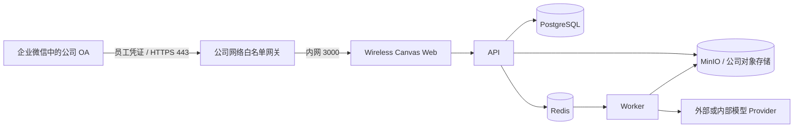

# 无线画布生产部署与验收

> 先在 [部署导航](installation-guide.md) 确认运行模式。本篇用于完整后端的上线验收：公司 OA 自动身份、HTTPS、员工画布与原图恢复、管理保护、备份和并发。真实员工、目标服务器及网络白名单仍待 IT 联调。

## 1. 服务器准备

建议准备一台安装了 Docker Engine 与 Docker Compose 的 Linux 服务器。正式环境只让公司的 HTTPS 网关、负载均衡或反向代理访问容器的 `3000` 端口；用户只访问域名的 `443` 端口。PostgreSQL、Redis、MinIO、API 和 Worker 不应直接暴露到公网。

使用者按“企业微信 → 公司 OA → 画布”进入，画布验证 OA 员工身份，不增加扫码或密码步骤。公司网关限制公司网络访问，网页、API、媒体及后端端口都必须覆盖，不能仅限制登录时的来源：


```mermaid
flowchart LR
    U[企业微信中的公司 OA] -->|员工凭证 / HTTPS 443| G[公司网络白名单网关]
    G -->|内网 3000| WEB[Wireless Canvas Web]
    WEB --> API[API]
    API --> PG[(PostgreSQL)]
    API --> R[(Redis)]
    API --> S[(MinIO / 公司对象存储)]
    R --> WK[Worker]
    WK --> S
    WK --> P[外部或内部模型 Provider]
```

需要公司 IT 提供：

- 目标 Linux 服务器的地址、SSH 端口、登录账号及可用认证方式；私钥或密码通过受控渠道提供，不贴到聊天或 Git。需要确认 Docker/Compose 权限和代码部署目录。
- 正式域名、DNS、HTTPS 证书或公司现有网关的管理方式，以及公司出口 IP / 内网允许网段；目标仅允许公司网络访问，具体网络位置和 IP 尚待 IT 确认。
- 网关转发到服务器 `3000` 端口的规则；确认该目录和端口是否已有服务，是否有需保留的数据。
- 持久化磁盘与备份存放位置。默认 Compose 使用本机 PostgreSQL、Redis 和 MinIO 卷；若要复用公司现有数据库或对象存储，应先提供对应连接方案，不直接套用默认 Compose。
- 公司 OA 画布菜单地址、可验证的临时员工凭证对接和受信任身份接口；凭据通过受控渠道配置，不提供画布独立企业微信扫码入口。

在目标服务器、连接方式和入口域名未明确前，只能完成源码、配置说明和测试环境验证，不能把本机演示地址或 CI 通过当成“公司服务器已部署”。当前演示服务中的作品应先由用户下载、导出画布备份，再单独安排迁移；不要通过重启演示服务来代替正式部署。

如果公司已有统一入口网关、WAF、零信任访问平台或内网域名，优先复用，不需要为了本项目单独购买 VPN。不要把 `3000`、`3100`、`5432`、`6379`、`9000` 或 `9001` 直接开放到公网。

```bash
git clone https://github.com/Jizhidemu52/Vincent-s-Canvas.git
cd Vincent-s-Canvas
test -e .env || cp .env.example .env
```

编辑 `.env`，至少替换：

- `POSTGRES_PASSWORD`
- `BOOTSTRAP_ADMIN_PASSWORD`
- `PROVIDER_ENCRYPTION_KEY`
- `S3_SECRET_ACCESS_KEY`

本项目复用现有 OA，而不是新增独立企业微信扫码。因此以下 `WECOM_*` 扫码字段留空，实际企业身份接口按 [公司 OA 接入](oa-workspace-integration.md) 配置：

```dotenv
WECOM_CORP_ID=
WECOM_AGENT_ID=
WECOM_SECRET=
WECOM_CALLBACK_URL=
```

不使用 `--require-wecom` 作为 OA 接入的前置检查；该参数针对旧独立扫码流程，不能代替真实 OA 凭证与员工隔离验证。

生成 Provider 加密密钥：

```bash
openssl rand -base64 32
```

启动前运行生产预检。已安装 Bun 时：

```bash
bun --env-file=.env ops/preflight/production-preflight.ts
```

服务器只有 Docker 时：

```bash
docker run --rm --env-file .env \
  -v "$PWD:/workspace:ro" -w /workspace \
  oven/bun:1.3.13 \
  bun ops/preflight/production-preflight.ts
```

预检只输出通过项、缺失变量名和修复提示，不打印密码、Secret 或加密密钥。首次部署仍必须提供有效初始管理员密码以保护敏感维护，达到 `0 项错误` 才进入正式启动；后续移除初始密码按下一节的只读复验流程处理。

预检默认只校验配置，并不证明 HTTPS 入口、对象存储、Provider 或公司网络已经可用。正式启动、业务测试与备份验证仍需实际执行。

## 2. 启动

### 企业模式与本机试用

根目录生产模板使用 `OA_LOGIN_ENABLED=true`；仅隔离本机试用设为 `false`。前端以 `/api/deployment` 的实际返回值为准，部署时必须使用同版本前后端，不用旧 `AUTH_ENABLED` 字段代替 OA 模式选择。

| 状态 | 当前行为 |
| --- | --- |
| `OA_LOGIN_ENABLED=true` | `oaLoginEnabled`、`authenticationEnabled` 均为 true；普通创作只接受已验证 OA 员工，缺失/失效身份不回退访客。 |
| `OA_LOGIN_ENABLED=false` | 本机试用，两个认证标志均为 false；完整后端签发浏览器访客会话，Windows 演示使用共用身份，不代表企业隔离。 |
| `CREDITS_ENABLED=false` | 新生成任务不冻结或扣除内部积分。旧任务按原计费快照结算。 |
| `ROLE_PORTALS_ENABLED=false` | 普通创作界面隐藏账号、积分、小组与管理入口；不取消后台角色权限校验。 |

免内部积分不等于免费调用：外部模型仍可能收费。生产管理员在独立 `/admin/login` 以密码认证并接受角色校验，普通 OA 员工和访客不能访问敏感维护；管理员也不能用维护身份自动进入员工画布。企业画布与原图按员工保存到 PostgreSQL / S3，本地保留员工缓存；确认已同步后可恢复。独立聊天与创意草稿、试用画布仍是浏览器数据，换环境前另存/导出。

`demo-server.ts` 用于本机试用或 OA 试点：素材和任务保存到 SQLite，OA 模式另持久化员工身份、会话及画布；试用共用身份，临时配置不等于正式持久化。它不提供管理员密码入口，不能替代完整生产后端。`Start-LAN.bat` 默认试用，`Start-LAN.ps1 -CompanyOa` 仅选择企业试点，不自动切换或重启已有服务。

```bash
docker compose up -d --build
docker compose ps
curl http://localhost:3000/api/health
```

首次启动会自动执行 PostgreSQL 迁移、创建 MinIO Bucket、启用对象版本保护，并创建首位超级管理员。

通过公司 HTTPS 网关打开 `https://正式域名/admin/login`，不要把初始管理员密码通过公网裸 HTTP 发送：

1. 使用 `.env` 中的超级管理员账号和初始密码登录。
2. 按页面要求修改密码。
3. 确认可用超级管理员已完成改密后，从 `.env` **删除整行** `BOOTSTRAP_ADMIN_PASSWORD`，不要改成 `BOOTSTRAP_ADMIN_PASSWORD=`；运行时会拒绝空字符串。

### 移除初始密码后的复验

默认预检服务于首次引导，仍要求初始密码；已初始化环境用 `--after-bootstrap`。该模式只读查询目标数据库，确认至少一个启用、可密码登录且完成首次改密的超级管理员，才允许初始密码缺失。数据库连接失败、尚未迁移、管理员不可用或没有完成改密，都不会按“已经初始化”放行。

在部署仓库根目录执行（数据库已启动，API 镜像已构建）：

```bash
docker compose run --rm --no-deps \
  -v "$PWD:/workspace:ro" -w /workspace \
  api bun ops/preflight/production-preflight.ts --after-bootstrap
```

该一次性容器继承 `api` 的网络和 `DATABASE_URL`，读取已编辑的 `.env`；覆盖默认启动命令，所以不会执行迁移、创建管理员或启动另一份 API，也不需要挂载 Docker socket。有 Bun 且已通过受控方式提供正确 `DATABASE_URL` 的环境，也可运行 `bun --env-file=.env ops/preflight/production-preflight.ts --after-bootstrap`；不要为宿主预检临时开放数据库公网端口。

复验通过后，在维护窗口重建 API/Worker 容器以移除旧容器环境中的初始密码：

```bash
docker compose up -d --force-recreate api worker
docker compose ps
```

这会短暂影响服务，应先确认没有处理中任务，并通知使用者。不要用 `docker compose restart` 代替，它不会加载变更后的环境变量。Provider 加密密钥和数据库/对象存储密码不是一次性初始密码，不能在此步骤一并删除或随意重置。

## 3. 员工从 OA 进入

企业微信打开公司 OA，再点击画布菜单。后端只信任受配置约束的 OA 身份接口返回的员工标识；姓名仅用于显示，不按姓名合并账号。前端消费入口凭证后移除地址中的 token，不写入本地存储；缺失/失效凭证显示返回 OA 的提示，不展示扫码页、不回退共享身份。

旧共用画布、历史账号数据不自动迁入新员工，也不公开。需要转移的作品先由有权用户导出，确认目标员工后导入，不能通过修改数据库归属批量绕过授权。

## 4. 公司 OA 与网络验收

本版不使用独立 `WECOM_*` 扫码流程，不需要让员工在画布内再扫一次码。接入和 IT 输入以 [公司 OA 接入](oa-workspace-integration.md) 为准：

- 确认 OA 菜单指向正式 HTTPS 画布入口，临时凭证可由后端验证；日志、截图与 Git 不保存真实 token，TLS 校验不能关闭。
- 仓库内层 Nginx 访问日志仅记录请求方法与不含查询串的路径，并设置 `Referrer-Policy: no-referrer`；外层公司网关和 OA 也必须去除带 token 的完整 URL、查询参数及 Referer，不能只脱敏应用日志。`index.html` 不缓存，静态 JS 可缓存。目标服务器仍需执行 Nginx 配置检查并实际验证响应头和日志脱敏，当前未完成该现场验收。
- 两位真实员工分别进入：A 保存画布与原图并确认已同步，关闭重开恢复；B 不能列表、读取或下载 A 的数据。
- 失效或错误凭证必须拒绝，不能沿用另一员工旧身份；普通创作不接受管理员维护身份。
- 公司 IT 确认服务器位置与出口 IP / 网段，限制网页、API、媒体及直接后端端口；从公司外网络实测全部入口不可访问，不能只测首页。
- 已下载、截图或浏览器缓存的文件不能被远程收回；网络限制不等于终端防泄漏。数据库和原图文件须联合备份。

这些正式输入和真实验收尚未完成，不因本机试用或自动化测试成功标记为完成。

## 5. 板块 API 配置

配置顺序：

1. 进入 `板块 API 配置`，选择要启用的功能板块。
2. 选择已有 API 服务或新增服务，填写 Base URL 和 API Key。
3. 填写模型 ID、模型成本、并发上限和板块基础积分。
4. RunningHub、ComfyUI 或自定义流程再从 `工作流（高级）` 配置模板和结果路径。
5. 保存后系统绑定该板块的默认模型并发布当前操作价格。
6. 检查板块卡片显示“已配置”，并确认创作端能选择模型；当前不显示内部积分限制。

API Key 由后端加密保存，浏览器只显示“已配置”。`API 服务与密钥`、`工作流（高级）` 和 `模型（高级）` 仍可用于复杂配置，但不再占用三个独立后台入口。

### 上游读取参考素材的对象存储入口

默认 Compose 的 `api` 和 `worker` 会把内部 `S3_ENDPOINT` 设为 `http://minio:9000`，用于系统读写。外部视频 Provider 无法访问这个地址；参考图、视频和音频的签名下载地址需要上游可达的 HTTPS 入口。

`S3_PUBLIC_ENDPOINT` 用于对外签名，内部 `S3_ENDPOINT` 可以保持不变。例如公司已有受控对象存储入口时：

```dotenv
S3_ENDPOINT=http://minio:9000
S3_PUBLIC_ENDPOINT=https://公司实际的对象存储域名
```

公共入口必须指向同一份对象、Bucket 与凭据，并正确转发签名请求的 Host、路径及查询参数；不能填一个未配置转发的域名或另一套独立 Bucket。若公司直接使用已有 HTTPS S3 服务，则按实际连接方案配置内部读写端点；不要以为只修改 `.env` 就覆盖了默认 Compose 的内部端点设置。

不要把 MinIO 管理端口直接暴露公网，也不需要把整个 Bucket 改成匿名公开。先由公司 IT 提供受控 HTTPS 对象入口并验证签名文件可在上游访问，再进行一次最小视频/音频参考任务；签名链接只在必要范围内使用，不放进公开文档或日志。未提供域名和入口前，不能把本地上传成功或 CI 模拟出图通过说成“真实上游已成功取回视频/音频素材”。

模板变量：

```text
$prompt       提示词
$sourceUrls   公司素材地址数组
$workflowId   工作流 ID
$modelId      模型 ID
$apiKey       服务端 Provider API Key
$voice        音频任务参数示例
$seconds      视频任务参数示例
```

任务的 `parameters` 会作为同名模板变量传给 Worker，并原样进入历史记录。设计师端只会收到模型名称、能力、积分、价格和启用状态；Provider Key 不进入任务参数或浏览器存储。

## 6. 模拟出图验收

首次验收可在 `.env` 设置：

```dotenv
TASK_MOCK_MODE=true
```

```bash
docker compose up -d api worker
```

用户点击生成后会经历真实的任务排队、Worker 执行、素材入库和状态保存，只是不调用外部模型。当前不扣内部积分；确认流程后必须把 `TASK_MOCK_MODE` 改回 `false`。

## 7. 备份与恢复

`backup` 容器每 15 分钟执行一次压缩 `pg_dump`，保存到 MinIO 的 `backups/postgres/`。MinIO Bucket 已启用版本保护。默认数据库和 MinIO 仍在同一台机器；这不是异机灾备。正式上线需按公司要求把数据库备份、素材对象与必要加密配置另存到独立受控位置，浏览器中的画布另行导出。

查看备份日志：

```bash
docker compose logs --tail=100 backup
```

恢复会覆盖目标数据库，先确认备份对象、目标环境和维护窗口。先停止 Web、API、Worker 和 Backup，避免新请求或自动备份在恢复期间写入，再将示例备份路径替换为已经核实存在的对象：

```bash
docker compose stop web api worker backup
docker compose run --rm --no-deps backup restore.sh backups/postgres/已核实的备份文件.dump
docker compose up -d api worker web backup
```

每季度至少执行一次恢复演练，并记录恢复耗时。验收目标为 RPO 不超过 15 分钟、RTO 不超过 4 小时。

## 8. 40 人并发验收

### 历史并发基线与当前复验

下述账号与积分链路是历史 `compose-recovery` 基线，不代表当前 OA 入口已完成目标服务器验收。当前以仓库实际 CI 脚本为准，并额外验证 OA 员工任务、画布/媒体隔离、管理接口保护及无内部积分扣费；免登录试用另行验证。

1. 构建并启动 Web、API、Worker、PostgreSQL、Redis、MinIO 和 Backup。
2. 写入恢复标记，创建数据库备份，删除标记后执行恢复，再确认标记恢复成功。
3. 通过管理员 API 完成首次改密，创建测试部门、模拟 Provider、模拟模型和 40 个相互隔离的设计师账号。
4. 40 个设计师分别登录并完成首次改密，获得 40 份独立 Session。
5. k6 使用 40 个并发用户持续提交 2 分钟；Worker 生成 QA 占位图并走真实队列、积分、对象存储、素材和历史链路。
6. 等待队列清空，核对成功任务、已结算额度、素材、历史、负余额和重复请求。

2026-07-10 的自动验收结果：

| 指标 | 结果 |
| --- | --- |
| 并发设计师 | 40 |
| 持续时间 | 2 分钟 |
| 成功提交 | 4,573 |
| 请求失败率 | 0.00% |
| 提交接口平均响应 | 53.83 ms |
| 提交接口 P95 | 106.77 ms |
| 失败任务 | 0 |
| 已结算额度记录 | 4,573 |
| 未结算冻结记录 | 0 |
| 已保存素材 | 4,573 |
| 成功历史记录 | 4,573 |
| 负余额账号 | 0 |
| 重复请求 ID | 0 |

对应的并发基线记录：[GitHub Actions 验证](https://github.com/Jizhidemu52/Vincent-s-Canvas/actions/runs/29092186577)。服务端媒体参数、音频计价、模型能力校验、跨账号隔离与恢复复验见 [最新 GitHub Actions 验证](https://github.com/Jizhidemu52/Vincent-s-Canvas/actions/runs/29096875561)。测试使用 `TASK_MOCK_MODE=true` 的部分验证平台自身并发、计费、队列和存储能力，不代表外部模型供应商的生成速度；接入正式模型后仍需对每个 Provider 单独做限流与超时验收。

### 手工复验

在测试环境创建 40 个设计师账号并准备各自的 Session Cookie，然后运行：

```bash
k6 run \
  -e BASE_URL=https://测试域名 \
  -e MODEL_CONFIG_ID=模型UUID \
  -e 'SESSION_COOKIES=["wireless_canvas_session=...","wireless_canvas_session=..."]' \
  ops/load/k6-40-submitters.js
```

通过条件：

- 40 个设计师持续提交 2 分钟。
- API 请求失败率低于 1%。
- 提交接口 P95 小于 1.5 秒。
- 相同 `requestId` 不重复冻结或扣费。
- 失败、取消和超时任务释放积分。
- 批量任务单张失败不影响其他图片。
- PostgreSQL、Redis、MinIO 和 Worker 无崩溃或数据串用。

## 9. 上线检查

```bash
docker compose ps
docker compose logs --tail=200 api worker postgres redis minio backup
curl https://正式域名/api/health
```

确认公司网络白名单、真实 OA 入口、员工画布/原图隔离及恢复、敏感管理保护、联合备份与供应商并发限制后，再逐步扩大使用范围。服务器位置、出口 IP 和真实员工联调未完成前，不把试用环境称为企业正式部署。
