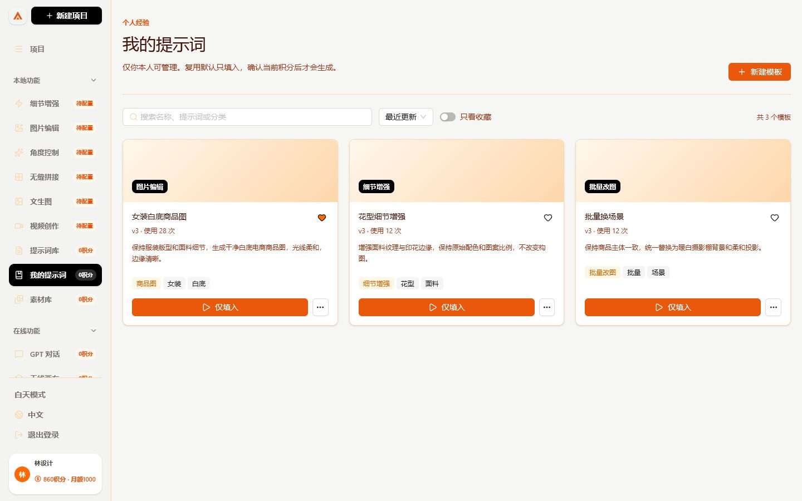
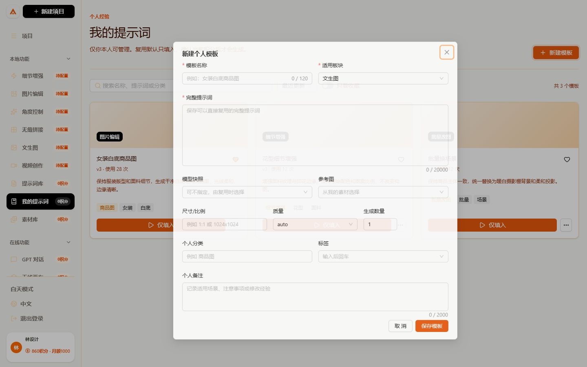
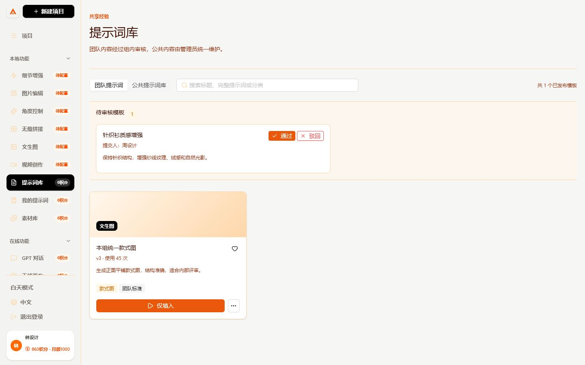
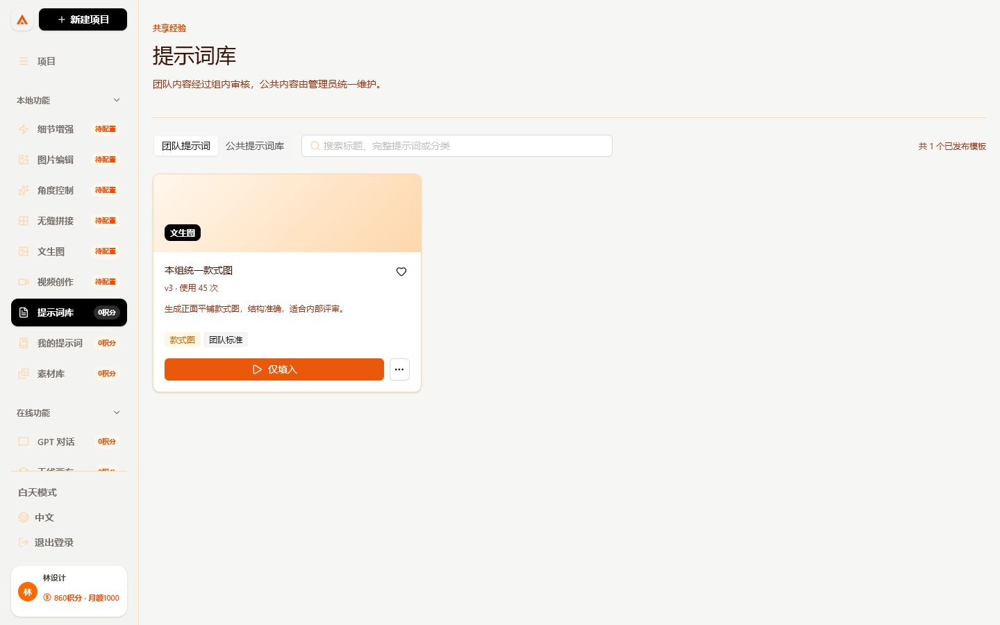
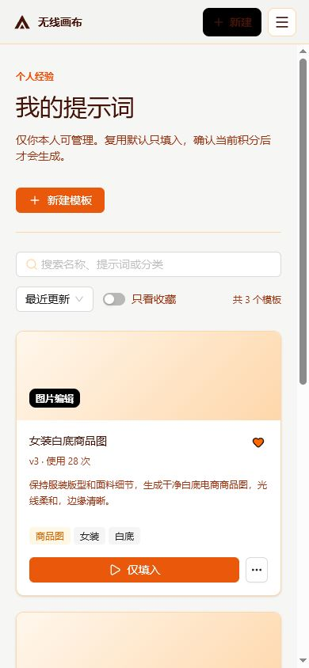

# 我的提示词、团队模板与公共提示词库操作手册

这套功能用于把一次成功出图沉淀成可以复现的模板，同时避免设计师之间互相看到私人提示词。

## 1. 三个层级怎么区分

| 层级 | 谁能看 | 谁能修改 | 怎么产生 |
| --- | --- | --- | --- |
| 我的提示词 | 创建人本人 | 创建人本人 | 手工新建、成功任务保存、素材保存 |
| 团队提示词 | 当前小组成员 | 发布版本不可直接覆盖 | 设计师提交，组长或管理员审核 |
| 公共提示词库 | 全公司 | 超级管理员 | 管理员新建，或从团队模板提升 |

管理员查看个人模板正文时会写入审计日志，但不能直接替设计师修改私人模板。设计师调组后，只能看到新小组当前发布的团队模板。

## 2. 新建个人模板

1. 用设计师账号登录，点击左侧 `我的提示词`。
2. 点击右上角 `新建模板`。
3. 填写模板名称、完整提示词和适用板块。
4. 按需要选择模型、尺寸、质量、数量、参考图、分类、标签和备注。
5. 点击 `保存模板`。
6. 后续编辑会生成新版本，旧版本保留用于审计，不会被覆盖或删除。

## 3. 从出图结果或素材保存

### 从成功任务保存

1. 在文生图、图片编辑等板块完成一次生成。
2. 在成功图片卡片点击 `存为提示词`。
3. 服务端会读取该任务的完整提示词、模型、参数和结果素材，保存为本人的个人模板。
4. 失败、取消、属于其他设计师或不存在的任务不能保存。

### 从素材库保存

1. 打开 `素材库`，进入本人公司素材的详情。
2. 确认素材详情里有来源板块和完整提示词。
3. 点击 `保存到我的提示词`。
4. 本地临时素材、其他设计师的私有素材和没有提示词的素材不能保存。

## 4. 如何复用且不误扣积分

每张模板卡的主按钮都是 `仅填入`。点击后只会：

1. 跳到模板对应的图片、视频、画布、批量改图或无缝拼接板块。
2. 填入提示词、当前可用模型、参数和仍有权限访问的参考图。
3. 显示管理员当前配置的实际积分。

此时不会创建任务、冻结额度或扣积分。

`更多操作 -> 填入并生成` 也不会立即扣费。目标页面会再次显示当前实际积分，只有用户点击 `确认生成` 后，才通过原有任务队列和额度账本提交。重复请求沿用服务端幂等保护，不能重复扣费。

批量改图模板会打开画布内的批量入口并填好提示词。用户必须先选择文件夹或多张图片，再确认执行；单张失败不会影响整批其他图片。

## 5. 模型停用或价格变化怎么办

模板保存的是历史模型快照，不保存可执行的历史价格。每次复用时服务端都会重新检查：

1. 原模型和 Provider 是否仍启用。
2. 原模型是否仍支持目标板块能力。
3. 管理员是否配置了替代模型。
4. 当前操作价格和模型价格是多少。

原模型不可用时，页面显示 `模型已变更`。若管理员已设置替代模型，系统带入替代模型并显示新积分；若没有替代模型，设计师必须从管理员当前启用的兼容模型中选择。API Key 始终只保存在服务端。

管理员设置路径：`后台管理 -> 模型/API -> 编辑模型 -> 停用后的替代模型`。

## 6. 提交团队审核

1. 设计师在 `我的提示词` 卡片的更多菜单点击 `提交为团队模板`。
2. 系统冻结本次提交的版本快照。设计师之后修改个人模板，不会偷偷改变待审核内容。
3. 组长仍从设计师入口登录，打开 `提示词库 -> 团队提示词`。
4. 组长检查完整提示词、提交人和参数后选择 `通过` 或 `驳回`。
5. 驳回时填写修改建议；通过后形成独立团队发布版本。
6. 同一请求重复点击不会重复创建审核或发布版本。

组长只能审核自己当前小组。部门管理员只能管理本部门范围，超级管理员可以管理全公司并把团队模板提升为公共模板。

## 7. 移动端使用

手机端入口、搜索、筛选、收藏和复用均可使用。模板卡片会变为单列，不产生横向滚动。

## 8. 管理员与模块开关

超级管理员可在 `后台管理 -> 模块开关` 关闭 `提示词库`。关闭后：

- 设计师和组长不再看到 `提示词库` 与 `我的提示词` 入口。
- 直接访问页面或接口也会被服务端拒绝。
- 已有模板、版本、审核记录和审计日志不会删除。
- 管理员可以重新开启模块。

## 9. 接口接入表

| 用途 | 方法和路径 |
| --- | --- |
| 查询个人/团队/公共模板 | `GET /api/prompt-templates?scope=personal|team|public` |
| 新建个人模板 | `POST /api/prompt-templates` |
| 编辑并产生新版本 | `PATCH /api/prompt-templates/:id` |
| 从成功任务保存 | `POST /api/prompt-templates/from-task/:taskId` |
| 从本人素材保存 | `POST /api/prompt-templates/from-asset/:assetId` |
| 提交团队审核 | `POST /api/prompt-templates/:id/submit` |
| 查询审核队列 | `GET /api/prompt-templates/review/submissions` |
| 审核通过或驳回 | `POST /api/prompt-templates/review/submissions/:id` |
| 解析当前模型与价格 | `POST /api/prompt-templates/:id/resolve` |
| 用短期令牌填入目标页 | `GET /api/prompt-templates/reuse/:token` |

所有接口依赖服务端 Session 鉴权和角色作用域。前端不能传入用户 ID 来绕过隔离，也不能读取 Provider Key、对象存储密钥或数据库凭据。

## 10. 常见问题

**点击后提示模型已变更**

原模型已停用、Provider 已停用或能力不匹配。使用管理员配置的替代模型，或选择当前启用的兼容模型。

**当前积分和以前不同**

这是预期行为。系统按管理员当前价格重新估算，不沿用历史模板价格。

**参考图不可用**

素材已删除、已撤销共享或不再属于当前账号可见范围。移除失效参考图或重新选择本人素材。

**看不到团队提示词**

检查账号是否仍在小组、模板是否已经审核发布，以及超级管理员是否开启 `提示词库` 模块。

**旧历史记录没有“存为提示词”所需的任务编号**

先把图片保存到公司素材库，再从素材详情保存模板。新生成任务会自动保留服务端任务编号。
