# 无线画布全板块操作手册

本手册面向第一次使用软件的设计师，讲清每个板块做什么、点哪里、填什么、完成后得到什么。安装与部署请另看 GitHub 仓库中的 [安装部署指南](installation-guide.md)，这里专注软件操作。

更新日期：2026-09-11。本次已补入连续对话创作、文档/表格附件、手动图片编辑、自定义尺寸、图片命名与版本、图片集 PDF/ZIP、自动读取画布、右键定位生成、视频/音频参考、任务恢复及多窗口保存保护。截图中的模型名称只是当前部署示例，不表示所有安装都会自动拥有这些模型。

画布负责把参考图、提示词、生成过程和结果摆在一起；其他创作页面负责快速完成单项任务；公司版后台负责账号、模型、积分和审计。

不用节点、只想直接做图或视频，可从第 6 节开始；需要画布工作流再看第 2—5 节。小组、账号、模型配置与后台查询在第 7 节，每天收工前按第 8 节备份。创作页截图来自当前运行页面，填写示例未点击收费生成；公司版示例图另有标注，界面样式和数字以实际部署为准。

### 按要做的事查步骤

| 你现在想做什么 | 直接阅读 |
| --- | --- |
| 第一次打开、认识菜单 | [第 1 节：进入软件](#start) |
| 上传原图，让 AI 改颜色或花型 | [第 2 节：画布第一次改图](#first-edit) |
| 缩放、框选、连线、批量改图 | [第 3 节：画布操作](#canvas-tools) |
| 不调用 AI，裁剪、标注、改像素尺寸 | [3.6：手动编辑图片](#manual-image-edit) |
| 图片重命名，分清 v1、v2 | [3.7：名称与版本](#image-versions) |
| 让 AI 看当前画布，先讨论再执行 | [第 4 节：画布 Agent](#canvas-agent) |
| 几张图排成 PDF，或打包原图 | [5.5：导出图片集](#image-set-export) |
| 单独做图、增强、换角度、无缝拼接 | [6.1：图像类页面](#image-tools) |
| 首尾帧、视频编辑、续写、音频参考 | [6.2：视频创作](#video-tools) |
| 上传 PDF/Word/Excel 让 AI 分析 | [6.3.2：附件读取](#chat-attachments) |
| 一边聊天一边反复改同一张图 | [6.3.3：连续对话创作](#continuous-creation) |
| 断网后找回原来的图片任务 | [6.3.6：恢复原任务](#chat-recovery) |
| 管素材、提示词、小组、账号和积分 | [6.4：素材库](#asset-library)、[6.5：提示词](#prompt-library)、[第 7 节：公司管理](#company-admin) |
| 换电脑、更新软件、发现保存冲突 | [第 8 节：数据保护](#data-safety)、[安装与拉取更新](installation-guide.md) |

<a id="start"></a>

## 1. 进入软件，先认识界面

### 1.1 第一次打开

1. 在电脑打开 Chrome、Edge 或平时使用的浏览器。
2. 点击浏览器最上方的地址栏，不是网页里的搜索框。
3. 输入管理员或启动窗口给出的完整软件地址，按回车。当前电脑上可能是 `http://127.0.0.1:3001/`；同事电脑应使用运行电脑的实际局域网 IP。
4. 看见首页“让想法，开始成形。”和左侧功能菜单，表示已经进入软件。
5. 登录版按自己的账号登录；免登录版直接进入创作，不必另外找设计师、管理员身份按钮。

如果网页显示“无法访问此网站”，先核对地址是否完整、运行软件的电脑是否开机、服务是否启动。不要把 GitHub 仓库地址当成软件运行地址。


左侧是功能菜单：点名称进入对应板块。中间是工作区。点击 `无线画布` 看已有画布，点击 `新建项目` 新建一个画布。`本地功能` 只是菜单分类名称，不表示 AI 模型离线运行；真实生成仍需要网络和已配置的服务端模型。

菜单很长时，在左侧菜单区域向下滚动可看到素材库、LLM 对话、无线画布等入口。不要在地址栏重新输入另一端口，以免进入不同的本地存储空间。

免费/权限边界：

- 单机免登录不扣项目内部积分，但使用的外部模型 Key 仍可能收费。
- 公司版模型和 Key 由管理员配置；设计师只在下拉框选择可用模型。
- 单机演示服务使用固定身份，素材与任务保存在本机 SQLite；会话、演示余额和后台临时配置仍在内存中，不是具备隔离能力的多人正式系统。
- 当前画布布局保存在当前浏览器，分享链接不是跨设备云同步。重要成果下载、画布导出 ZIP，见第 5 和第 8 节。

### 1.2 九个词，一次看懂

| 页面上的词 | 用大白话理解 |
| --- | --- |
| 模型 | 替你画图或回答问题的“AI 工具”；不同工具擅长的事不同 |
| 提示词 | 你给 AI 写的要求，例如“只把花瓶改成黄色，其他不变” |
| 参考图 | 交给 AI 对照的图片，告诉它主体长什么样、颜色或花纹参照什么 |
| 生成 | 让 AI 开始制作新图片、文字或视频；点击后可能产生费用 |
| 参数 | 大小、比例、画质、张数、时长等设置 |
| 画布 | 一张可以拖动、缩放的电子工作台，把整个设计过程摆在一起 |
| 节点 | 放在画布上的一个图片框、文字框、视频框或配置框 |
| 素材 | 之后还想复用的图片、视频或文字，可放进素材库集中管理 |
| 下载 / 导出 | 下载通常拿到一张成果；导出画布拿到整个过程的 ZIP 文件 |

“点击”是鼠标左键点一下，“双击”是连续点两下，“拖动”是按住左键移动后松开。“滚动”通常用鼠标滚轮；在画布空白处滚轮用于缩放，在左侧设置区滚轮用于上下看设置。

### 1.3 不会选参数时的安全起步方式

先选一个可用图片模型，只生成 `1 张`，使用该模型默认画质和方形尺寸，提示词一次只写一个清楚要求。确认结果方向正确，再尝试更多张数、更高分辨率和视频。没有可用模型时联系负责运行软件的人配置，不要把自己的密码或 Key 填进提示词框。

<a id="first-edit"></a>

## 2. 画布第一次改图：照着做一遍

### 2.1 新建并命名

进入 `无线画布` / `我的画布`，点击 `新建画布`。也可以从首页的 `新建项目` 进入画布。


双击画布顶部名称，改成容易辨认的名字，例如“秋冬围巾—配色方案”。节点、连线、视口等会自动保存为本浏览器的本地草稿，不需要每次找保存按钮；重要阶段仍应手动导出 ZIP。

这一步完成后，你应看到空白工作区、左侧“创建 / 对话”和底部工具条。如果没有看到左侧面板，在工具条的 `更多工具` 找 `画布生图` 打开。

### 2.2 把图片放进去

可使用任一方式：

- 将电脑中的图片文件直接拖到画布空白处。
- 点击工具栏 `上传素材`，或顶部画布菜单中的 `导入素材`。
- 打开 `我的素材`，选择已有素材插入画布。
- 在画布非文字编辑状态下粘贴剪贴板中的图片。

导入画布是在工作区建立节点，不等于已经发布给所有人。原始图片比例会保留；不要把画布上的显示大小误认为导出文件的真实像素尺寸。

### 2.3 用选图自动带入参考图

打开左侧 `创建` / `画布生图` 面板：

1. 点击画布上的一张图片，这张图会进入参考图区域。
2. 按住 `Shift`、`Ctrl` 或 `Cmd` 继续点图可追加选择；用选择工具在空白处拖动也可框选多张。
3. 参考图区域会显示 `图 1`、`图 2` 等编号。最终以这里的顺序为准，不要只看图片在画布上的左右位置。
4. 拖动缩略图调整顺序，或点中缩略图后使用 `前移 / 后移`。聚焦缩略图时也支持 `Alt + 左/右方向键`。
5. 点缩略图的移除按钮只移除本次参考，不删除画布原图；`清空` 清除参考列表。

也可点模型名称右侧的回形针按钮 `添加参考图`，从电脑补充参考。数量上限和是否支持多图由当前模型决定；参考图超限时，先移除多余图片或切换支持相应能力的模型。


图中红色花瓶是图 1，黄色花瓶是图 2。先点左侧缩略图，再用它下方的 `前移 / 后移`。如果左侧没有出现图片，先确认你选的是图片节点，而不是仅把鼠标停在上面。

### 2.4 写清楚每张图各做什么

单图示例：

```text
保持图1的围巾版型、纹理、边缘流苏和构图不变，
只把主体颜色改成深酒红色，背景保持干净，不添加文字。
```

多图示例：

```text
以图1为主体，保留图1的款式、比例和材质；
参考图2的配色，把图3的花纹用于主体表面。
不要改变图1的结构，不增加Logo，不复制图2的背景。
```

推荐写法是“主体 + 要改的内容 + 必须保留的内容 + 不要出现的内容”。顺序改了以后，要同步检查提示词里的“图 1 / 图 2”是否仍指向正确图片。

### 2.5 选参数并生成

- **模型**：决定能力、风格、速度和供应商成本。这里只选服务端实际可用的模型。
- **宽高比 / 尺寸**：决定新图构图，不是拖拽画布节点的大小。
- **质量 / 分辨率**：在提供该选项的面板里设置；不是每个模型都支持相同档位。
- **数量**：先生成 1 张确认方向，再增加数量。数量越多，任务和费用通常越多。

参数按当前模型支持范围选择；切换模型后检查比例、质量、分辨率和数量，不沿用已失效的选项。平台会做参数校验，但不能保证所有上游模型的效果完全一致。

参数放在左侧输入区下方的 `生成设置` 中，可展开或收起：

1. 点 `生成设置` 展开。标题旁的摘要可快速核对当前尺寸、画质和张数。
2. 点 `宽高比` 右侧下拉框，选方形、横图、竖图或当前模型支持的尺寸。
3. 在下一行点 `画质`、`分辨率` 或 `生成速度` 的小按钮。名称随模型变化；“高画质”不等于“4K 分辨率”。
4. 在 `批量张数` 一行拖动滑块，或点右侧 `− / +`，把数字调成 1。它表示本次出几张，不是放大倍数；只支持单任务的模型会显示 `任务数 1`。
5. 要把已有图片精确改为指定像素，使用 [3.6 的编辑图片](#manual-image-edit)，不要把这里的生成比例当作已有图片尺寸修改器。
6. 最下方点 `生成` 或 `生成修改图`。如果按钮在屏幕外，在左侧面板内向下滚动。

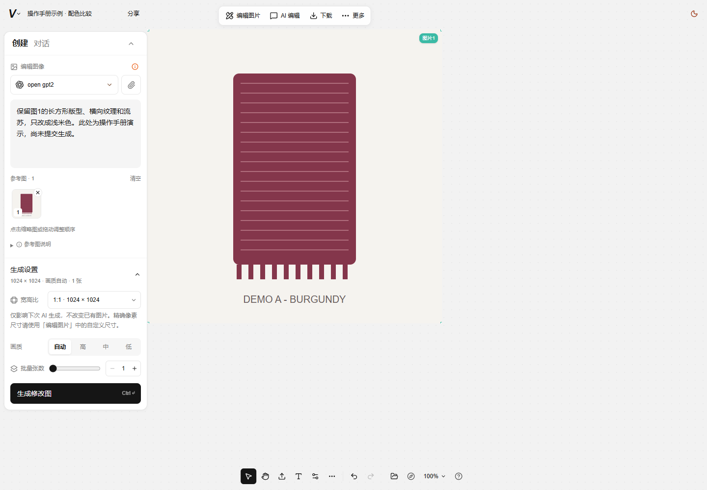

为什么别人截图里有 4K，你这里只有“高 / 中 / 低”？因为设置取决于实际接入渠道，不只取决于模型的显示名字：

| 当前设置栏 | 应怎样理解和选择 |
| --- | --- |
| `画质：自动 / 高 / 中 / 低` | 当前标准图片接口的画质档位；像素由宽高比/尺寸栏决定，不代表 1K/2K/4K |
| `分辨率：1K / 2K / 4K` | 相应图像渠道提供分辨率档位；已有图的精确像素调整另在编辑图片中进行 |
| `分辨率：0.5K / 1K / 2K / 4K` | 相应 Gemini 图像渠道提供的分辨率档位；初次使用保留默认值 |
| `生成速度：休闲 / 快速 / 极速` | Midjourney 的速度模式，不是图像清晰度；具体供应商费用可能不同 |

批量选择多张时，软件会拆成多个独立的单图任务，并分别计费，不是一次请求免费多送几张。切换模型后先读模型旁的能力说明，再检查设置。Midjourney 混合模式使用 2—4 张参考图，不使用普通描述提示词；不要把它当通用文生图模式。

有参考图时点击 `生成修改图`；没有参考图时点击 `生成`，走文生图。快捷键为 `Ctrl / Cmd + Enter`。同一要求不要重复提交；当前创建面板在任务提交后可继续准备下一次任务，并非必须等前一张全部完成才可输入。

结果会作为新图出现，原参考图保留，方便比较和继续改。选中新结果，再写下一步要求，就可以逐轮迭代。AI 编辑不是像素级保证；对 Logo、文字、服装结构和花型等关键部位要放大检查。

### 2.6 第一批还在生成，可以准备下一批吗

1. 提交后先确认画布出现任务节点或明确的提交状态；上传参考素材和提交请求期间仍需等待。
2. 创建面板恢复可操作后，可改下一轮提示词、选择另一组参考、调整参数。
3. 确实要新增一批时，再点一次生成；两批任务各自处理，也各自可能收费。
4. 前一批结果回来后，核对它对应的提示词和参考图，不把新输入框里的要求误认为已改变旧任务。

这是“提交后允许继续工作”，不是取消并发限制、无限排队或自动重试。想改一条已提交任务的要求，通常需要等结果后再编辑；修改输入框不会追改上游已经收到的请求。

### 2.7 在指定位置生成：右键空白处

1. 在画布空白处找到希望放新结果的位置，点击鼠标右键。
2. 点右键菜单 `生成`，打开创建面板；此动作只是设置位置，不会立刻提交 AI 任务。
3. 确认面板上方出现 `下一次生成放在右键位置`。
4. 检查参考图、提示词、模型和数量，再点面板底部的 `生成 / 生成修改图`。
5. 只针对下一次生成定位；改变主意时先点 `取消定位`，或重新在目标空白处右键。

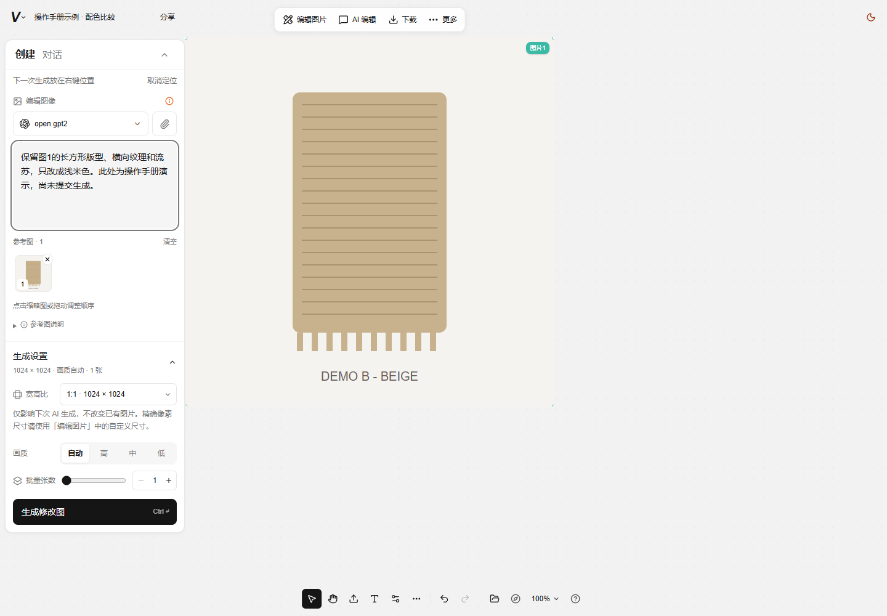

右键点在图片上会出现该节点的复制、重命名、删除菜单，不是空白画布的定位菜单。

<a id="canvas-tools"></a>

## 3. 画布操作、节点与连线

### 3.1 常用操作

| 想做什么 | 操作 |
| --- | --- |
| 框选节点 | 选中箭头/选择工具，在空白处拖动 |
| 平移画布 | 手形工具拖动，或按住空格拖动 |
| 缩放 | 鼠标滚轮或缩放控件；面板内滚动不会故意带动画布缩放 |
| 追加 / 取消单个节点选择 | `Shift / Ctrl / Cmd + 点击` |
| 全选 | `Ctrl / Cmd + A`，文字输入时仍优先编辑文字 |
| 复制 / 粘贴 | `Ctrl / Cmd + C / V` |
| 撤销 / 重做 | `Ctrl / Cmd + Z`；`Ctrl / Cmd + Shift + Z` 或 `Ctrl / Cmd + Y` |
| 删除 | 选中节点或连线后按 `Delete / Backspace` |
| 退出选择与浮层 | `Esc` |
| 调整背景 | `更多工具 → 画布背景`，可选点阵、网格或纯色 |

顶部菜单的 `快捷键` 可随时查看当前页面操作。撤销主要针对画布编辑，不是服务器账本回滚：已提交的外部任务、已产生的服务商费用、素材库删除等，不会因为撤销节点自动恢复或取消。

底部工具条右侧也有 `快捷键` 按钮。缩放时把鼠标移到要看的细节附近再滚轮，画布围绕鼠标位置缩放；停止滚动即停止，反向滚动即可反向调整。`画布缩放` 百分比控件可用于调整查看倍率；这只改变观看大小，不会提高图片分辨率。图片不见时先用小地图寻找，不要急着再次导入同一文件。

在输入框内使用复制、全选、删除等快捷键，优先处理输入内容；打开编辑弹窗时先完成或取消弹窗操作，再对画布按快捷键。删除节点前点一下目标并看清选区，尤其不要在多选状态下误删整组。

### 3.2 每一种节点有什么用

| 节点 | 用途 | 典型输入和输出 |
| --- | --- | --- |
| 文本 | 提示词、需求、说明、AI 改写结果 | 双击编辑；可作为生成配置的文字输入 |
| 图片 | 原图、参考图、生成结果 | 上传、查看、继续编辑、局部处理、下载 |
| 生成配置 | 把输入和生成参数组合成可重复执行的步骤 | 上游文字 / 图片 → 选择模式和模型 → 生成结果 |
| 视频 | 视频参考或结果 | 支持上传和播放；生成依赖已配置视频模型 |
| 音频 | 音频参考或结果 | 支持上传；生成依赖已配置音频模型与参数 |

选中节点后，使用它的工具条或参数面板。图片的裁剪、分割与 AI 编辑是不同操作：裁剪/分割处理已有像素；扩图、去背景、角度或增强等 AI 操作可能提交新的模型任务。具体按钮与是否可用以当前节点内容、模型能力为准。

文本节点下方的对话框用于生成或改写文字；要用文字生成图片，使用文本节点的 `生图` 按钮，或连接到图片模式的生成配置节点。

注意：文本节点的 `生图` 可以直接创建配置并开始生成，不只是打开一个空表单。想先检查参数、不执行时，先新建 `生成配置` 节点，设置好再点击生成。

### 3.3 连线不是装饰，是给下游传输入

从节点的连接点拖到另一个节点，建立上游 → 下游关系。典型结构：

```text
文字需求 ─┐
参考图1 ──┼─→ 生成配置（图片） ─→ 结果图
参考图2 ──┘
```

选中生成配置后，检查输入预览：文字是否正确、参考图是否齐全、顺序是否符合要求，再选择模式、模型与参数，点击生成。

配置节点之间不能直接连接；把实际文本、图片或其他支持的媒体接入配置节点。单纯画一条线不会自动执行整个流水线，仍需执行对应生成步骤。更换上游图以后也要检查输入预览，避免误用旧参考。

### 3.4 批量改图与多参考图不是同一件事

多参考图：多张参考共同指导一次生成，比如“图 1 款式 + 图 2 配色”。

批量改图：对一批原图逐张应用同一个要求，比如“把文件夹内每件衣服的背景改成浅灰”。入口是 `更多工具 → 批量改图`：

1. 上传文件夹或选择多张图片。
2. 确认文件清单、模型和统一修改要求。
3. 查看数量与预估成本后，点击右下角 `一键生图`。
4. 通过面板查看逐张进度；需要时使用 `暂停等待项`、`恢复` 或 `取消未处理项`。
5. 单张失败按错误处理，不必把已成功的整批重新生成。

已经发给上游的任务不一定能立刻停止；取消和内部积分退还不等于供应商一定退款。批量量大前先测试少量样本，确认相同提示词适合整组图片。

### 3.5 在画布里放文字、视频或音频

写一段普通说明，不需要生成：点底部工具条的 `文本` → 双击新出现的文本节点 → 输入“保留原稿，只比较颜色方案” → 点空白处退出编辑。这段文字是你的笔记，不会因为输入文字自动收费。

放入已有视频/音频：把电脑里的视频或音频文件拖到画布，等待对应节点出现；视频可在节点内播放。也可从 `更多工具` 新建视频/音频节点，再用节点的上传按钮选文件。

让 AI 制作视频或音频：先准备文字/参考素材 → 新建 `生成配置` → 选择视频或音频模式 → 选择已配置的相应模型 → 调时长、声音等可用参数 → 再执行生成。没有相应模型时让管理员配置，不是多刷新几次就会出现。

<a id="manual-image-edit"></a>

### 3.6 手动编辑图片：裁剪、标注、马赛克、自定义尺寸

这和左侧菜单中的 AI `图片编辑` 不是同一功能。画布图片工具条的 `编辑图片` 处理已有像素，不调用 AI；`AI 编辑` 则使用模型，需要检查生成费用。

#### 打开、修改、保存

1. 在画布点中一张图片，看到图片工具条。
2. 点 `编辑图片`，等待图片在弹窗中完整加载；加载失败时先重试，不对空白预览保存。
3. 选择下表中的工具，在预览区域操作。弹窗里的撤销/重做只针对当前图片编辑过程。
4. 用右下方放大、缩小或 `适应画面` 检查细节。预览倍率不是实际像素尺寸。
5. 满意后点 `确定并保存`；尚未修改或仍在处理时，保存按钮可能不可点。
6. 回到画布后检查当前节点。手动编辑保存回这个节点，不会额外摆出一张新图；连线继续保留。
7. 保存后想恢复原图，及时使用画布 `撤销`。重要原稿建议编辑前先复制节点或下载，不能把撤销当永久版本库。

| 工具 | 怎么操作 | 得到什么 |
| --- | --- | --- |
| 框选 / 裁剪 | 选 `框选`，在预览里拖出区域，再点 `应用裁剪` | 保留所框区域，区域外像素被裁掉 |
| 画笔 | 选画笔，调整颜色和粗细，在图片上拖动；已有选区时涂画受选区限制 | 手动画线或遮盖，不会自动补出真实纹理 |
| 矩形 / 箭头 | 选工具，调整样式，在起点按住拖到终点；矩形可拖动框内或边框移动，按住 Shift 可在旧框内另画新框 | 标出要修改的部位或指向细节 |
| 文字 | 选文字工具，设置文字与样式，在图上放置 | 增加说明，不等于修改图中原有字形 |
| 马赛克 | 选工具，对目标区域拖动 | 像素化遮挡；不应当作敏感信息已不可恢复的保证 |
| 顺时针旋转 90 度 | 点旋转按钮，每点一次转 90 度 | 调整图片朝向；不是 AI 生成产品另一视角 |
| 撤销 / 重做 | 点弹窗上方相应箭头 | 回退或恢复本次尚在编辑中的步骤 |

#### 精确改成 800 × 600 像素

1. 在编辑弹窗的 `自定义尺寸` 填宽度 `800`、高度 `600`，单位是 `px`。
2. 选择适配方式。希望产品完整、不变形，选 `完整保留 · 透明留边`。
3. 点 `应用尺寸`，检查预览与右上角像素数；只填数值、不应用，并不等于已修改。
4. 确认主体没有被裁掉或拉宽，再点 `确定并保存`。

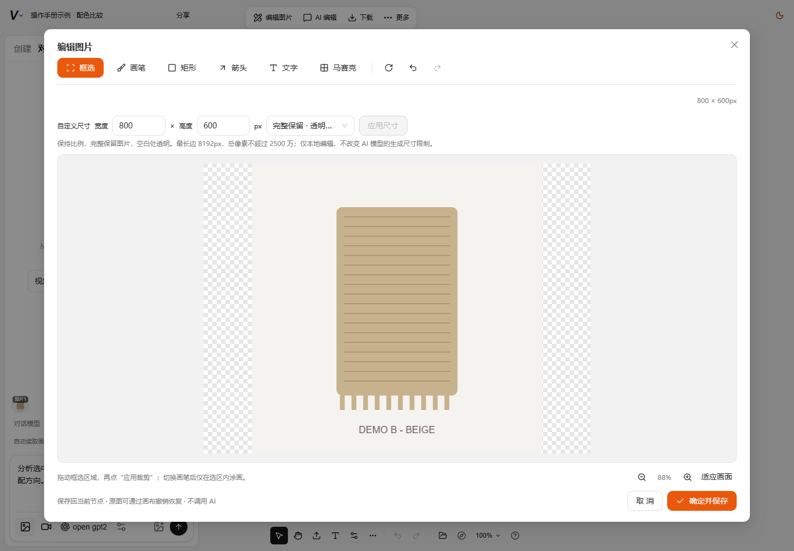

| 适配方式 | 是否保留完整主体 | 适用情况 |
| --- | --- | --- |
| 完整保留 · 透明留边 | 完整保留，等比缩放，空余部分透明 | 产品图、图案、需要保留边缘流苏的素材 |
| 填满画面 · 居中裁剪 | 等比填满，但可能裁掉两边或上下 | 必须铺满版面的封面；应用后检查边缘 |
| 拉伸变形 | 不裁切，但横纵比例可能改变 | 明确接受变形的素材；不建议用于产品结构图 |

棋盘格表示透明区域，不是图片上的灰白花纹。当前本地编辑最长边 8192px，总像素不超过 2500 万；扩大像素不会凭空恢复真实细节，也不会突破 AI 模型的生成尺寸上限。保存通常得到 PNG，以保留透明度；电脑上的源文件不会被覆盖。不想保留时点 `取消`，有未保存改动时按提示确认丢弃。

<a id="image-versions"></a>

### 3.7 图片重命名与版本号

1. 在目标图片上点右键，点 `重命名`。
2. 输入便于交付的名称，例如 `围巾方案A-酒红`。不必手工补文件扩展名或版本后缀。
3. 点 `保存名称`。改名不修改图像内容，也不会单独增加版本号。
4. 下载图片或打开图片集导出，核对文件名中的 `_v1`、`_v2` 等版本。

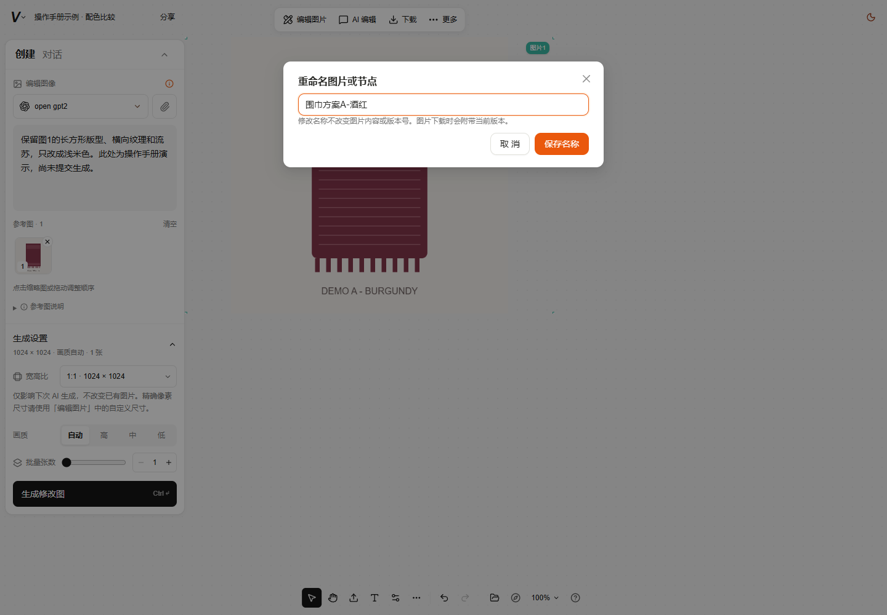

画布新导入图片按初始版本记录；本地编辑保存后版本递增。以主参考图继续 AI 编辑时，新结果继承主参考图的命名身份并推进版本；主参考是参考列表第一张，所以改图前要检查图序。旧数据没有名称或版本信息时会使用兼容默认值。

例如原图叫 `围巾方案A`，初始下载为 `围巾方案A_v1` 加实际扩展名；手动编辑后可为 `围巾方案A_v2.png`。这是识别迭代关系的标签，不是自动保存所有旧像素的版本仓库；批量分支还可能出现同版本名称，交付前可分别命名为 A、B、C。

<a id="canvas-agent"></a>

## 4. 画布里的 Agent 怎么用

打开 `对话` 面板，可以让 Agent 理解画布、拆提示词或执行节点操作。第一次建议选中相关节点再提问，减少它误解处理对象的机会。


第一次可以这样练习：先在画布点中一张图片 → 点左侧上方 `对话` → 在底部输入“请帮我把这张图的修改要求写清楚，先只分析，不生成” → 检查当前模型可用 → 再点发送箭头。你应先得到文字分析或工具操作卡片；出现确认卡片时读清内容再决定，不要把它当普通消息随手同意。

### 4.1 网站 Agent：先明确讨论还是执行

使用服务端已配置的文本 / 多模态模型。它可以读取选区和画布概况，并通过工具创建文本、配置与媒体流程，连接或移动节点，也可能触发生成。

可直接说：

```text
只分析选中的两张图，先比较版型和花型，不要生成。
```

```text
以选中的衣服为原款，创建3个配色方向的文字节点，
并分别连到图片生成配置。先搭好流程，不要提交出图。
```

```text
把选中的原图改成浅米色，保留材质和结构，生成1张新图。
```

生成预设只是默认参数，不代表聊天必须出图。想先讨论就明确说“只分析 / 不生成”；想执行则说清楚参考、数量和保留项。


面板的 `工具执行前确认` 控制画布写入工具是否先等待确认。开启后要在工具卡片上同意，流程才继续；关闭后可直接执行，不要以为发送消息永远只会得到文字。涉及出图的视频/图片步骤可能产生费用。

`对话历史` 切换会话，`运行日志` 查看工具请求与错误；普通聊天成功也不代表该模型支持画布工具调用。遇到“工具不支持”时，换管理员启用的兼容模型，或使用无工具聊天。

### 4.2 自动读取当前画布

1. 打开左侧 `对话`，在输入框上方找到 `自动读取画布 · 图片、视频画面与文字`。
2. 开启时，把要讨论的素材移到当前视野，或选中它们；要精确指向某张图片，仍建议点击选中。
3. 选择支持相应图片理解/工具能力的对话模型，输入“这张围巾的配色适合什么场景？只分析，不生成”。
4. 发送后检查消息中的自动读取项数，以及无法读取、超限或省略提示。看不到的细节可放大、单独选中或手动添加参考后再问。
5. 不希望附带可见素材时点右侧 `关闭`；需要时再点 `开启`。

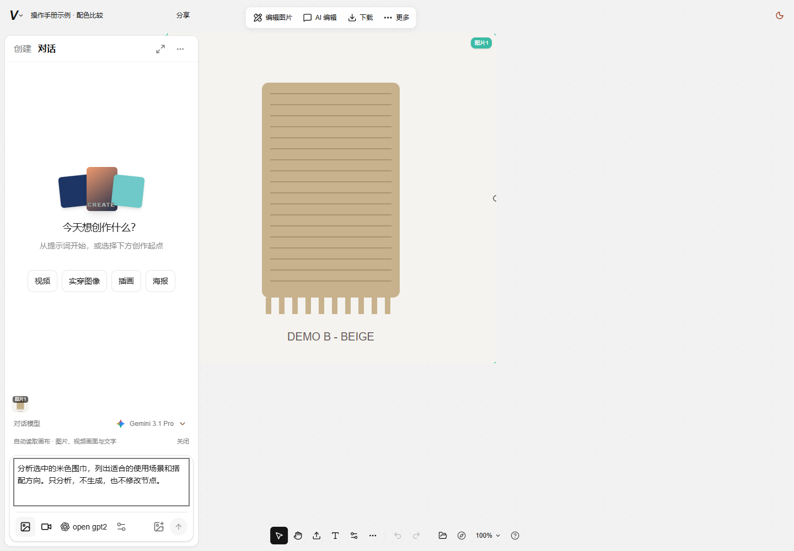

自动读取在发送时收集可见、选中和预览中的素材；图片提供视觉内容，文字提供文本，视频提供抽样画面和时间位置，**不包含视频声音**。它不是完整视频逐帧分析，也不是“读了整个无限画布上的所有文件”。关闭自动读取后仍可提供画布结构和手动参考，不表示消息完全不含画布信息。

敏感素材先移出当前讨论范围，必要时使用只包含可分享素材的新画布。发送到已配置外部模型的内容受相应服务的数据规则约束。

### 4.3 模型、设置、历史与确认入口

1. 输入框上方的 `对话模型` 负责理解和工具调用；输入框底部的图像/视频模型负责实际生成，两者要分别检查。
2. 点击输入框底部的图像或视频图标切换生成类型，再点模型旁的设置按钮调整对应参数。
3. 设置区的 `工具执行前确认` 开启后，遇到写入工具卡片先核对目标、数量与动作，再批准；拒绝时不要期待节点已经修改。
4. 面板右上角 `对话选项`（三个点）里可进入 `对话历史`、`运行日志`，或切换网站/本机 Agent。
5. 查看图片或视频任务失败时，先从任务节点或日志查原任务状态；日志里有工具错误时，不把上一条普通文字回答当作执行成功。
6. 面板过窄时可点 `切换为宽屏对话`；收起或切换面板只是改变显示，不等于取消已提交任务。

### 4.4 本机 Agent

`本机 Agent` 需要当前电脑已经安装并运行配套的本地连接组件 / Codex 插件，不是单击网页就自动获得本机控制能力。

在连接页面按实际提示启动连接组件，优先自动发现；失败时填组件显示的 `Local URL` 和 `Connect token`，确认状态为已连接后再发送。不要把模型 API Key 当作 Connect token，也不要把 Token 发给别人。

同事访问局域网页面时，`127.0.0.1` 指的是同事自己的电脑，不是运行网站的电脑。本机 Agent 不可用不会阻止正常的画布生图；可以切回网站 Agent 或创建面板。

## 5. 下载、保存与分享

### 5.1 下载单张成果

选中图片，点击图片工具条的 `下载`。当前画布下载使用图片名称加版本号，详情见 [3.7](#image-versions)；未重命名时从原始文件名等信息取得名称。以参考图编辑出的新图继承主参考图，也就是参考图列表第一张的命名身份；纯文生图没有原始文件名时使用生成名称。

### 5.2 下载以后，文件去哪了

1. 点 `下载图片 / 下载` 后，留意浏览器右上角的下载箭头或提示。
2. 若弹出“另存为”窗口，左侧点 `桌面` 或你想保存的文件夹，确认文件名后点 `保存`。
3. 若没有弹窗，通常保存在 Windows 的 `下载` 文件夹；打开文件资源管理器，点左侧 `下载` 查看。
4. 也可按 `Ctrl + J` 打开浏览器下载列表，在该文件旁选择“在文件夹中显示”。
5. 双击文件，确认能正常打开，才算拿到了电脑上的独立文件。

没有下载完成、文件大小为 0 或打不开时，不要删除网页里的原结果；保留错误信息再排查。网页里看见图片不代表它已经放到了桌面。

下载扩展名按实际图像格式确定，不再因为原文件名是 JPG 就强制把 PNG 转为白底 JPG。透明 PNG 应保留透明度；文件名后缀和实际格式要一致，不要自己改后缀冒充格式转换。连续下载同名文件后浏览器可能自动添加 `(1)` 等后缀，这是浏览器避免重名的行为，不是软件的图片版本号。

### 5.3 保存到素材库

点击图片后，在图片工具条找 `存素材`；若没显示，点工具条的三个点 `更多图片工具`，再点 `存素材`。看到保存成功提示后，可以从软件左侧 `素材库` 或画布底部 `我的素材` 再找这张图。

素材库用于集中搜索、复用和归档，画布用于组织过程，两者作用不同。服务端上传失败时不要把本地显示成功当作云端已经安全入库；检查同步状态并保留本地下载。

### 5.4 导出整张画布

顶部画布菜单 → `导出画布`，得到 ZIP；也可回到画布库，勾选多个画布后 `导出选中`。


具体点击：点画布左上角 `V` 旁的小箭头 → 点 `导出画布` → 到浏览器下载列表找到 `.zip` 文件 → 保存到备份文件夹。恢复时，先进入画布库 → 点列表上方 `导入画布` → 选择这个 ZIP → 等待“已导入”提示 → 打开导入画布检查图片。

**自动保存不等于导出**：自动保存留在当前浏览器；导出 ZIP 才是你可以自己复制、备份、发给别人的文件。

ZIP 包含画布节点、连线、会话和能够读取到的本地媒体。另一台设备打开同一版本项目后，从画布库 `导入画布` 选择 ZIP，会建立导入画布，不必手工逐张摆图。

只保留远程链接、已失效或本地丢失的媒体，未必能够完整装入 ZIP。重要交付请同时下载最终图片/视频，并在导出后试导入一份确认图片都能打开。

<a id="image-set-export"></a>

### 5.5 导出图片集：合并 PDF、单页 PDF 包、原图包

想把几张方案按顺序给客户看，用图片集；想备份可继续编辑的节点和连线，用上一节的画布 ZIP。两者不是同一种文件。

1. 打开目标画布，先确认图片都能显示，必要时按 [3.7](#image-versions) 改成清楚的名称。
2. 点左上角 `V` 画布菜单 → `导出图片集 / PDF`。
3. 在 `图片集名称` 填交付名称，例如 `秋冬围巾-第一轮配色`。
4. 选择一种导出方式，见下表。
5. 在图片列表逐张勾选；`全选` 选择全部，`仅画布已选` 取当前画布选中的图片，`清空` 取消全部导出选择，不删除图片。
6. 使用每张图右侧 `上移 / 下移` 排顺序。左侧的 `1、2、3` 才是导出顺序，不凭画布左右位置推断页码。
7. 看弹窗底部图片数量和文件方式，确认无内部草稿或不应交付的图。
8. 点 `导出并下载`，等待处理完成，在浏览器下载列表找到文件。
9. 打开 PDF 或解压 ZIP，核对页数、顺序、名称、清晰度和边缘。确认文件正常后再发送。

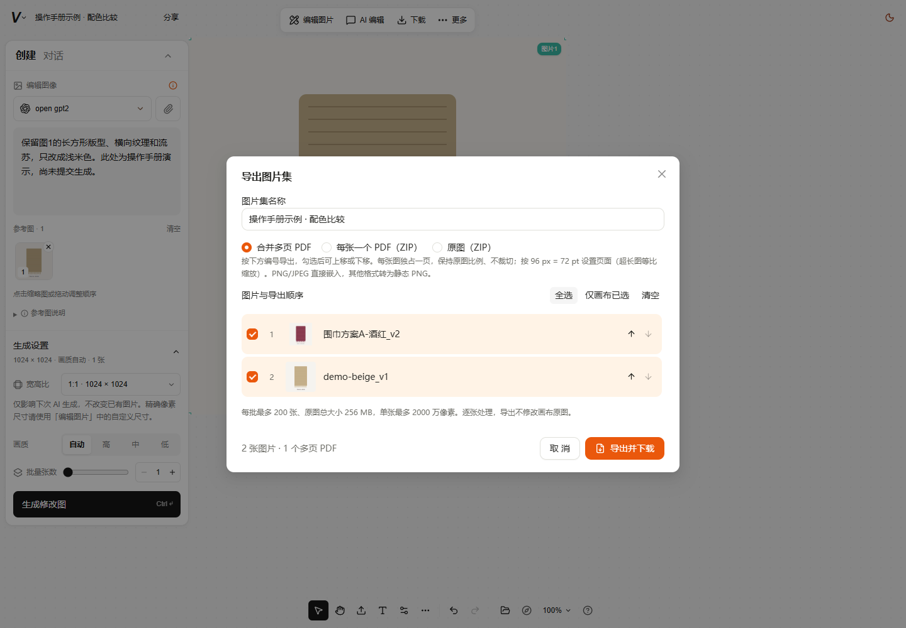

| 导出方式 | 得到的文件 | 适合用途 |
| --- | --- | --- |
| 合并多页 PDF | 一个 PDF，每张图片一页 | 客户顺序翻看多款/多配色方案 |
| 每张一个 PDF（ZIP） | 一个 ZIP，里面每张图各自一个 PDF | 逐款单独归档、交给后续流程 |
| 原图（ZIP） | 一个 ZIP，保留图像实际格式与原始文件内容 | 交付透明 PNG、原图像素或继续加工 |

PDF 每张图独占一页，按原比例、不裁切；不是统一 A4，也不是把整块画布截图。PNG/JPEG 直接嵌入，其他格式为适配 PDF 转成静态 PNG；需要保留原格式时选择原图 ZIP。PDF 页面尺寸按 96px = 72pt 换算，超长图等比缩放，不应仅凭 PDF 页面大小判定印刷 DPI。

每批最多 200 张、原图总大小不超过 256MB；PDF 导出单张不超过 2000 万像素。超过限制先分批，或另外准备适用尺寸的副本，不覆盖原稿。导出不修改画布原图，也不包含节点连线、文字笔记或聊天记录。

### 5.6 “分享”按钮的实际含义

顶部 `分享` 复制当前画布链接，适合同一个浏览器里重新打开。它不是云端发布，不会自动上传整张画布，也不保证另一台电脑能看到同样内容。

跨设备传画布：使用 ZIP 导出 / 导入。向他人交最终成果：发送下载的图片、视频或经授权归档的文件。不要把带私人参考图和聊天记录的完整画布误发给外部人员。

## 6. 画布外的独立创作板块

菜单可能因管理员模块开关、账号角色或精简版模式而不同。入口没显示不一定是故障，也不代表可以靠手输网址绕过权限。

| 板块 | 路径 | 最适合做什么 |
| --- | --- | --- |
| 工作台首页 | `/` | 找近期本地画布、新建项目 |
| 文生图 | `/image` | 不需要摆节点，直接输入要求出图 |
| 细节增强 | `/image?tool=detail-enhance` | 原图清晰度、材质与细节增强 |
| 图片编辑 | `/image?tool=image-edit` | 有明确原图的局部或整体修改 |
| 角度控制 | `/image?tool=angle-control` | 保持主体，生成不同视角 |
| 无缝拼接 | `/image?tool=seamless-stitch` | 面料、纹理的四方连续处理 |
| 视频创作 | `/video` | 文生视频、图生视频或模型支持的视频编辑 |
| LLM 对话 | `/chat` | 聊天、需求分析、整理提示词、对话式图像创作 |
| 我的素材 | `/assets` | 搜索、预览、下载、上传、归档和复用 |
| 我的提示词 | `/my-prompts` | 管理自己的可复用模板 |
| 提示词库 | `/prompts` | 使用团队审核模板和公共模板 |
| 无线画布 | `/canvas` | 管理整个节点式创作过程 |
| 我的小组 | `/team` | 公司版的组内成果、积分申请和组长管理 |
| 管理后台 | `/admin` | 公司版账号、模型、额度、任务和审计 |

<a id="image-tools"></a>

### 6.1 图像类页面

通用操作顺序是：选板块 → 选可用模型 → 上传参考图（需要时）→ 填提示词 → 调参数 → 生成 → 查看结果 / 生成记录 → 下载或复用。

页面分为三块：左侧 `生成记录` 是以前的任务；中间填写本次要求；右侧 `生成结果` 放新结果。屏幕较小时，中间设置区需要向下滚动才能看到模型、张数和 `开始生成`。

**文生图具体步骤**：

1. 点击软件左侧 `文生图`。
2. 在中间的提示词框填写“浅米色羊毛围巾产品图，纹理清晰，白色背景，柔和自然光，不添加文字或 Logo”。
3. 向下找到 `模型`，选择可用图片模型。首次选 `1 张`，先不要批量。
4. 设置模型支持的画质/分辨率和宽高比，检查页面是否有红色校验提示。
5. 点击 `开始生成`。右侧出现结果后，先预览再点 `下载`；需要继续修改可复用结果为参考图。


#### 细节增强：让一张原稿更清楚

1. 在软件左侧点 `细节增强`，中间标题会变为“细节增强”。
2. 在中间参考图区点 `上传图片`，电脑弹出选文件窗口。
3. 找到自己的原图，点中文件，再点窗口右下角 `打开`。网页中出现缩略图，才表示选图成功。
4. 在提示词框填写：“增强织物纹理与清晰度，保留花型、边缘和颜色，不增加不存在的装饰。”
5. 向下滚动选择模型和参数，首次只选 1 张，再点 `开始增强`。
6. 等右侧出现新图，放大比较原稿和结果；满意后点下载。不满意时把要求缩小，比如只增强纹理，不同时改色和背景。

结果是新图片，不会直接改掉你电脑上的原文件。没有上传缩略图、模型为空或按钮灰色时，先补齐图片和模型，不连续点生成。


#### 图片编辑：只改背景，不改主体

1. 点软件左侧 `图片编辑`。
2. 点中间参考图区的 `上传图片`，选一张主体完整的产品图。
3. 确认网页里能看到这张图。使用多图时，检查缩略图编号，提示词里的“图 1”就是编号 1 的图。
4. 在提示词框填写：“仅修改图1的背景为浅灰色，主体位置、颜色、纹理和轮廓不变，不添加文字。”
5. 向下选择支持编辑的模型、尺寸和 1 张，点 `开始编辑`。
6. 右侧出图后，对照主体颜色和轮廓，再下载。想继续改这张结果时，将结果作为新的参考图，不要误用最初的原图。

没有参考图时，本例无法执行；要从零画一张图，请去文生图。若图片有透明背景、很细的流苏或小字，尤其要放大检查。


#### 角度控制：同一产品换个视角

1. 点左侧 `角度控制`。
2. 点参考区 `上传图片`，选择一张能看清主体的原图。
3. 在中间提示词框填写：“生成同一产品右侧45度视角，保持颜色、材质、结构和Logo位置，背景简洁。”
4. 选择模型和 1 张，点 `生成角度图`。
5. 结果出现后，与原图比较：是不是同一个产品？轮廓、花纹、配件有没有变？确认后再下载。

只有正面图时，模型会猜测看不到的侧面和背面。本功能适合设计探索，不应把猜测结果当成已核实的产品结构图。


#### 无缝拼接：让纹理重复排列时没有明显边线

1. 点左侧 `无缝拼接`，确认看到处理面板，而不是普通文生图。
2. 在 `输入图片` 区域点 `上传`，选择一张纹理图片；先用可公开的简单纹理试一张。
3. 查看预览和边缘处理参数，不知道参数含义时先保留页面默认值。
4. 确认该板块已有可用处理服务，再点击 `开始无缝拼接`。
5. 下载结果后，把同一张结果上下左右重复排列，检查四边是否接得上。单张看着自然不代表平铺无缝。

若页面提示“待配置”，请负责软件的人在后台配置该板块。提示远端工作节点未启动时，让维护该处理服务的人检查，不连续重复提交。


- **文生图**：重点写主体、风格、构图、光线、用途；加入参考图时确认当前模型支持编辑。
- **细节增强**：必须有原图；写清哪些纹理要增强、哪些元素不能改变，不把它当成无条件恢复真实细节的工具。
- **图片编辑**：写清要改的位置与保留项；结果不符合预期时先缩小修改范围。
- **角度控制**：明确正面、侧面、俯视或角度；只提供单视图时，背面结构由模型推断，必须人工核对。
- **无缝拼接**：上传纹理，按页面参数控制接缝处理；这需要后台配置实际可用的内部工作流。完成后检查四边接缝和重复平铺效果，不能仅凭单张缩略图判断无缝。

`生成记录` 可查看历史参数和结果；保存为个人提示词模板后可重复使用。旧记录缺少任务来源或模型已停用时，以页面提示为准，先选择当前可用配置。

<a id="video-tools"></a>

### 6.2 视频创作

先选模型，再选 `生成方式`，最后准备对应素材。当前入口已支持按模型上传图片、视频、音频，并提供首尾帧、多素材参考、视频编辑或续写等适用模式；不是每个模型都支持全部功能。

一步步操作：

1. 点软件左侧 `视频创作`，中间标题变成“视频创作”。
2. 在中间区域找到 `模型`，先选模型，再回到上方提示词框填写下面的动作示例。
3. 想从产品图片开始时，点 `参考素材` 展开，在 `参考图` 旁点 `上传`，选择本机图片，等网页显示缩略图。当前入口接收 JPEG、PNG、WebP，每张不超过 10MB；没有图片时使用模型允许的纯文字模式。
4. 在中间区域向下滚动，先选 `生成方式`，再检查分辨率、画面比例与时长。首次用较短时长；不同模型的最短时长不同，以页面选项为准。
5. 点击下方 `生成视频`，等待右侧出现视频结果。左侧 `生成记录` 用来回看这次任务。
6. 点视频预览的播放按钮，检查是否有意外变形或文字；确认后点 `下载`。下载位置按第 5 节查找。

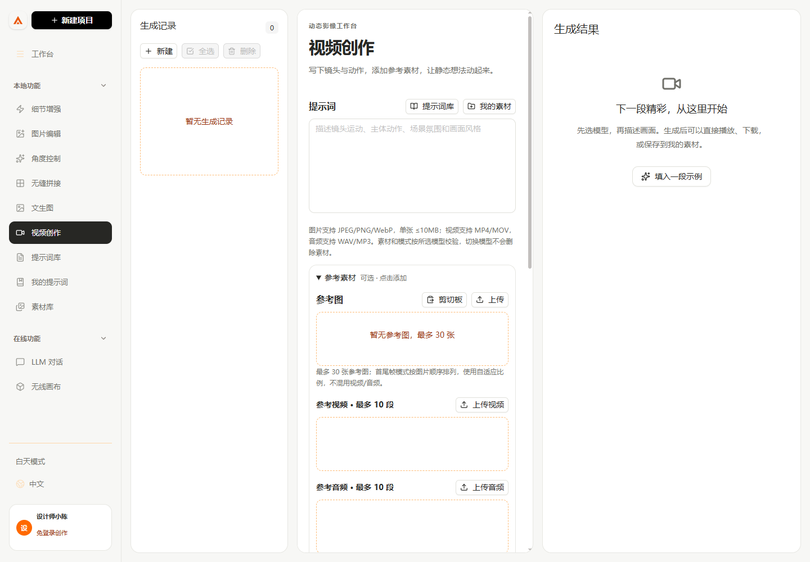

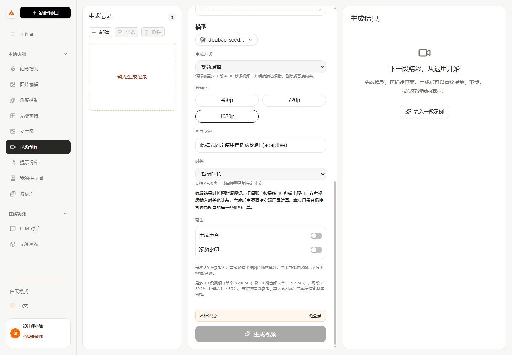

提示词应包含“主体动作 + 镜头运动 + 场景变化 + 要保持的内容”。例如：

```text
模特缓慢向前走两步，镜头保持中景平稳跟随。
服装颜色、花型和版型与参考图一致，背景简洁，不出现字幕。
```

当前四个视频模型的参数并不相同：

| 模型 | 输出时长与分辨率 | 当前入口支持的主要输入与模式 |
| --- | --- | --- |
| MiniMax-H3 | 4—15 秒；768P / 2K | 文生、首帧、尾帧、首尾帧、多素材参考；最多 9 图、3 视频、3 音频；音频须搭配图片或视频 |
| doubao-seedance-2.5 | 4—30 秒，支持自动时长；480p / 720p / 1080p | 文生、首帧、首尾帧、多素材参考、视频编辑、延长；最多 30 图、10 视频、10 音频，支持纯音频参考 |
| wan2.7 | 2—15 秒；720P / 1080P | 文生、首帧、首尾帧、续写；一般最多 2 图；续写为 1 视频及可选 1 张尾帧，不配音频 |
| happyhorse-1.1 | 3—15 秒；720P / 1080P | 文生、首帧、参考图；首帧 1 图，参考模式最多 9 图；不支持视频/音频输入或编辑 |

“首帧”是视频开始的画面，“尾帧”是结束画面，“参考图”只是指导主体或风格，不保证成为开始或结尾画面。要做首尾帧时，用明确支持的模型，检查图片顺序；首帧模式的比例可能由原图决定，不是下拉框一定能覆盖它。

#### 6.2.1 两张图做首尾帧

1. 选择支持 `首尾帧` 的模型，例如当前接入的 MiniMax、Seedance 或 Wan。
2. 在 `生成方式` 明确选 `首尾帧`，不只保留“自动判断”。
3. 上传恰好两张图片，检查列表顺序：第 1 张是开始，第 2 张是结束。顺序不对时调整；入口不能调整时移除后按顺序重新添加。
4. 写清两张画面之间发生什么，例如“镜头缓慢推近，围巾从平铺过渡为自然垂挂，花型保持一致”。
5. 移除不兼容的视频/音频参考。MiniMax/Seedance 的帧模式不混用视频和音频；Wan 可按模式接受自定义音频。
6. 检查比例提示；跟随原图或锁定自适应时，不强求设置固定比例。选短时长后再生成。

自动模式的规则因模型不同：MiniMax 单图通常作首帧、多图作参考；Seedance 带素材时默认走参考；Wan 两图作首尾帧。要明确控制开始和结束画面，请主动选首尾帧模式。

#### 6.2.2 上传视频和音频，做多素材参考

1. 选支持相关输入的模型，再展开 `参考素材`。
2. 在 `参考视频` 点 `上传视频`，选 MP4/MOV；在 `参考音频` 点 `上传音频`，选 WAV/MP3。
3. 等待“正在处理参考素材”结束，确认卡片、时长及预检提示。上传按钮灰色或显示最多 0 段，说明当前模型不支持，不要重复点。
4. 选择 `多素材参考`，说明每份素材的作用，例如“图片定义产品外观，视频参考镜头节奏，音频参考节奏变化”。
5. 读清数量、单文件大小、单段时长和总时长限制；修正红色提示后再生成。

| 当前模型 | 视频输入限制 | 音频输入限制 |
| --- | --- | --- |
| MiniMax-H3 | 最多 3 段；每段 ≤50MB、2—15 秒；视频合计 ≤15 秒 | 最多 3 段；每段 ≤15MB、2—15 秒；音频合计 ≤15 秒；不能只给音频 |
| Seedance 2.5 | 最多 10 段；每段 ≤200MB、2—30 秒；视频合计 ≤30 秒；编辑模式源视频至少 4 秒 | 最多 10 段；每段 ≤15MB、2—30 秒；音频合计 ≤30 秒 |
| Wan 2.7 | 续写使用 1 段；≤100MB、2—10 秒 | 文生/图生可配 1 段；≤15MB、2—30 秒；续写不接受音频 |

这些是本项目当前入口的校验范围；格式、尺寸、帧率等也可能影响是否接收。切换模型不会替你删除素材，必须主动移除不兼容的输入。涉及真人素材时，Seedance 渠道可能要求素材审核；本项目未接入该审核流程，不把“上传成功”当作已获准生成。

#### 6.2.3 视频编辑与延长

视频编辑：选择 Seedance → `生成方式` 选 `视频编辑` → 上传源视频 → 写清改变和保留的内容 → 核对自适应比例及自动时长 → 生成。编辑模式至少提供一段源视频；当前时长由模式锁定，不用另一模型的固定秒数强行覆盖。

视频续写：选择 Seedance 或 Wan → 选 `视频延长 / 续写` → 上传源视频 → 写接下来发生的动作 → 设置允许的输出时长 → 检查后生成。Wan 的时长是最终输出总时长，必须大于源视频时长；例如 5 秒源视频，输出不能仍选 5 秒。Wan 续写可另加一张结束画面，不混入音频。

声音开关与音频输入是两回事：Seedance 提供生成声音开关；MiniMax 原生输出带音轨，当前渠道没有关闭声音参数；Wan 可传自定义音频但没有生成声音开关；HappyHorse 当前入口没有音频输入。没有开关不等于必然静音。

#### 6.2.4 查询中断、配置不足与验证边界

任务查询暂停时，如果页面提供 `恢复查询`，优先恢复原任务；它不会重新生成。不要把页面轮询中断当成上游任务不存在，也不要在提交状态不明时反复创建收费任务。成功后预览并下载视频。

本地音视频处理需要管理员配置媒体探针和渠道可访问的素材地址。遇到 `ffprobe`、公开素材地址或 HTTPS 配置错误时，保留提示交给维护人员，不把局域网路径或 `blob:` 地址手填给渠道，也不要自己临时把内部资料公开。

四个型号已有基础真实成功记录，但不代表每个视频编辑、多音视频参考和续写组合都已逐项实付验证。正式大批量前用授权的小样检查效果。详细参数、部署要求和验证范围见 [视频模型参数与接入范围](video-model-parameters.md)。

### 6.3 LLM 对话

`聊天` 用于问答和看图；`Agent` 中的分析需求、整理提示词、生成方案用于辅助设计思考；`创作` 使用图像模型生成或编辑图片。这一页的 Agent 模式不等同于画布的节点操作 Agent。

#### 6.3.1 普通聊天与需求分析

1. 点软件左侧 `LLM 对话`。如果看不见，在左侧菜单区域向下滚动。
2. 点工作区上方的 `聊天`、`创作` 或 `Agent`；普通问答先选聊天。
3. 在工作区右上角下拉框选择当前模式可用的模型。
4. 在底部大输入框写问题；要让它看图，先点旁边的图片或回形针按钮，选文件并检查附件是否显示。
5. 点输入框旁的 `发送`；创作模式关闭连续对话后显示 `生成图片`。按 `Ctrl / Cmd + Enter` 也会发送，所以还没想好时不要按这个组合键。
6. 回答出现在上方对话区域，后续问题继续写在同一个输入框。左侧 `对话记录` 用来切换会话。

切到 Agent 后可选择“分析需求 / 整理提示词 / 生成方案”作为任务方向；只想讨论时使用聊天或分析，不点图像生成。


一个不需要参考图的小例子：选择 `聊天`，输入“我想做一条秋冬围巾，请给我3个配色方向，每个方向说明适合的人群和理由”，点 `发送`。正常结果是一段回答，不是一张图片。想把某个方向变成图，再复制相应描述到文生图或切到创作模式；切换模式后重新检查模型。

模型列表现在同时支持已配置的 OpenToken 与其他服务端渠道；例如本次部署显示 `gpt-6-astra`、`claude-fable-5-1` 等名称。模型由后台启用，不需要在浏览器另填 Key；列表数量也不是可用余额。切换模型后检查附件能力与参数，原会话记录不会因此变成新会话。

选择提供 `Claude 原生参数` 的模型时：先决定是否启用 `流式输出`（逐步显示回答），再检查思考模式，最后选 `总输出预算`。部分型号的思考始终开启或由渠道默认管理，不显示可关闭开关；总输出预算包含思考与可见回复，当前页面最高 16384 tokens 是项目限制，不是模型官方上限。长文分析可以提高预算，但也可能增加耗时与费用，这些参数不适用于所有模型。

左侧 `对话记录` 用来切换已有会话，顶部新建入口用于开始独立话题；窗口较小时先打开会话列表。新客户或完全不同项目建议另开会话，减少混入旧要求。删除会话前保存重要文字和成果；浏览器本地会话删除后没有自动恢复保证，不要删除仍有待核实图片任务的记录。

<a id="chat-attachments"></a>

#### 6.3.2 上传图片、PDF、Word、Excel 或文本

1. 切到 `聊天`，选择支持所需输入的对话模型；看图请使用兼容多模态模型。
2. 点输入框左下角回形针。旁边图片按钮用于只挑图片；回形针可选图片、文档和表格。
3. 选择文件，每次待发送附件最多 5 个，单个文件不超过 5MB，本次附件累计按页面处理后的大小限制为 8MB。等待读取完成，检查输入框上方出现相应文件卡片或图片缩略图；聊天附件限制和视频创作页的素材限制不同。
4. 上传错了，点该卡片的移除按钮再选；不要只修改文件名就假定内容已换掉。
5. 问题里写清分析范围，例如“读取附件需求单，列出必须保留的版型、颜色和工艺，标记缺失信息；只分析，不生成图片”。
6. 点击 `发送`，核对回答有没有真的引用文件内容。解析失败、无文字或截断时先处理，不能只看文件名已显示就认定全文已读。
7. 回到这个会话继续追问时，已保存的附件上下文会随历史保留；刷新后仍要检查解析/恢复提示，不把会话当原文件备份。

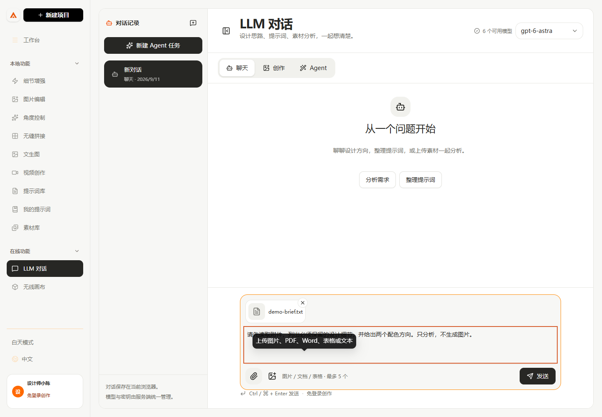

| 文件类型 | 可以怎样使用 | 需要注意 |
| --- | --- | --- |
| 图片 | 比较外观、颜色、细节，作为创作参考 | 模型必须支持看图；小字、尺寸与工艺结论需人工复核 |
| PDF | 按提取的页面文字归纳需求 | 扫描件可能没有可提取文字；当前解析不等于完整 OCR |
| Word `.docx` | 分析正文、要求、说明 | 老式 `.doc` 不在当前文档解析范围；图片/复杂排版不等于全文视觉读取 |
| Excel `.xlsx / .xls` | 按工作表分析表格内容 | 不等于保留工作簿版式、公式运算或识别所有嵌入图片；重要单元格需核对原表 |
| TXT、Markdown、CSV、JSON 等 | 读取文本或结构化说明 | 检查编码与分隔符；不要上传密钥、密码等秘密文件 |

为控制上下文长度，通用附件文本最多约 8 万字符，工作簿发给模型的文本最多约 8000 字符，并提供截断标识。大文件请按页、工作表或业务范围拆分，明确让模型只分析实际读取内容。上传附件本身不等于提交生成，但发送后调用模型可能产生服务商费用。

<a id="continuous-creation"></a>

#### 6.3.3 连续对话创作：先讨论，再改图，再继续改

1. 进入 `LLM 对话`，新建或选择一个独立会话，点顶部 `创作`。
2. 勾选 `连续对话创作`。这是组合流程：理解模型分析意图，图像模型负责生成/编辑，不是所有聊天模型原生都会画图。
3. 在 `理解模型` 选择当前可用的对话模型；右上角另外选择图像模型。两处都要检查，不能只选其中一个。
4. 有原图就添加图片附件；没有原图也可以从文字开始。不要把 PDF/表格文件直接当图像像素参考。
5. 第一轮可先发“先讨论这条围巾适合哪些配色，不生成”。你应得到文字讨论，而不是因为处在创作页就每句都出图。
6. 方向确定后明确发“按刚才的浅米色方案生成 1 张，保留原图的版型、纹理和流苏”。这一步可能调用图像模型并收费。
7. 出图后，在同一个会话继续发“保持上一版，只把底色再暖一点”。连续模式可自动带上最近的生成结果，不必每轮手工下载再上传。
8. 中间可以说“先评价一下这一版，不生成”，暂停出图、只讨论。若要回到更早的一张，找到那张结果点 `继续编辑`，检查输入区带入的缩略图，再写修改要求。
9. 每次结果出来检查结构、颜色、文字和边缘，不满意时一次缩小一个修改点。重复发同一要求是新任务，不是免费刷新结果。

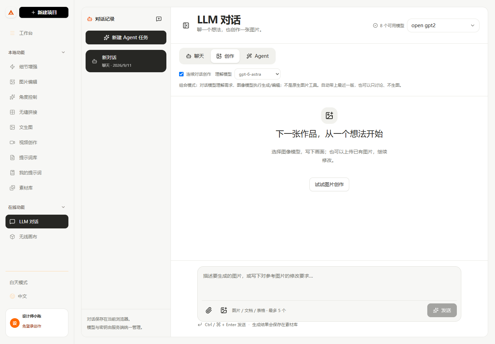

可直接照着逐条发送的例子（每条等上一轮完成后再发送）：

```text
第一轮：先分析参考图中必须保留的版型和流苏，不生成。
第二轮：保留上述结构，只把主体改为浅米色，生成1张。
第三轮：基于刚才结果，只让颜色更暖一点，其他不变。
第四轮：先比较两版适合的客群，不继续出图。
```

理解模型也可能误判意图，所以讨论时明确写“不生成”，执行时明确写“生成/修改几张”。模型缺失、结果尚未核实或附件仍在读取时，先解决提示再发送。

#### 6.3.4 关闭连续对话：直接生图

1. 在创作页取消勾选 `连续对话创作`，看到 `直接生图 · 不调用理解模型`。
2. 选择右上角图像模型；有图则添加参考，没有图则写文生图要求。
3. 填好完整提示词，点 `生成图片`。
4. 结果需要继续改时点该图 `继续编辑`，检查带入的图片，再输入下一轮修改。

直接模式不先经过理解模型讨论；不要在这里输入“你觉得怎么样”并点击生成，期待它只回复文字。想边讨论边改图，重新开启连续对话或切回聊天。

#### 6.3.5 结果的三个按钮：继续编辑、放入画布、下载

| 按钮 | 操作后发生什么 | 下一步 |
| --- | --- | --- |
| 继续编辑 | 把所点结果带入创作输入区作为图片参考 | 检查图是否正确，输入修改要求后再发送；点击本身不马上生成 |
| 放入画布 | 将结果放入该会话对应的画布并打开它；首次会创建“对话创作”画布 | 在画布摆放、连线、手动编辑或导出 |
| 下载 | 保存这一张生成结果到电脑 | 在浏览器下载列表检查文件；不等于导出整段会话 |

同一会话继续放图会复用已关联画布，同一结果重复点击会复用已有节点，不应故意连点。若提示存储失败，先保留对话和结果，不新建多份绕过。创作结果也会按应用流程保存到素材库，仍建议下载关键成果。

<a id="chat-recovery"></a>

#### 6.3.6 断网、刷新或等待超时：先查原任务

1. 如果显示 `本会话有图片任务尚未核实`，先留在或重新打开原会话。
2. 点击 `查询原任务`，等待查询结果；它查询原来的任务，不重新生成或再次提交收费请求。
3. 已完成的结果会回到会话，确认后再继续编辑；还在处理中则保留该记录，不在新会话重复提交同一要求。
4. 原任务结果未确认前，本会话会暂时禁止继续发送，这是防止不明状态下重复提交。
5. 明确显示 `聊天记录未保存，消息尚未发送` 或 `图片任务尚未提交` 时，草稿/附件会保留；修正存储、网络或输入问题后才重新发送。
6. 显示 `结果尚未确认` 时，不能按“尚未提交”处理；记录任务信息，让维护人员核实原任务。

“停止等待”“关掉网页”“连接报错”都不保证上游没执行。只有明确查到原任务状态后，才能决定是否再生成。聊天成功与图片任务成功是两件事，不能用理解模型已经回复作为出图成功依据。

对话历史是浏览器侧记录，不要把它作为原附件或全部生成文件的唯一备份。重要文字保存为模板或文本文件，成果从素材库或结果区域下载。

<a id="asset-library"></a>

### 6.4 素材库

先点左侧 `素材库`。要找图片，在顶部搜索框输入标题或标签并选图片类型；点素材缩略图或 `查看` 打开详情，再使用下载/复刻等按钮。要保存一段常用说明，点 `新增素材`，选文本类型，填标题、内容和标签，再点 `保存`。这会建立素材记录，不会提交模型任务。


- 用标题、内容、标签或来源搜索，按文本、图片、视频筛选。
- 右上角 `新增素材` 适合保存单个文本或图片；`上传图片` 可以一次选择多张，适合一组原稿。
- 打开素材查看大图、提示词、来源、模型、下载情况等已有信息。
- 通过继续创作或画布插入复用；需要归档时将素材加入有权限的正式项目。
- `导出素材 / 导入素材包` 用于传递与备份素材包，不等于导出整个画布结构。

正式服务按用户身份隔离素材，管理员按权限查看。单机演示版使用固定身份及本机 SQLite，不应拿它验证公司正式数据隔离。删除素材前先下载；删除、画布节点删除、删除生成记录是不同操作，不应认为其中一个会自动清理所有其他位置。

#### 从素材复用与编辑副本

1. 搜索或筛选目标素材，打开详情，核对作者/来源、完整提示词和图片，不只看相似缩略图。
2. 需要原样保存时直接下载；需要 AI 再创作时使用复用入口，并在目标创作页重新检查模型、提示词和参考图。
3. 在提供 `编辑图片` 的素材详情或生成记录中，可使用同一套本地裁剪/标注工具。
4. 看清弹窗底部保存说明：素材库/生成记录中的本地编辑走“另存副本”流程，生成新的素材，不覆盖原记录；画布里的编辑则保存回当前节点。
5. 保存后回素材列表核对新副本，再决定是否用于后续创作。原始任务记录不会因为修改副本而被改写。

<a id="prompt-library"></a>

### 6.5 提示词

`我的提示词` 是个人工作区，可以创建、编辑、删除、搜索和按最近更新/使用排序。生成记录和素材里可把有来源的提示词保存为模板。

新建模板：点击左侧 `我的提示词` → `新建模板` → 填标题和完整提示词，根据需要补模型/参数 → 保存。复用模板：找到模板 → 点对应的使用/复用入口 → 在打开的创作页面检查实际填入内容 → 再决定是否点击生成。只想借用别人的模板，可在 `提示词库` 搜索后复制到自己的提示词再修改。


新手照填例子：

1. 点右上角 `新建模板`。
2. `模板名称` 填“白底围巾产品图”。
3. `适用板块` 选择“文生图”。
4. `完整提示词` 填“浅米色羊毛围巾产品图，纹理清晰，白色背景，柔和自然光，不添加文字或Logo”。
5. 暂时不指定模型，`生成数量` 保持 1；分类可填“围巾”。
6. 向下找到 `保存模板` 并点击。回到列表能看到新模板，才表示保存完成；本手册截图展示的是空白表单，没有代你保存。
7. 下次点击模板的 `仅填入`，确认文字和当前模型后，再决定要不要生成。


复用默认把模板填入创作页面，检查当前模型、参数、参考图和价格后再生成；不要认为点一下模板就已经开始扣费出图。

公司版中，个人模板可提交团队审核；组长/有权限人员审批后形成独立团队版本。团队版不会被个人后来修改自动覆盖。公共提示词由有权限的管理员维护。详细操作见 [提示词与团队模板手册](prompt-template-guide.md)。

<a id="company-admin"></a>

## 7. 我的小组和管理后台

单机精简版没有完整管理入口，下面主要针对完整部署。

- **超级管理员**：配置部门、模型/API、模块开关、全局积分价格、系统集成。
- **部门管理员**：管理授权部门内的账号、额度和业务数据，不能随意看到其他部门或全局密钥。
- **组长**：仍是设计师身份，在 `我的小组` 查看本组任务、成果、提示词、成本并处理授权范围内的小组事务。
- **设计师**：管理自己的创作、素材、提示词和额度。

管理员开通顺序建议为：部门 → 账号 → 模型和板块绑定 → 额度/价格 → 小组 → 一位设计师试用 → 扩大范围。

### 7.1 小组成员申请和归还额度

普通设计师从软件左侧进入 `我的小组`，不需要管理员账号。没有此入口时，先请管理员确认是否已加入小组、是否启用相应模块；单机精简版不必寻找这项功能。

1. 进入后看顶部小组名称，确认不是其他小组；四张额度卡分别表示已领取可用、本月累计领取、已使用小组额度和小组池当前可用。
2. 需要额外额度时，点右上角 `申请小组额度`。
3. 填申请积分和用途，例如“本周围巾配色方案”；数值不要超过页面显示的单次上限，点 `提交申请`。
4. 在 `我的额度申请` 查看状态。`待审批` 表示还不能使用；组长同意后显示 `已到账`。不要因未到账重复提交相同申请。
5. 有不再需要的个人本月剩余额度时，可点 `归还个人额度`，输入数值，读清提示再点 `确认归还`。归还不能撤回或转到别组，不要把它当转账给某位同事。

系统先使用个人额度，不足才使用已批准的小组额度。小组领取、共享池与待批申请按月处理，不能把当前数字理解成永久余额；具体规则以公司的配置和本页提示为准。

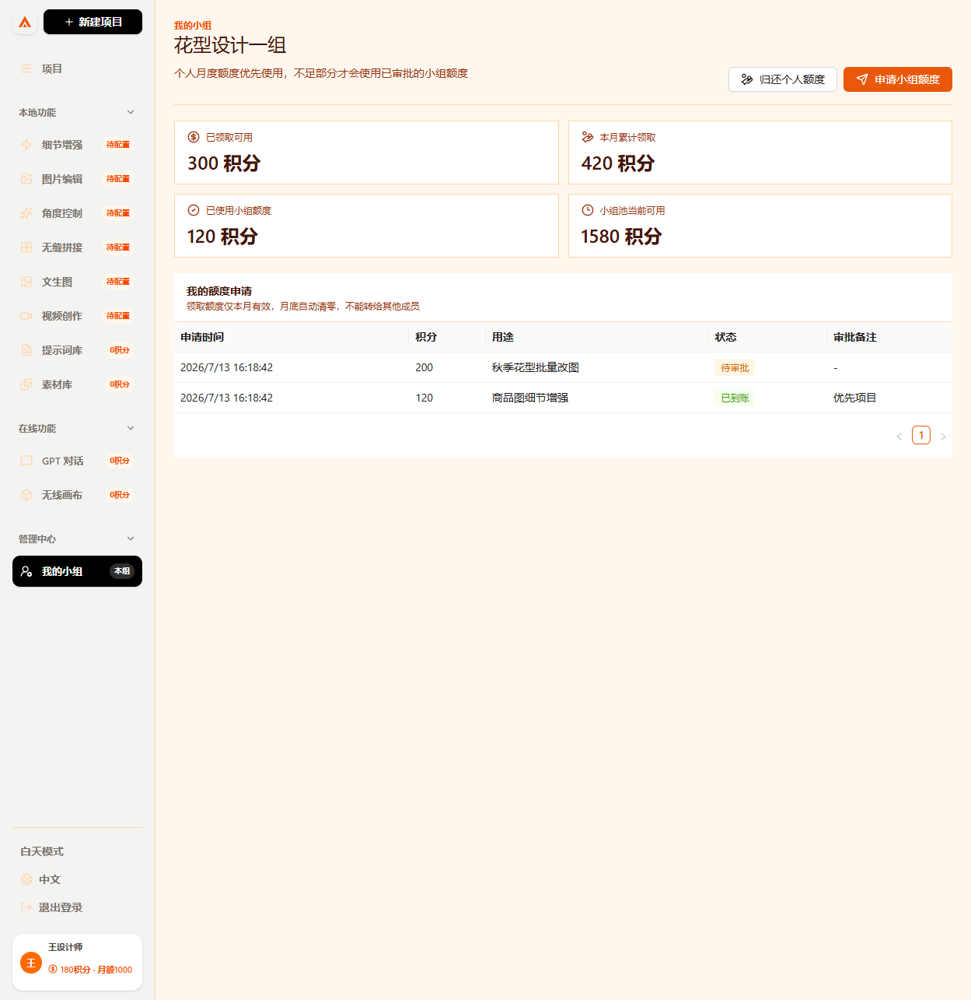

### 7.2 组长审批和检查成果

组长同样进入 `我的小组`，会额外看到 `共享池审批`、本组成员、最近成果、任务与完整提示词等区域。

1. 在 `共享池审批` 找到成员、用途和金额，确认确实属于本组工作后点 `通过`；不符合用途时点 `拒绝` 并确认。不能批准自己的申请。
2. 向下查看 `最近成果`，先读文件名、作者和提示词，再使用 `确认采用`、`最终交付`、`标记待定` 或 `标记废弃`。这些按钮修改成果状态，不等于替你下载文件或发送给客户。
3. 需要追溯制作过程时，查看 `本组任务与完整提示词`。表格较宽可横向滚动，不能只看左侧时间就认定任务成功。
4. 需要交报表时，点 `导出本组报表`，在浏览器下载列表找 CSV 文件。导出仅包含权限范围内的本组数据，并记录审计。

若提示部分数据未更新，先点 `刷新` 或 `重试`，保留旧数据和错误提示，不在数据尚未加载完成时重复审批。

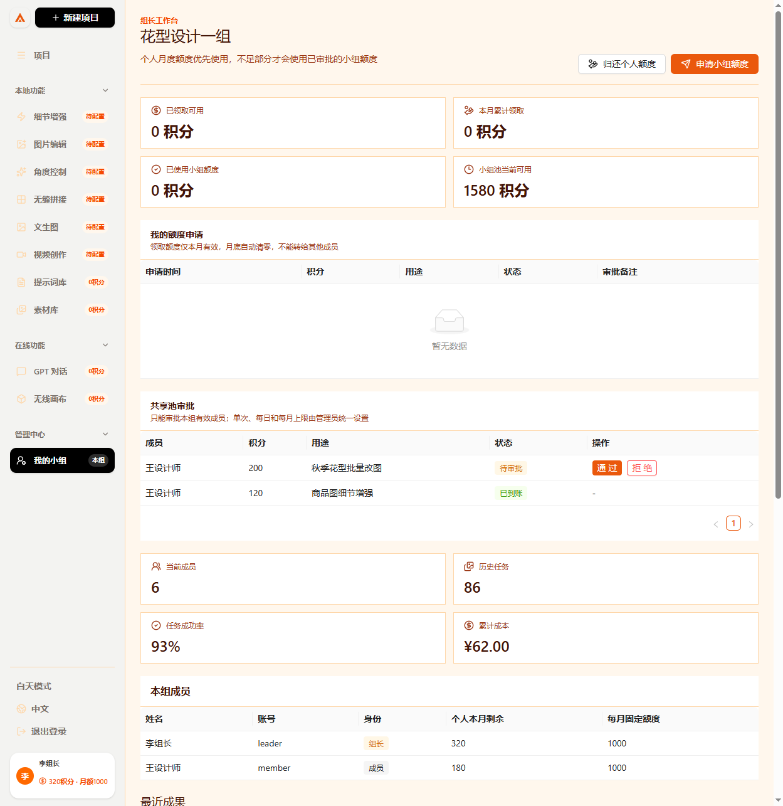

### 7.3 管理员开通账号和分配额度

在软件地址后打开 `/admin/login`，用实际分配的管理员账号登录。首次登录需要改密码时先完成改密；设计师账号不能从这个入口获得管理权限。

1. 进入 `账号额度`。首次开通部门时，由有权限的管理员填写部门信息并点 `新建部门`。
2. 在 `开通设计师账号` 填登录账号、初始密码、姓名、所属部门、角色和状态；普通成员选择普通设计师，不为方便操作随意授予管理员角色。
3. 分别设置 `每月固定额度` 和 `当前剩余额度`，再点 `开通账号`。回到账号表核对姓名、部门、角色与状态，再通过公司认可的安全方式交付登录信息。
4. 只想本月增加额度：在 `调整本月临时额度` 选择设计师，填写本月有效的积分变化和原因，再点 `保存调整`。
5. 想改变以后每月的额度：使用 `设置每月固定额度`，点 `保存每月固定额度`；该值在下月重置时生效，不等于立即补足本月剩余。

编辑账号后点 `保存账号权限`。停用、重置密码会使原会话失效，先确认目标姓名；不要拿正在工作的同事账号做练习。批量导入先下载页面提供的 CSV 模板，按模板填写并检查每条导入结果，失败行修正后单独处理。

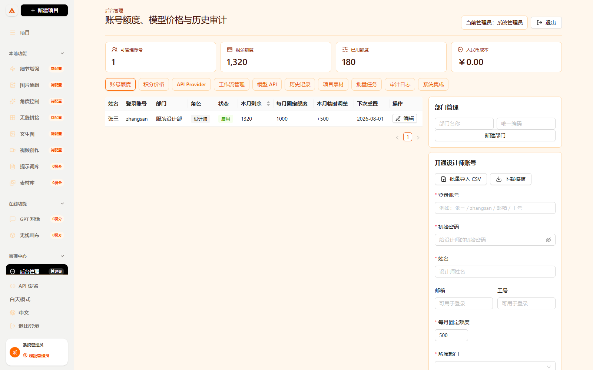

例如员工本月临时多做一个项目，应使用临时额度调整；想从下个月起每月增加固定预算，再修改每月固定额度。这两个操作不能互相代替。新账号开通后让员工以自己的账号登录检查部门和菜单，不把管理员会话直接交给员工使用。

### 7.4 模型与板块 API 配置

这项由超级管理员操作。普通设计师只选择可用模型，不在提示词中填写 API Key。


1. 点后台 `板块 API 配置`，在 `板块配置` 找到要开通的功能，例如文生图，点该卡片的 `修改配置`。
2. 选择已有 API 服务；尚未添加时选 `新增 API`，按供应商要求填写协议、Base URL 和 Key。
3. 填设计师看到的模型名称，以及供应商要求的模型 ID。显示名称可自定义，但模型 ID 不能只写一个相似名称。
4. 填当前服务需要的价格、能力和相关限制；启用 `设计师端启用`，点 `保存并同步到设计师端`。
5. 回到对应创作页面，检查模型是否出现、参数是否匹配。得到费用确认后，才用 1 张或最短视频做实际测试；“配置已保存”不能证明模型账号一定有权限或余额。

统一管理多个服务时使用 `API 服务与密钥`；精细管理模型用 `模型（高级）`。普通接口不用强行选工作流。RunningHub、ComfyUI 或公司内部流程按服务方提供的输入、输出和工作流 ID 配置 `工作流（高级）`；无缝拼接等板块显示待配置时，请维护该服务的人补齐，不猜填节点编号。

### 7.5 设计师分组与共享池

1. 进入后台 `设计师分组`，点 `新建`，填写小组名称、唯一编码和所属部门并保存。
2. 点左侧目标小组，在成员选择框选择该部门已有设计师。
3. 选择普通成员或组长身份，点 `加入小组`；回到名单检查姓名、账号和组内身份。
4. 需要移出成员时，在其所在行操作并读清确认提示，不把移出小组当作停用登录账号。
5. 设置共享池时，核对月度预算、单次/单日/每月申请限制，以及是否同步影响当月余额，再保存。
6. 用相应组员页面检查 `我的小组`，确认成员看到的小组和额度规则正确。

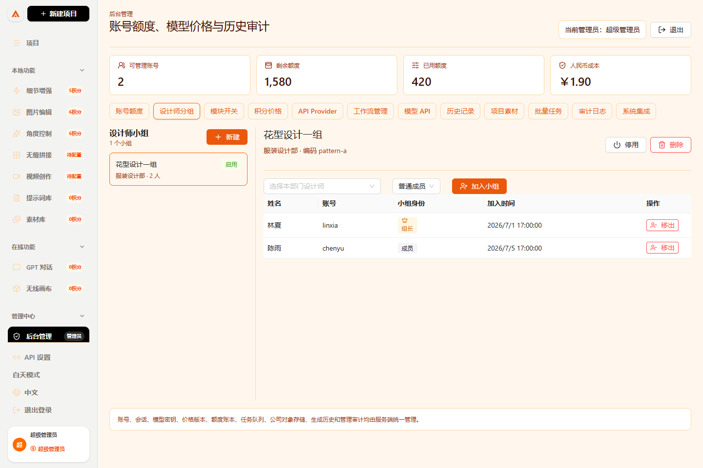

组长仍是设计师身份，不是后台超级管理员；跨部门管理、重复入组和多人多组关系受服务端限制。共享池调整属于额度操作，先核对目标小组，不拿正在生产的小组做测试。

### 7.6 模块开关

1. 超级管理员打开 `模块开关`，找到要控制的功能。
2. 对照业务需求调整启用状态，等待页面保存结果。
3. 回设计师端刷新，检查对应菜单与任务入口；若仍旧，确认是不是旧标签页或另一个部署地址。
4. 要恢复功能，再到同一模块启用并核对。

关闭影响入口和任务权限，不会自动删除历史成果，也不等于撤销已经提交的外部任务。部门管理员或普通设计师没有相应权限时，不应修改请求绕过。

### 7.7 积分价格

1. 进入 `积分价格`，确认要调整的操作类型/模型。
2. 填内部积分与页面要求的人民币成本信息，创建价格草稿。
3. 检查单位和应用范围，按页面流程测试、发布；只保存草稿不等于正式生效。
4. 发布后回设计师端查看对应操作的展示价格，必要时在授权预算内做最小任务核对。

内部积分与上游服务商账单不同；免内部积分不代表外部 API 免费。视频自动时长、多张图片及输入视频可能影响渠道成本，不能仅按一个按钮的名字估算外部费用。

### 7.8 项目素材与设计效能

项目素材：

1. 打开 `项目素材`，先按项目、设计师或类型筛选。
2. 点开目标素材，核对来源、提示词和结果；文件相似时以实际记录为准。
3. 下载或执行授权操作前，确认这份素材属于当前管理范围。
4. 本页查不到的浏览器本地画布，应让作者从原浏览器导出，不据此认定文件不存在。

设计效能：

1. 打开 `设计效能`，先选今日、本周、本月或自定义日期。
2. 按权限选择部门、小组、设计师，等待数据刷新。
3. 依次看有效出图、任务成功率、成本、采用与交付情况；同时核对指标说明和统计范围。
4. 比较团队时保持同一时间范围，不把生成数量当成采用或最终交付数量。
5. 导出或分享时只包含获准公开的数据。

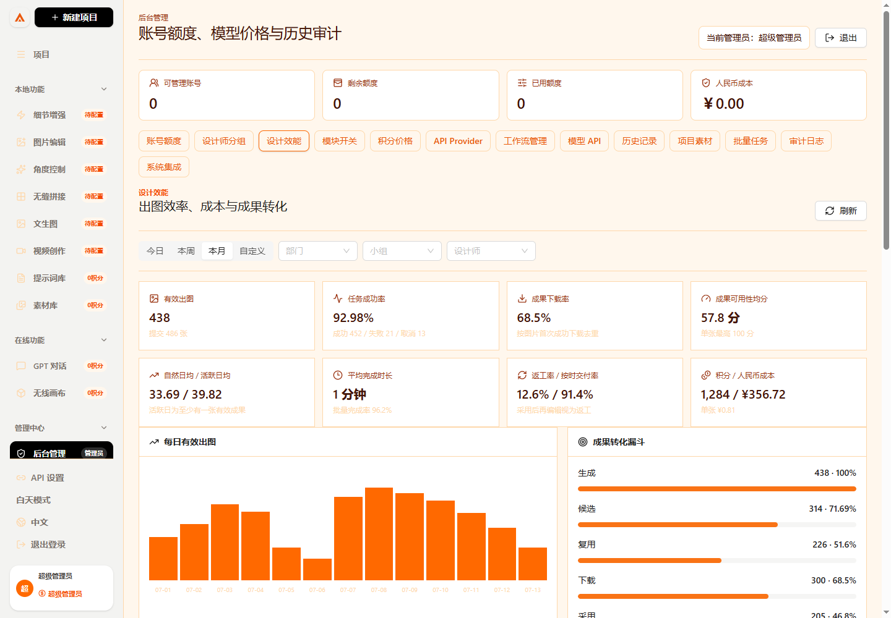

### 7.9 历史记录：查任务、错误与成本

1. 进入 `历史记录`，选择设计师、模型、操作类型和日期范围；知道项目时补项目条件。
2. 找到相应任务，核对时间、任务身份和输入要求，避免把相邻两次生成混为一条。
3. 横向滚动表格，查看右侧状态、完整提示词、成本和失败原因。
4. 下方翻页查看其余记录；当前页不是全部筛选结果。
5. 需要交付查询结果时点 `导出当前结果`，下载后检查范围。

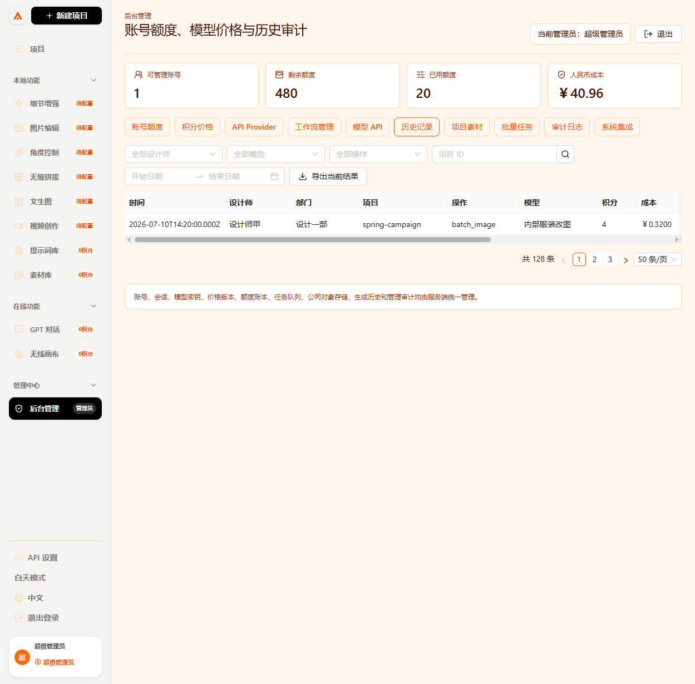

排查结果不明的生成时，先查原任务，不从历史直接再发同样一单。提供给维护人员的是任务 ID、发生时间、模型和脱敏错误，不是 API Key。

### 7.10 批量任务

1. 打开 `批量任务`，定位目标批次，查看成功、等待、执行和失败数量。
2. 进入批次详情逐条检查，优先读失败原因而不是整体重跑。
3. 要暂缓后续工作时，对允许操作的等待项暂停；需要继续时恢复。
4. 确认不再需要的未处理项后取消；已经提交上游的任务不保证立即停止。
5. 处理完重新核对状态与结果，避免成功项再次生成。

内部取消或积分处理不能保证外部供应商退款，批量前先用少量样本确认方向。

### 7.11 审计日志与系统集成

审计日志：进入页面 → 选时间、操作人和目标 → 查看谁改了什么与成功/失败结果 → 与任务 ID 或配置变更时间对应 → 导出或记录获准分享的脱敏信息。不要修改或删除日志来隐藏错误。

系统集成：

1. 由有权限的维护人员进入 `系统集成`，选择企业微信、对象存储或相关内部服务配置。
2. 核对实际服务地址和凭据来源，不填演示值或把私密 Key 放进前端变量。
3. 按页面提示保存，并执行提供的连接检查。
4. 检查成功后再验证对应的登录、上传或读取路径；连接通过不代替完整业务验收。
5. 重要配置改动前做好安全备份，恢复按生产部署手册执行，不在生产库上随意实验。

普通设计师无需修改系统集成。部署方式、权限或页面字段不同时，沿用当前部署的提示和专门手册，不照抄演示图中的账号、价格或地址。

详细配置见 [分组与模块开关](groups-and-module-switches.md)、[小组共享积分池](group-shared-credit-pool.md)、[设计效能看板](design-performance-dashboard.md) 和 [生产部署与恢复](production-deployment.md)。

`TASK_MOCK_MODE=true` 用于正式环境的模拟任务验收，不代表真实模型已接通。正式使用外部模型前按部署手册关闭模拟模式，分别验证供应商限流和超时。

<a id="data-safety"></a>

## 8. 数据保存在哪里，怎么不丢

### 8.1 自动保存、多窗口和冲突副本

当前保存会合并不同画布及同一画布中可独立合并的改动；发生无法自动合并的真实冲突时，会保留带 `（保存冲突副本）` 的画布供恢复。这是浏览器本地保护，不是多人实时协同，也不是跨设备同步。

同一张画布仍建议主要在一个标签页编辑，避免两个窗口同时修改同一节点。升级后关闭旧标签页再重新打开，旧页面未必使用新的保存逻辑。

看到保存冲突副本时：

1. 暂停在多个窗口里继续改同一张图，先回画布列表。
2. 分别打开原画布与冲突副本，比较最近修改的节点、连线与文字。
3. 先把两份都导出 ZIP，保留恢复依据。
4. 确认需要的内容后，在最终保留的画布中整理；核对完整后才处理多余副本。
5. 保存失败或空间不足时先导出能读取的内容，不能靠清空网站数据“修复”。

### 8.2 各类数据的位置

| 数据 | 当前保存位置 | 应如何保护 |
| --- | --- | --- |
| 画布布局、节点、连线、画布会话 | 当前浏览器站点的本地存储，主要是 IndexedDB / LocalForage | 定期导出画布 ZIP；换浏览器、域名、端口或电脑前先导出 |
| 画布中的本地图片与媒体缓存 | 当前浏览器本地媒体存储 | 导出画布并另存关键成果；不要直接清理网站数据 |
| 个人浏览器聊天记录、页面偏好 | 浏览器侧存储 | 重要内容另存；不把历史列表当全部附件备份 |
| 正式账号、任务、额度、历史、审计、服务端素材元数据 | PostgreSQL | 部署级数据库备份与恢复演练 |
| 正式上传文件与生成结果 | S3 / MinIO 等对象存储 | 备份对象数据，保护访问凭据与版本；数据库备份不代替文件备份 |
| 单机演示服务的任务、服务端素材 | 本机 SQLite，默认 `server/.data/local-demo.sqlite` | 重启保留；中断任务暂停而不自动重发。停服后备份整个数据目录，演示余额和后台临时配置不在此范围 |
| 模型 Key、数据库密码和加密密钥 | 本地 `.env` 或正式服务加密凭据 | 单独安全备份，不提交 GitHub；加密密钥丢失可能无法解密已有 Provider Key |

自动保存只是减少编辑丢失，不是云同步或灾备。共享一台电脑或浏览器配置文件时，要把本地画布视为该浏览器使用者可接触的数据，不能用服务器账号权限替代电脑本身的访问控制。

一个实用的收工习惯：下载已确认成果 → 导出重要画布 → 检查素材入库状态 → 把 ZIP 与成果放到公司规定的备份位置。正式部署还要备份 PostgreSQL、对象存储和安全配置；恢复流程见生产手册，不要在正在使用的生产库上随意试恢复。

### 8.3 换电脑、浏览器、域名或端口

1. 在旧地址、旧浏览器中打开重要画布，下载最终图片/视频，并逐个或批量导出画布 ZIP。
2. 核对 ZIP 非空、最终文件能打开；重要聊天和原始附件另外保存。
3. 把文件复制到新电脑或公司批准的备份位置。
4. 在新地址打开软件，进入画布库，点 `导入画布` 选择 ZIP。
5. 打开导入项目，检查图片、文本、连线与媒体。远程地址已失效的媒体需要原始文件补回，不能保证 ZIP 自动找回。
6. 确认新环境内容完整后，再决定是否清理旧环境；不要先清浏览器数据。

`localhost`、`127.0.0.1`、局域网 IP，以及不同端口都可能形成不同的浏览器存储空间。网站能打开但画布列表变空，先回原地址检查，不要马上认定升级删除了数据。

### 8.4 更新或重启之前

1. 先按上一节保存关键成果和画布 ZIP；存在未确认任务时记录原任务信息。
2. 维护人员按 [安装部署指南](installation-guide.md) 拉取更新、安装依赖、构建并重启；设计师不要在工作目录里随意删除 `.data` 或环境文件。
3. 单机演示服务停服后备份 `server/.data` 等实际数据目录；只拉取 Git 代码不会替你备份 SQLite 与媒体。
4. 重启后刷新页面、重开原地址，查看素材与任务。中断任务可能暂停，不会自动当作新单重新提交。
5. 有 `恢复查询 / 查询原任务` 就优先查询；状态不明先交维护人员核实，不批量点重试。

## 9. 常见问题：先看症状再操作

| 症状 | 优先检查 |
| --- | --- |
| 页面打不开 | 服务进程是否运行、端口是否正确；局域网使用实际 IP，不用另一台电脑的 `127.0.0.1` |
| 网页打开但模型列表空 | API 是否可达；Key 是否配置；Provider/模型/板块是否启用；修改 `.env` 后是否重启 |
| 单机仍出现登录或积分 | 是否运行了旧服务；后端 `/api/deployment` 的开关是否已更新；是否打开了另一端口 |
| “没有权限”或模块消失 | 账号角色、模块开关、会话是否过期；不要靠修改前端请求绕过 |
| 按钮不可点 | 提示词是否为空、模型是否可用、参考图是否超限、参数是否合法、是否已有任务执行 |
| 生成特别慢 | 后台任务处于排队还是执行；供应商限流、并发、余额与网络；低分辨率少量任务是否同样慢 |
| 报 401 / 403 | 会话或供应商凭据/模型权限；让管理员查看脱敏错误，不在群里发 Key |
| 报 429 | 供应商或平台限流；降低并发，按错误提示等待，不连续点击重试 |
| 视频页面查询中断 | 查看原任务状态；有恢复入口就恢复原任务，不重新生成同一个请求 |
| 创作页发送按钮灰色，提示尚未核实 | 在原会话点查询原任务；不要换会话重复下单 |
| 提示聊天记录未保存、消息尚未发送 | 草稿/附件保留；检查浏览器存储与网络，修正后重新发送 |
| 附件卡片存在但回答没读到内容 | 检查解析失败、扫描 PDF 无文字或长文截断；缩小范围或拆分文件 |
| 想聊天却开始出图 | 是否关闭了连续对话；直接生图模式的生成按钮不是普通问答 |
| 自定义尺寸填了但图片没变 | 是否点击应用尺寸并确定保存；生成比例与已有图尺寸不同 |
| 原图变成当前编辑版本 | 画布编辑保存回原节点；及时撤销，重要原稿先复制或下载 |
| 导出名字出现 v2 或扩展名变了 | 版本随图像编辑递增，扩展名按实际格式；浏览器的 (1) 不是版本号 |
| PDF 页码不符合画布摆放 | 在图片集弹窗用上移/下移排序，以编号而非画布左右位置为准 |
| 视频上传按钮不可点、参考素材报错 | 模型是否支持该输入；检查模式、数量、格式、大小与时长，切模型后移除不兼容素材 |
| 视频提示素材地址或 ffprobe 未配置 | 让维护人员检查媒体探针和可访问素材地址；不是更改提示词能解决 |
| 多出保存冲突副本 | 先分别导出原画布和副本，比较内容后整理，不立即删除 |
| 换地址后画布不见 | 是否换了域名、IP、端口、浏览器或配置文件；回原地址导出 ZIP，再在新地址导入 |
| 分享后别人打不开同一画布 | 链接不是云同步；发送导出的画布 ZIP 或最终成果 |
| 本机 Agent 未连接 | 本机组件是否启动、连接地址和 Token 是否匹配；可先切回网站 Agent |
| 原图没变或返回占位图 | 是否使用模拟任务/模拟 Provider；核实实际模型和运行模式 |

遇到失败应保留任务 ID、发生页面、模型、参数和不含密钥的错误信息。先查实际状态再重试，尤其是收费生成；“浏览器没收到结果”不等于供应商没执行。

## 10. 最短日常使用路线

只有一句话要记：**选对模型 → 明确参考图顺序 → 写清改什么与保留什么 → 小批量确认 → 下载成果与导出画布。**

单张简单任务用图像/视频页面；多轮设计和多素材关联用画布；需求讨论用 LLM 对话；复用经验用提示词；成果归档用素材库；公司权限、费用与故障追踪交给正式后台。

### 一个完整的围巾方案流程

1. 在 LLM 聊天上传需求附件，让 AI 列出要保留的版型、花纹与工艺，先不生成。
2. 切到连续对话创作，选理解模型和图像模型，上传原图，逐轮探索两种配色。
3. 对满意的结果点 `放入画布`；或直接在画布上传原图，用创建面板出图。
4. 在画布把原稿、候选图、需求文字摆开，重命名为原稿、A、B；用 Agent 先比较，不直接继续出图。
5. 需要精确像素或说明箭头时使用本地 `编辑图片`，保存前检查边缘、透明度和尺寸。
6. 需要视频时挑确认过的图，选合适首帧/首尾帧模式做短片；结果不明先恢复查询。
7. 把最终图按客户阅读顺序导出多页 PDF，另导出原图 ZIP；这两份用于交付，不代替画布备份。
8. 导出完整画布 ZIP 保存设计过程；有团队流程时再归档素材、标记采用/最终交付，并保存必要的提示词模板。

截图说明：图 23—32 为本次当前页面的操作截图，使用手册专用演示素材，没有为截图提交收费模型任务。公司版图片为仓库已有的演示场景，展示入口与操作结构，不代表当前账号、余额或真实经营数据。截图可点击放大；若按钮位置因窗口大小改变，优先按本文的按钮名称查找。
