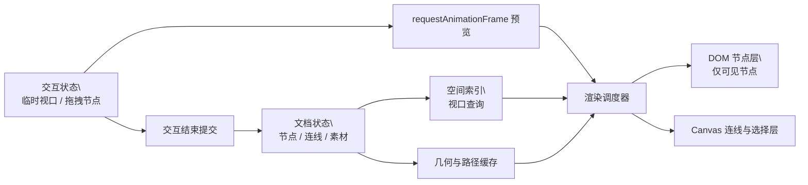

# 无限画布高性能渲染架构设计

**日期：** 2026-09-01
**状态：** 待用户审阅
**范围：** `web` 端无限画布的平移、缩放、节点拖拽与连线渲染。

## 目标

在不改变既有图片生成、视频生成、Agent、节点双击编辑、上传素材、导出与画布数据格式的前提下，让复杂画布在交互时保持可预测的流畅度。

验收基准：

- 500 个普通节点、1,000 条连线时，平移、缩放、拖拽不因全量 React 重渲染而阻塞交互。
- 只有视口附近的节点进入 DOM；隐藏节点仍保留在画布数据中，可以被搜索、选择、导出和恢复。
- 移动一个节点时，只更新该节点、其选择状态和与其相连的连线。
- 停止交互后恢复完整阴影、滤镜、高清图片与精确连线；不丢失位置、缩放、选择或未保存编辑内容。
- 在开发环境记录每次交互的帧率、P95 帧耗时、总节点数、可见节点数和可见连线数。

## 现状与根因

当前版本已把视口预览改为 `requestAnimationFrame` 驱动的 DOM transform，并为节点、连线增加了基础 memo。仍存在三类规模性成本：

1. 可见节点计算按视口变化扫描完整节点数组。
2. 完整节点卡片和视觉效果在交互中仍可能参与合成与绘制。
3. 连线虽然有组件稳定性判断，但大量 SVG path 的布局、路径计算和滤镜仍是热路径。

这些成本在节点数量、图片数量和连线数量同时增加时叠加，不能靠继续增加 `React.memo` 根治。

## 方案对比

### 方案 A：继续优化 DOM 组件

增加 memo、拆分状态、移除阴影。

- 优点：改动小。
- 缺点：全量可见范围扫描和 SVG 连线瓶颈仍在；不足以支撑大画布。

### 方案 B：混合渲染架构（采用）

保留 DOM 节点用于图片、视频和编辑交互；连线、选择辅助和小地图使用批量 Canvas 绘制；新增空间索引与交互 LOD。

- 优点：最大性能收益与功能兼容性之间的平衡最佳。
- 缺点：需要明确文档状态、交互状态和渲染缓存的边界。

### 方案 C：全量迁移 WebGL

节点、图片和连线全部使用 WebGL。

- 优点：理论吞吐量最高。
- 缺点：重写编辑、输入、可访问性、图片/视频资源生命周期和导出路径，回归风险不成比例。

不采用方案 C，除非方案 B 在实测基准下仍不达标。

## 目标架构

### 1. 状态边界

将状态按更新频率拆分：

- **文档状态：** 节点、连线、资源引用、持久化视口。只有实际编辑完成时更新。
- **交互状态：** 鼠标指针、临时拖拽坐标、实时视口、悬停节点。仅在交互中使用，不触发完整文档树重渲染。
- **派生状态：** 可见节点、可见连线、节点邻接表、节点边界、路径缓存。由文档状态增量更新。

公开画布数据模型保持兼容。已有保存记录无需迁移。

### 2. 空间索引

使用固定大小的世界坐标网格，默认格子边长为 1,024 画布单位：

- 每个节点按其边界登记到覆盖的格子。
- 视口查询只读取视口外扩 280 单位范围内的格子，并去重节点 ID。
- 节点创建、删除、尺寸或位置提交时增量更新索引。
- 拖拽过程中不反复重建全局索引；交互结束后一次性提交最终边界。

固定网格相比 R-tree 更适合当前以卡片节点为主、尺寸相近的场景，代码量小并且可预测。若未来支持超大自由绘制元素，再替换为 R-tree。

### 3. 交互 LOD

交互开始时启用 `interactionQuality = "moving"`，交互结束后延迟 150ms 恢复 `"full"`：

- `moving`：关闭卡片阴影、backdrop blur、hover 动画、连线 drop-shadow；图片使用现有缩略版本或浏览器已解码版本，不触发高清替换。
- `full`：恢复完整视觉；对当前可见图片按屏幕实际尺寸选择所需分辨率。
- 当缩放低于阈值时，节点显示轻量摘要，不渲染编辑控件、批处理按钮和非必要标签。

LOD 只改变显示，不改变节点数据、选择状态或导出内容。

### 4. 连线与几何缓存

连线层改为独立 Canvas：

- 按可见连线批量绘制普通连线、箭头和选择高亮。
- 用邻接表从节点 ID 查出受影响连线；节点移动时只使相邻路径缓存失效。
- Canvas 使用设备像素比进行清晰绘制；尺寸变化时重新设置位图尺寸。
- 连接点命中与右键菜单继续由轻量 DOM/SVG 命中层处理，避免改变既有操作习惯。

保留现有 SVG 连线实现作为 feature flag 回退路径，待基准测试稳定后再移除。

### 5. 性能测量

开发环境提供可开关的性能仪表：

- 每次平移、缩放和拖拽记录平均 FPS、P95 帧耗时、最长帧耗时。
- 记录总节点/连线与实际可见节点/连线。
- 超过 50ms 的长帧记录阶段标签：视口查询、路径计算、节点渲染或 Canvas 绘制。
- 生产默认关闭，不上传用户内容或画布数据。

## 分阶段实施

1. **基准与数据边界：** 加入性能测量、节点邻接表、空间索引及单元测试。
2. **节点渲染：** 用空间索引替换全量可见节点扫描，加入交互 LOD 与回归测试。
3. **连线渲染：** 引入 Canvas 连线层、路径缓存、SVG 回退开关与交互测试。
4. **压测与验收：** 生成 500/1,000 与 1,000/2,000 两组可复现的本地画布夹具，比较优化前后指标，并验证保存、刷新、拖拽、选择、导出和生成节点不回归。

每一阶段完成后运行前端全量测试、生产构建与浏览器真实交互测试；若发现数据一致性或编辑回归，停止后续阶段并保留可回退实现。

## 错误处理与回退

- 索引异常或缺失时，降级为当前线性可见范围扫描，优先保证画布可用。
- Canvas 连线绘制异常时，自动切换到 SVG 连线层并在开发环境报告原因。
- 性能仪表不可用时不影响编辑、生成、保存或导出。
- 不改变项目持久化格式，避免部署后旧画布无法打开。

## 测试策略

### 单元测试

- 空间索引：边界、跨格、移动、删除、重复去重、空画布与负坐标。
- LOD：交互开始、连续交互、延迟恢复、缩放阈值与取消交互。
- 连线缓存：仅相邻节点使路径失效、删除节点清理缓存、隐藏批处理子节点不产生连线。

### 集成与浏览器测试

- 500 节点 / 1,000 连线画布的缩放、平移、单节点拖拽。
- 文本、图片、视频、生成配置节点的编辑和选择。
- 刷新后节点位置、视口、连线、图片和选择语义保持正确。
- Canvas 渲染不可用时 SVG 回退仍可操作。

## 非目标

- 本次不迁移至全量 WebGL。
- 本次不修改生图、生视频、LLM、认证、额度或供应商 API。
- 本次不改变用户可见的画布风格和操作入口，LOD 期间的临时简化除外。
